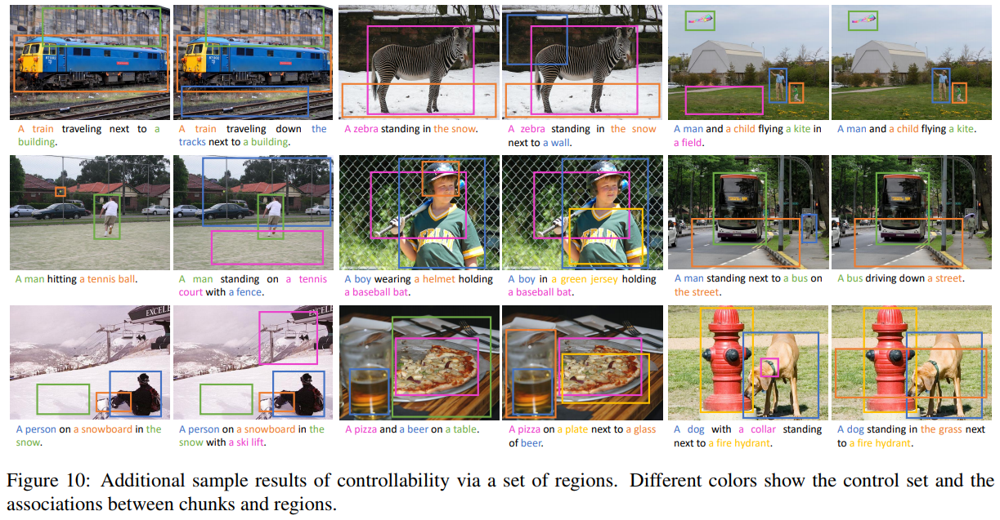

Show, Control and Tell: A Framework for Generating Controllable and Grounded Captions  
Marcella Cornia, Lorenzo Baraldi, Rita Cucchiara  
[arXiv](https://arxiv.org/abs/1811.10652), [pdf](https://arxiv.org/pdf/1811.10652.pdf), [GitHub](https://github.com/aimagelab/show-control-and-tell)  
CVPR2019  

# どんなもの？
従来のキャプション生成手法では記述する対象を制御できず，なぜそのキャプションが生成されたのか説明することも難しい．  
そこでグラウンディング(grounding)と制御可能性(controllability)の両方を可能にすることによって多様な記述を生成することができるフレームワークを提案．  
  


# 先行研究との差分
キャプション生成手法ではアテンションモデルがよく用いられているが，制御可能性と説明可能性がまだ欠けている．  
例えばattention-drivenモデルの場合，アーキテクチャは各タイムステップでどの領域に注目するかを暗黙的に選択するが，外部から監視することはできない．  
画像は複数の方法で記述することができるが，そのようなアーキテクチャはどの領域が記述され，各領域にどの程度の重要性が与えられるかを制御する方法を提供しない．  

提案モデルでは，記述したい画像領域のシーケンスまたはセットとして与えられる制御信号から多様な自然言語キャプションを生成することができる．与えられた条件従って，異なる領域に異なる順序で注目することによって同じ画像でも異なるキャプションを生成できる．  
提案モデルは文の名詞チャンクへの分解を考慮し，画像領域とテキストチャンクとの間の関係をモデル化するRNN上に構築されているので，生成プロセスを明示的に画像領域に対応付けることができる．

# model
文は本質的に階層的な自然言語構造であるので，単語間の依存関係をツリー構造に出来る．  
また画像を説明する文の場合，画像内に視覚的に存在するものを記述する視覚的な単語と，画像内に存在しない実体を指すテキストの単語とを区別することができる．  

依存関係ツリーを考えると，名詞でグループ化することができるので，名詞チャンクを構築することができる．  
名詞チャンクは単語と同じように視覚的に画像領域にグラウンディングできるので，キャプションは一連の領域にマッピングすることもできる．各領域は名詞チャンクに対応する．  
複数のマッピングが可能な場合，チャンクは同じクラスの複数の画像領域にも関連付けられる．  

  

## Generating controllable captions
画像 $I$ と領域のセットのシーケンス $R=(r_0, r_1,...,r_N)$ が与えられると，キャプションモデルは言語の流暢さを維持しながら，$R$ 内のすべての領域を順番に記述するセンテンス $y=(y_0,y_1,...,y_T)$ を生成することが目標．  

制御信号として働く $I, R$ に条件付けられ，文の単語レベルとチャンクレベルの表現に対応する2つの出力分布を予測する．  
- 与えられた時間に単語を生成する確率：$p(y_t|R,I;\theta)$
- あるチャンクから別のチャンクに切り替える確率：$p(g_t|R,I;\theta)$，$g_t$ はブール値のチャンクシフトゲート  
キャプション生成中，モデルは現在の領域 $r_i$ へのポインタを維持し，ゲート $g_t$ によって $R$ 内の次の領域に移動する．

adaptive attentionを用いたRNNを使用してキャプションを生成する：$h_t = \text{RNN}(w_t, r_t, h_{t-1})$  
トレーニング時には $r_t, w_t$ は $t$ に対応する真値領域セットと単語．  
テスト時には $w_t$ はモデルによって予測された $p(y_t|R,I;\theta)$ からサンプリングされ，画像領域の選択は $g_t$ の値によって決まる．  

```math
r_{t+1}\gets R[i], \text{where} i= \min (\sum_{k=1}^t g_k, N), g_k \in {0,1}
```


### Chunk-shifting gate
$P(g_t|R)$ を計算する為に，LSTMの内部状態と(チャンクの終わりの)潜在的表現との適合性(compatibility)スコアを計算するadaptive mechanismを用いる．  
適合性スコアは $r_t$ 内の領域の１つに参加したものと比較され，その結果は $R$ 内に設定された次の領域に切り替えるための指標として使用する．

まずチャンクの終わりのLSTMの状態を符号化するメモリから抽出されたコンポーネントをモデル化するチャンクセンチネル $s_t^c$ を取得するためにLSTMを拡張する：

```math
l_t^c = \sigma(W_{ig}x_t+W_{hg}h_{t-1}) \\
s_t^c = l_t^c \bigodot \text{tanh}(m_t)
```

$m_t\in \mathbb{R}^d$ : LSTM cell memory  
$x_t \in \mathbb{R}^k$ : タイムステップ $t$ のLSTMの入力  
$\sigma$ : sigmoid logistic function  

次に1層のNNを通して内部状態 $h_t$ とセンチネルベクトル間の適合性スコアを計算する．同様に $h_t$ と $r_t$ の領域間の適合性関数を計算する．

```math
z_t^c = w_h^T\text{tanh}(W_{sg}s_t^c+W_gh_t) \\
z_t^r = w_h^T\text{tanh}(W_{sr}r_t+(W_gh_t)\mathbb{1}^T)
```

あるチャンクから次のチャンクに移動する確率を以下のように定義：

```math
p(g_t=1|R)=\frac{\exp z_t^c}{\exp z_t^c + \sum_{i=1}^n \exp z_{ti}^r}
```

テスト時には $g_t$ は $p(g_t|R)$ からサンプリングされる

### Adaptive attention with visual sentinel
選択された $r_t$ に対して，その領域に注目し，視覚的な単語とテキストの単語を区別するためにAdaptive attention with visual sentinelを構築．

visual sentinel vector $s_t^v$ は $r_t$ の領域に注目しないことを選択したときにモデルがフォールバックできるメモリのコンポーネントをモデル化する：

```math
l_t^v = \sigma(W_{is}x_t + W_{hs}h_{t-1}) \\
s_t^v = l_t^v \bigodot \text{tanh}(m_t)
```

次に $r_t$ の領域と $s_t^v$ のattentive分布が生成される

```math
\alpha_t = \text{softmax}([z_t^r;w_h^T \text{tanh}(W_{ss}s_t^v+W_gh_t)])
```

$[]$ : concatenation  
attentive分布に基づいて，ネットワークが注目しているものの表現としてLSTMに供給できるコンテキストベクトルを取得：

```math
c_t = \sum_{i=1}^{n+1} \alpha_{ti}[r_t;s_t^v]
```

コンテキストベクトルは，ほとんどが $r_t$ の領域またはビジュアルセンチネルのいずれかの近似値になる．  
しかし $r_t$ はChunk-shiftingメカニズムに従って異なるタイムステップで変化するので，制御入力に従う． 
このモデルはビジュアルセンチネルの平均を使用してビジュアル単語とテキスト単語を交互に生成できる．

## Objective
モデルの2つの出力分布を考慮したlossで学習する．  
  

先行研究に従って，クロスエントロピーを用いた学習の後さらに強化学習を用いてシーケンス生成を最適化する．  
具体的には，テスト時に推論モデルの下で得られた報酬でREINFORCEアルゴリズムを用いるself-critical sequence training approach [37](https://arxiv.org/abs/1612.00563)を使用する．

各時間ステップで $p(y_t | R), p(g_t | R)$ の両方からサンプリングして，次の単語 $w_{t+1}$ と領域セット $r_{t+1}$ を取得．  
EOSタグに達するとサンプリングされた文 $w^s$ の報酬を計算し， $w^s, g^s$ の両方に関して逆伝播する

```math
\nabla_\theta L(\theta) = -(r(w^s)-b)(\nabla_\theta \log p(w^s)+\nabla_\theta \log p(g^s))
```

$b=r(\hat{w})$ : 推論プロセスで得られた文の報酬  
次にキャプションの品質とその制御信号 $R$ との位置合わせを考慮した報酬関数を作成  
- キャプションの品質は先行研究[3]に従い CIDEr-D スコアを使用  
- 位置合わせはNeedleman-Wunschアルゴリズム[30]に基づくアライメントスコアを使用．
予測キャプション $y$ とそのターゲット $y^*$ が与えられると，両方の文からすべての名詞を抽出し，それらのアラインメントを評価する．  
2つの名詞を一致させることによる報酬は，それらの単語の埋め込み間のコサイン類似度とする．最適なアラインメント $al(y,y^*)$ が計算されたら，シーケンスの長さに関してそのスコアを正規化する：

```math
NW(y,y^*)=\frac{al(y,y^*)}{\max(#y,#y^*)}
```

$#y,#y^*$ : 名詞の数

## Controllability through a set of detections
これまでのところ提案されたアーキテクチャは，領域セット $R$ の順序によって制御されるキャプションを生成することができる．  
制御信号がソートされていない場合に対処するために，データから学習しながら，制御信号を候補順にソートできるソーティングネットワークを構築する．  
結果の順序はキャプションネットワークに渡され，出力キャプションが生成される．  
Sinkhornネットワーク [29](https://arxiv.org/abs/1802.08665)を参考にする．


# 評価実験
データセットはCOCO EntitiesとFlickr30k Entitiesを使用  
まず単語ベクトルを使用して，データセットの各名詞と最も類似した5つのクラス名を関連付けるインデックスを作成する．
次にキャプション内の各名詞チャンクは，その名前を使用して，画像内で使用可能なインデックス内で見つかった最初のクラスに関連付けられる．  
この関連付けプロセスは一般的に信頼性があり，誤検知の関連付けはほとんどない．   
  

  

領域セットの順序は真値のキャプションを選択する際に考慮すべきなので，BLEU-4, METEOR, ROUGE, CIDEr, SPICEの評価だけでなく，追加の評価方法を用いる．  

順序に関する制御可能性を評価する時は，各真値入力 $(R, I)$ に対して，同じペアを用いているデータセット内のすべてのキャプションに対して評価する．  
また，モデルが制御入力にどのように従うかを評価するために alignment score(NW)を使用．  
同様に，領域のセットに関する可制御性を評価する時は，同じ入力を有する全ての真値キャプションに対して評価する．

予測キャプションが制御信号をどのようにカバーするかを評価するために，真値の名詞セットとその予測した対応物とのsoft intersection-overunion (IoU)を定義．  
まず，単語ベクトル間の距離とHungarian algorithm[20]を使用して，2つの名詞セット間の最適なアライメントを計算し，その合計を2つのセットの間のintersection scoreとして定義．  
IoUは以下のように計算する：

```math
IoU(y,y^*) = \frac{I(y,y^*)}{#y+#y^*-I(y,y^*)}
```

$I$ : intersection score, $#$ : 2つの名詞セットのcardinality(種類数?)  


## Baseline
- Controllable LSTM : ↓のアテンション無し
- Controllable Up-Down : VQA2017チャレンジで1位を獲得したモデルのキャプションバージョン
- Ours without visual sentinel : 視覚的な単語とテキストによる単語を区別するメカニズムが無い
- Ours with single sentinel : ビジュアルセンチネルとチャンクセンチネルをマージ


## 入力が順序の場合

### COCO Entities  
  
CIDErとNWを最適化させる学習をすることで最も高いNWの値を得る．

### Flickr30k Entities
CIDErとNWを最適化させた学習結果  
  


## 入力に順序が無い場合
一連の検出で制御したときのモデルのパフォーマンスを評価

COCO Entities  
  

Flickr30k Entities
  
提案モデルのIoUが最も高く，制御信号をより効果的に反映できている．

## キャプションの多様性の評価
PoSシーケンス用いて多様なキャプションを生成する手法 [9](https://arxiv.org/abs/1805.12589) と比較  
多くの多様なキャプションを生成するために，入力画像に対して制御領域セット内の全ての領域を用いて，より高い対数確率を有するキャプションをもたらす順列を取る．  
評価は先行研究と同様：各真値センテンスは，各手法において最大スコアで生成されたキャプションに対して評価．従ってより高いスコアは高精度のキャプションをサンプリングできることを示す．  
  

## 生成例
  
