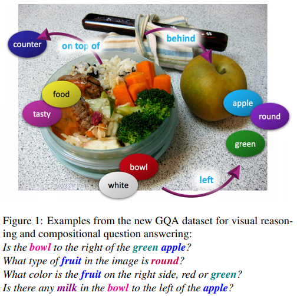
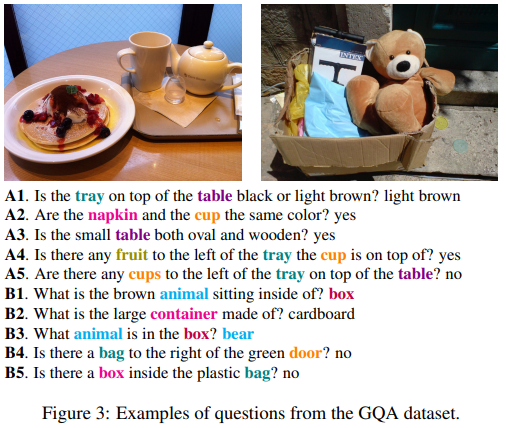
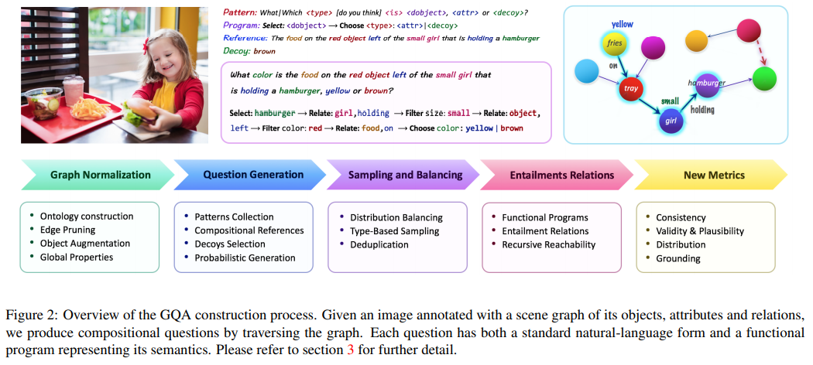
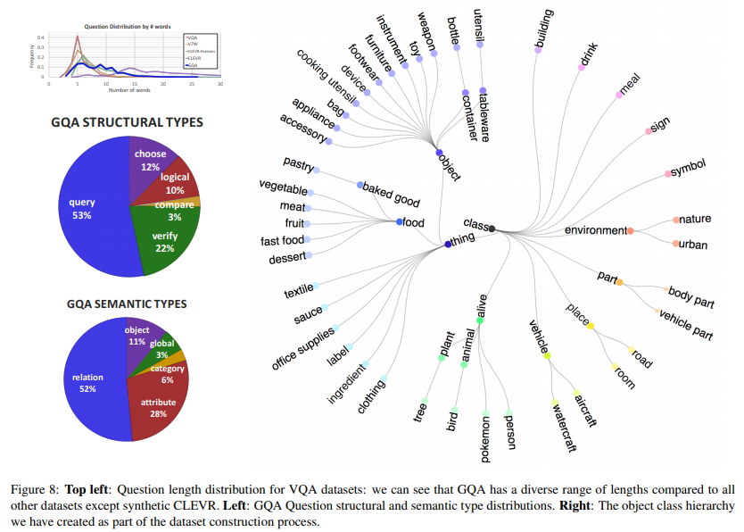
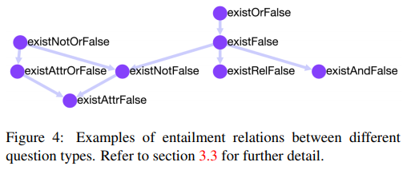
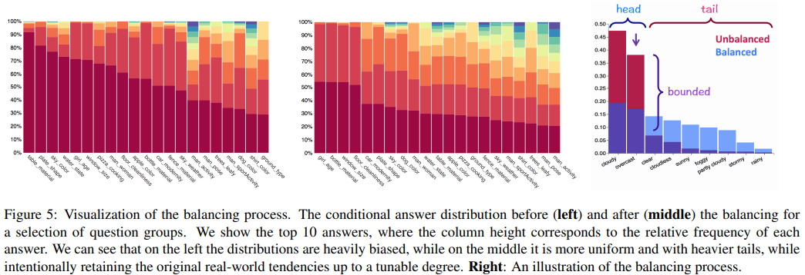
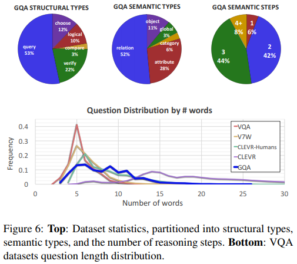
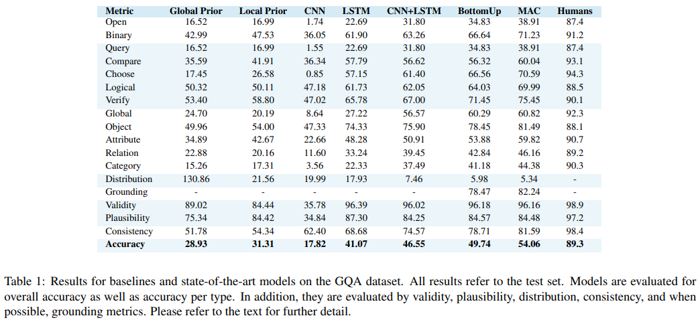

Drew A. Hudson, Christopher D. Manning  
[arXiv](https://arxiv.org/abs/1902.09506), [pdf](https://arxiv.org/pdf/1902.09506.pdf), [HP](https://cs.stanford.edu/people/dorarad/gqa/)  
CVPR2019

# どんなもの？
実世界の視覚的推論と構成的質問応答のための新しい GQA データセットを開発．  
データセットの質問を作成するために，シーングラフ表現と計算言語学的手法を組み合わせて，意味的に多様な質問を生成するための効果的な手法を提案．  
一貫性(consistency)，根拠(grounding)，妥当性(plausibility)などの新しい5つの評価方法を提案．  

  

# 先行研究との差分
VQAデータセットには「ほとんどのトマトは赤い」というような実世界の事前分布があり，VQAモデルはその事前分布を活用しているので，物体検出以上の視覚的理解能力は必要ではない．  
また質問の構造と内容に関するアノテーションが不足しているため，モデルの動作とパフォーマンスに影響する要因を理解・特定することは難しい．

GQAでは各質問グループの回答分布より均一にする平滑化手法を適用し，事前分布ではなく視覚情報と言語情報の両方を理解する必要があるバイアスの少ないデータセットになっている．

# GQAデータセット
GQAデータセットの例  
  

GQAコンポーネントと生成プロセスの概要  
  

各画像には含まれるオブジェクト，属性，関係を表すシーングラフでアノテーションが付けられている．
各質問は，回答に到達するために実行する必要がある一連の推論ステップをリストする機能プログラムに関連付けられている．
各回答には，テキスト情報と画像内の関連する領域を示す視覚的情報の両方がある．

## Scene Graph Normalization
Visual Genome Scene Graph のアノテーションを利用する．  
各ノードは画像内のオブジェクト(人，雲など)を表し，1~3個の属性(色，形，材質など)に対応付けられる．  
オブジェクトはアクション(動詞)，空間関係(前置詞)，および比較を表すリレーションエッジによって接続される．  

シーングラフは自由形式の自然言語でアノテーションされているので，質問生成で使用するためにグラフとボキャブラリを正規化する．  
まずオブジェクト，属性，リレーションを含む2690クラスを使用してオントロジーを作成．  
次にオブジェクト検出の信頼度，n-gram頻度，共起統計，単語埋め込み距離，カテゴリベースのルール，および手動キュレーションによって不正確または不自然なエッジを取り除く．  
最後に，位置情報とセマンティックプロパティでグラフを充実させる．  
  

## The Question Engine
質問の生成プロセスではは2つのリソースを利用：
- 豊富なコンテンツ(オブジェクト，属性，関係の情報)を含むシーングラフ
- コンテンツから質問を形成する構造パターン  

524パターンで117の質問グループ，1,878の回答を持つ質問データを生成．  
各質問グループは3つのコンポーネントに関連付けられている：  
1. セマンティクスを表す機能プログラム
2. 自然言語で表せるテキストフレーズのセット : “What|Which <type> [do you think] <is> <theObject>?”
3. 短い回答と長い回答のペア : <attribute> ， “The <object> <is> <attribute>.”   

250の手動で構築されたパターンのシードセットから開始し，オントロジーからの単語のテンプレートを用いて VQA1.0 から得られた 274 の自然パターンを拡張． 
e.g. "Q : What color is the apple?, A : red" から "What <type> <is> the <object>? <attribute>" を作成．    

各オブジェクトについて，直接的(e.g. "the bear", "this animal")もしくは非直接的("the white bear", "the animal behind the tree")なリファレンスを付ける．
これによって柔軟な質問生成が出来る．  

最後にシーングラフ要素のデコイセットを作成する．  
e.g. ケーキを食べている子について (s, r, o)(e.g. (girl, eating, cake))が得られると，s に関連するものやシーン内の他のオブジェクトの共起性を考慮してディストラクターを選択．  
"Is the girl eating ice cream?"  

ランダムに質問パターンを選択して質問を自動生成する．

## Functional Representation and Entailment
各質問パターンは，機能プログラムの形式で構造化された表現に関連付けられている  
ex) Q : What color is the apple on the white table? は次のプログラムと等しい  
select : table → filter : white → relate(subject, on) : apple → query : color．  

  

これらの意味的に明確な表現は，自由形式の質問に勝る複数の利点がある：  
1. 質問のテキストや意味の長さ，タイプ，トポロジーなどの軸に沿って性能を分析できるので，手法の包括的な評価が可能
2. データセットのばらつきを調整し，質問の言語バイアスを減らす
3. 異なる質問間の含意や等価関係を識別できる : Q. What color is the apple? の質問の答えを知っているなら，Is the apple red? の回答も推論できるはず．  
これらからモデルの一貫性を測定できる．  

## Sampling and Balancing
各質問に添付された機能プログラムを使用して，回答の分布をスムーズにする．

質問の機能プログラムが得られると，global と local のラベル付けする．  
global : 質問タイプ ex) color → What color is the apple?  
local : 質問の主題 ex) apple-color, table-material  
これらのラベルを使用して質問をグループに分割し，最初に global，次に localの粒度で回答分布を滑らかにする．  

  

各グループについて最初に回答分布 P を計算し，次にそれをダウンサンプリングして，以下の手順で得られたより滑らかな回答分布 Q に適合させる :   
回答の頻度が高い順にソートし，テールサイズに応じて P の重みを変え，ヘッドをテールに移動させる．  
この操作を繰り返して頻度が最小と最大の比率を維持する．

# Dataset Analysis and Comparison
GQAデータセットは113,018枚の画像に関する22,669,678の質問がある．
ボキャブラリサイズは3,097単語，候補回答は1,878．
VQAデータセットの質問と回答のそれぞれ88.8％と70.6％をカバーしている．

  

質問を structural と semantic の2つのタイプに関連付ける．

structural は質問の機能プログラムの最終操作からもたらされる :  
1. verify : yes/no の質問
2. query : オープンな質問(other?)
3. choose : 2つの候補から選択する質問．e.g. “Is it red or blue?”
4. logical : 論理的推論が必要な質問
5. compare : 2つ以上のオブジェクト間の比較質問．  

semantic では質問の主な主題を言及 :  
1. object : 存在しているかについての質問
2. attribute : オブジェクトのプロパティと位置を考慮した質問
3. category : クラス内のオブジェクトの識別に関連する質問
4. relation : 記述された関係の主題または目的について尋ねる質問．e.g. “what is the girl wearing?”
5. global : 天気や場所など、シーンの全体的なプロパティについての質問  

# 評価実験
## Baseline Experiments
- LSTM : 質問のみ
- CNN : 画像のみ
- LSTM + CNN
- local : 最も多い回答を返す
- global : 最も多い回答を返す
- Bottom-Up : VQA Challenge 2017で1位を獲得したモデル
- MAC : CLEVRで用いられているcompositional attentionモデル

  

## Transfer Performance
MACモデルで GQA で学習し VQA でテストした結果は 52.1% で，ファインチューニングした結果は 60.5%．
VQA で学習とテストをした際は LSTM+CNN で 51.6%，MAC で 68.3%．

MACモデルで VQA で学習し GQA でテストした結果は 39.8% で，ファインチューニングした結果は 46.5%．

# New Evaluation Metrics
5つの新しい評価方法を提案．

## Consistency
さまざまな質問に対する回答の一貫性を測定．  
各(q,a)ペアについて，entailed question のセット $E_q=q_1,q_2,...,q_n$ を定義する．
e.g. Q : Is there a red apple to the left of the white plate?，A : yes  
が与えられた際に，以下の質問の回答を推論できるはず：
- Is the plate to the right of the apple?
- Is there a red fruit to the left of the plate?
- What is the white thing to the right of the apple?  

モデルが正しく回答できた質問集合 Q の各質問 q について，$E_q$ の精度を計測し平均をとる．

人は 98.4% の精度だが，最良のモデルでも5つの質問のうち約1つで矛盾している．
高い精度を得るには，画像のコンテキストで質問のセマンティクスをより深く理解する必要がある．
また精度とは対照的に，関連する質問間のつながりを検査するため，経験に基づいた推測に対してよりロバストになっている．
したがって，モデルの視覚的理解スキルのより良い尺度として役立つ場合がある．

## Validity
特定の回答が質問のスコープ内にあるかどうかを確認する．  
e.g. 色の質問にいくつかの色を答える

## Plausibility
与えられた質問に対して，回答がが合理的であるか，意味があるかどうかを測定．
e.g. 象は通常ピザを食べない

具体的には，質問の主題に関連して，データセット全体で回答が少なくとも1回発生するかどうかを確認する．
e.g. 赤と緑はもっともらしいリンゴの色と見なし，逆に紫は有り得ないと見なす．

モデルが少なくとも5〜15％の確率で妥当な回答でさえ予測できず，一部の質問の理解が限られていることを示している．

## Distribution
カイ二乗統計[21]を使用して，真の回答分布とモデル予測分布間の全体的な一致度を測定する．
これによりモデルが最も一般的な回答だけでなく，頻度の低い回答も予測するかどうかを確認できる．

## Grounding
アテンションベースのモデルについて，モデルが質問に関連する画像内の領域に注目しているかどうかを確認する．
各データセットインスタンスについて，質問または回答が参照する視覚領域へのポインター r を定義し，その領域に対するモデルの視覚的アテンション(確率)を測定する．
これによりモデルが画像内でその推論を根拠とする度合いを評価できる．

