Nils Murrugarra-Llerena, Adriana Kovashka  
[pdf](https://people.cs.pitt.edu/~kovashka/murrugarra_kovashka_cvpr2019_crossmod.pdf)，[dataset](https://github.com/nineil/cross_mod/)  
CVPR2019  

# どんなもの？
画像のキャプショニングはそれをする人の性格や，画像の中で注目する点によって異なってくる．  
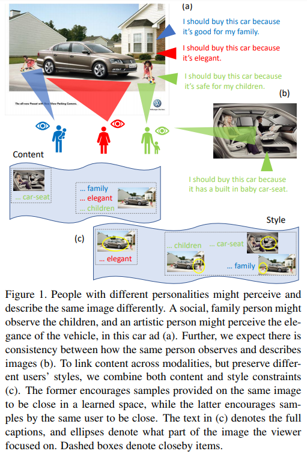  
人によっては車の安全性能を重視したり，形状を重視したりする．その注目している部分に応じてキャプションが変わってくる．  

このキャプションや注視の仕方，ユーザーの性格を互いに検索し合うようなタスクの提案とデータセット，モデルの設計を行った．  
タスク例：ユーザーがある画像をどのように見たかに基づいて，その画像のキャプションを予測．

# 先行研究との差分
パーソナライズされたキャプションを生成する方法はあるが，人の画像の見方(注視)が表現方法(キャプション)に与える影響については考慮されていない．

提案手法では，注視とキャプションのモデル化に加えて，これらのサンプルを提供するユーザーの個性もモデル化する．  
同じ画像上の注視表現とキャプションのサンプルが類似するような制約を組み込んだモデル(Content)と，同じユーザーから提供されたサンプルが類似するような制約を組み込んだモデル(Style)を統合する．

# introduction
私たちのアプローチはソーシャルメディアの文脈で使用することができます。 たとえば、ソーシャルメディアのプロフィール[24]からの性格の推定値や注目している投稿に関する情報を使用して、Facebookユーザーが写真にキャプションを付ける方法を予測するために使用できます。 あるいは、ユーザーが自分の休暇の写真からナラティブを作成する方法や、興味に応じて他のユーザーの休暇の写真を見る方法を推測できます。


# データセット作成
2種類のデータセット（Ads，COCO）を作成．各アノテーターは15枚の画像に対し3つのモダリティ(Gaze, Caption text, Personality)に関するアノテーションをする．  

64,832の広告を含む[データセット](http://people.cs.pitt.edu/~kovashka/ads/) [16](https://arxiv.org/abs/1707.03067)を使用．  
alcohol, travel, beauty, animal rights というトピックからそれぞれ15のランダムにサンプリングされた画像で60セットを構成．各セットを3人のアノテーターに見せた．  
139人のアノテーターによって，543枚の画像に対し2,700のアノテーションを集めた．  
COCOデータセットでは，多くのオブジェクトを含む雑然とした画像を選択し，79人のアノテーターによって363枚の画像に対し1,350のアノテーションを集めた．

3つのモダリティについて：
- Gaze : [BubbleView](https://arxiv.org/abs/1702.05150) を用いて注視しているところをシュミレーションした．ぼやけた画像が表示され，その一部をクリックするように視聴者に要求し，明確な円形の領域を明らかにする．これは注視表現と強く相関するデータを返すことが知られている．このクリックの場所と順序を記録．   
- Caption text : 広告のデータセットでは，次のフォームに従って画像の意味の記述を依頼．“I should [action that the ad prompts] because [reasoning that the ad provides].” e.g. “I should buy this perfume because it will make me attractive.” COCO画像については，画像が示している内容の記述を依頼．
- Personality : artistic, trusting, neurotic vs laid-backなどの特性を含む性格についての質問[32](https://www.sciencedirect.com/science/article/pii/S0092656606000195)に答えるように依頼．

データ収集には Amazon Mechanical Turk を使用．

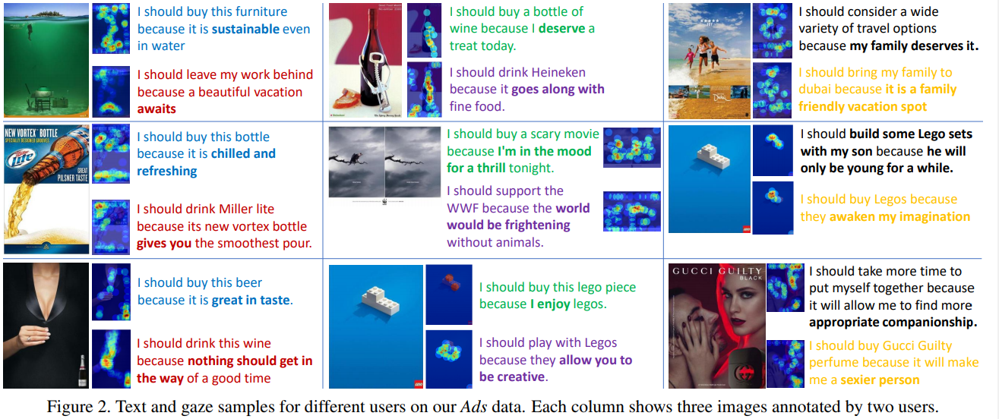  
最初の列では，青のユーザーは形容詞の単語を多く使用し，赤のユーザーは動詞を多く使用している．正確に関する質問結果から赤のユーザーはより内向的であり，精力的な感情と動詞の使用する傾向がある．


# model
6つの検索タスクを考える．
- gaze to personality (g2p)
- text to personality (t2p)
- personality to gaze (p2g)
- text to gaze (t2g)
- gaze to text (g2t)
- personality to text (p2t)  
これらすべてで，同じ画像の同じユーザから別のサンプルを受け取ったときに，異なるモダリティで，与えられたユーザが提供したアノテーションを検索したい．  
例えば，ユーザが画像をどのように見たかを考慮して，画像を説明するために書いたテキストを検索する．

画像は Inception-v4 CNN[36](https://arxiv.org/abs/1602.07261) を用いて特徴を抽出する．次に，顕著性マップを畳み込み特徴サイズにサイズ変更し，それらを一緒に乗算することによって，BubbleView顕著性マップで画像特徴をマスクする．最後に平均プーリングを実行して1536次元の特徴ベクトルを取得．   
テキストのアノテーションはGloveを用いて200次元の特徴を抽出する．  
パーソナリティは，[32](https://www.sciencedirect.com/science/article/pii/S0092656606000195)のパーソナリティに関する質問のスコアを含む10次元の特徴ベクトルを使用．  

triplet lossを用いるために，各モダリティを全結合層を介して共有の200次元特徴ベクトルにする．
次に $x$ (入力)と $y$ (出力)のモダリティごとに，コンテンツとスタイルの制約を生成．  
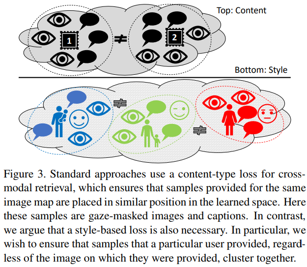  


## Content Network
同じ画像に関するモダリティごとの表現を獲得する．  
ユーザー $a$ によって提供された画像 $i$ に関するキャプションを $t_i^a$ とし，注視表現マップを $g_i^a$ とする．
キャプション/注視表現を得るために提示された画像の特徴を $v_i^a$ とする．

以下の埋め込みペアは似ているべき(*は任意のユーザー，i,j は異なる画像)  
$\{x_i^*, y_i^*\}, \{x_i^*, x_i^*\}, \{y_i^*, y_i^*\}, \{v_i^*, x_i^*\}, \{v_i^*, y_i^*\}$

例えば $x$ をキャプション， $y$ を注視表現とすると，  
同じ画像に関するキャプションと注視表現のサンプルは似ているべき，  
同じ画像に関する異なるユーザーから提供されたキャプションサンプルは似ているべき，  
キャプションと注視表現は元画像表現と似ているべき．  
最後の制約は，各画像が3人のユーザーによって観察され，それぞれが潜在的に異なる注視表現マップまたはキャプションを提供するために必要．

以下のペアは似ていないべき(anchorとは異なる画像を参照しているため)：  
$\{x_i^*, y_j^*\}, \{x_i^*, x_j^*\}, \{y_i^*, y_j^*\}, \{v_i^*, x_j^*\}, \{v_i^*, y_j^*\}$

以上をまとめたlossを用いて学習する：  
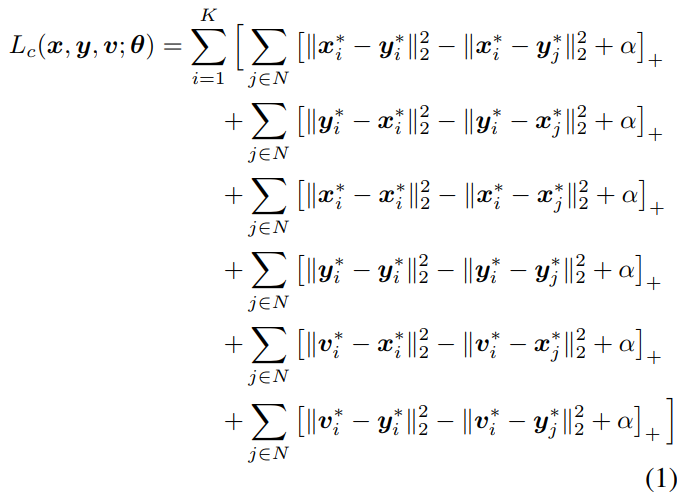  
$\alpha$ : triplet margin

このネットワークでは，$\{x,y\} : \{t,g\}, \{g,t\}$ のみ対象する．

## Style Network
同じユーザーから提供された異なるサンプル間の類似度を獲得する．  
$a, b$ を異なるユーザーとする．  
ここでは任意の画像に関して同じユーザーから提供されるアノテーションは似ているべき：  
$\{x_*^a, x_*^a\}, \{y_*^a, y_*^a\}, \{x_*^a, y_*^a\}$  

異なるユーザーから提供されるアノテーションは似ていないべき：  
$\{x_*^a, x_*^b\}, \{y_*^a, y_*^b\}, \{x_*^a, y_*^b\}$  

このネットワークでは，$\{x,y\} : \{t,g\}, \{g,p\}, \{t,p\}$ を対象とする．  
ここで $p$ を入力として扱うと，15(もしアノテーターがそれ以上のタスクを行った場合それ以上)のポジティブがあるので対象としない．  

以上をまとめたlossを用いて学習する：  
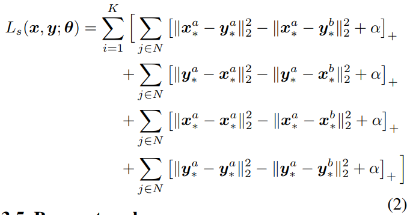  

## Base Network
Base Networkに上記の2つのlossを追加することによって類似度を確実にする．  
Adsには VSE++[10](https://arxiv.org/abs/1707.05612) を使用．
このネットワークは以下のlossで学習する：  
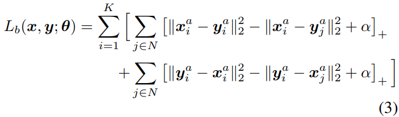  
同じユーザーで同じ画像に関する異なるモダリティのサンプルは似ていて，異なる画像に関しては似ているべきでない．  

## Combining base, content and style
今までの特徴量を組み合わせた埋め込みを計算する：

```math
x = \beta_b*x^b + \beta_c*x^c + \beta_s*x^s
```

0.25ステップ，$[0,1]$の範囲の値を用いて各タスクごとにvalidationセットの重みを最適化する．  

## Joint embedding and privileged information
上記の説明ではモダリティのペアごとに別々のネットワークを作成したが，すべてのペアに対するすべての制約を同じ空間に埋め込むこともできる．  
式1~3をまとめ，1つのネットワークでトレーニングすると特定のタスクで性能が向上．


# 実験
ユーザー $a$ の画像 $i$ のサンプル $x_i^a$ (caption, gaze, personality) に対して，$y_i^a$ を検索する．  
ネガティブは 14件：2件は $y_i^b$ , 12件は $y_j^b$  
トレーニングとテストの両方に出現するユーザーは居ないように設定．  

3つの評価方法を用いる：
- top-1 accuracy
- top-3 accuracy
- rank

比較手法としてVEIT[42](https://arxiv.org/abs/1711.09825) を用いる．これはパーソナリティを考慮し，特定のユーザーが特定の画像に対して提供するハッシュタグを予測する．  

## Adsデータセットでのrank結果
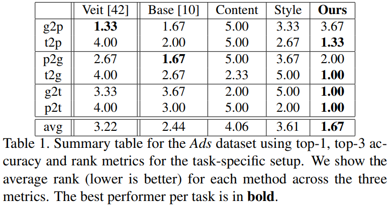  

## COCOデータセットでのrank結果
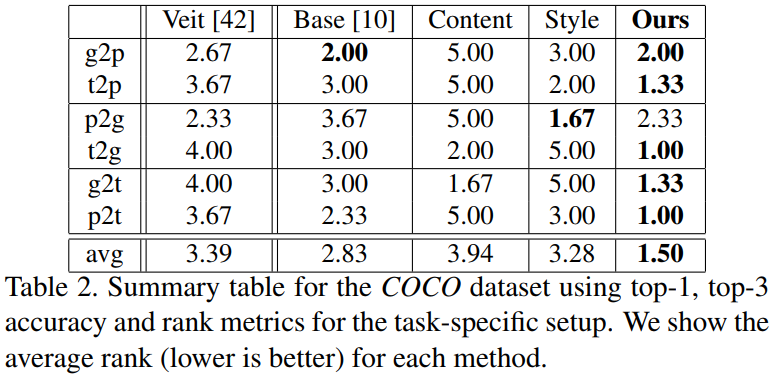  

## Adsデータセットでのtop-3 accuracy結果
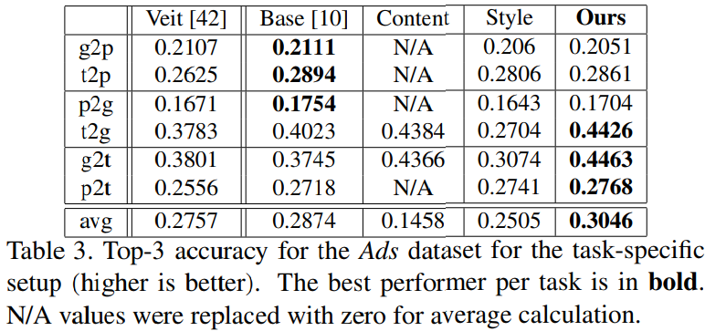  

## COCOデータセットでのtop-3 accuracy結果
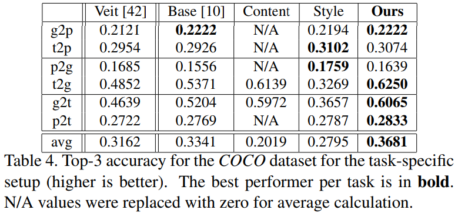  

提案手法はCONTENTとSTYLEが補完的な情報を提供するのでt2gとg2tの性能が良い．  
パーソナリティが含まれるタスクに関しては，STYLEが冗長な情報を提供するため性能が出ない．  

top-3 accuracyにおいて，g2t/t2gが最も簡単なタスクで，g2p/p2gが最も難しい．

## Joint modeling of all tasks
  
  
全ての結果でベースラインよりは性能が良い．

タスクごとと全てのタスクを組み合わせモデルの比較：
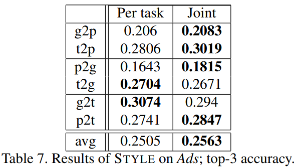  
トレーニング時に3つ目のモダリティを使用することは，関連性の低いモダリティペアがある場合にのみ役立つ．   
視線とテキストは密接に関連しているためタスク固有のネットワークの方が良い．

## Content/style/base weights
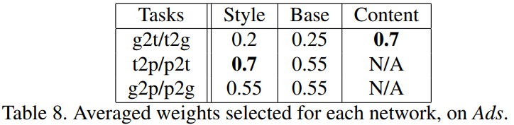  
視線とテキストは密接に関連しているため，このタスクに関してはcontentが重要．それ以外のタスクでは重要ではない．  

# future work
ユーザーごとではなく，性格や知覚が似ているユーザーグループを作成するなどより効率の良い学習方法を調べる．  
他のドメインへの拡張．