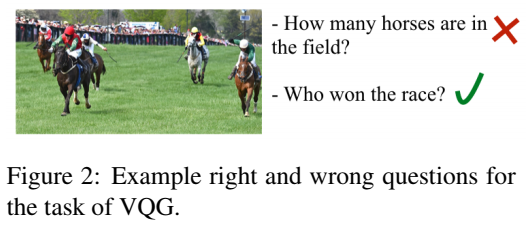
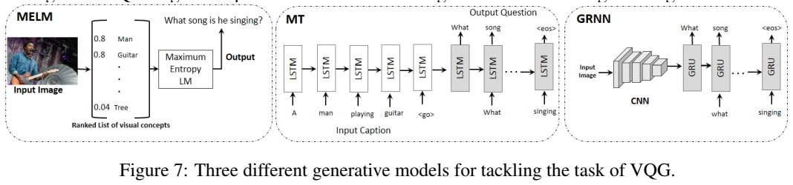

Nasrin Mostafazadeh, Ishan Misra, Jacob Devlin, Margaret Mitchell, Xiaodong He, Lucy Vanderwend  
[arXiv](https://arxiv.org/abs/1603.06059) , [pdf](https://arxiv.org/pdf/1603.06059.pdf) , [DL](https://www.microsoft.com/en-us/download/details.aspx?id=53670) , [GitHub](https://github.com/gitlost-murali/Natural-Questions-Generation-from-Images)  
ACL2016

# どんなもの？
人が画像を見た時に思う自然な質問とは，得られたオブジェクトに関する推論のはず．  
  
自動生成されたキャプションはオブジェクトを文字通り説明しているだけ．  
人が思うような質問は抽象的概念に関する単語が使われるので，これをシステムにさせたい．  

与えられた画像に関する「自然で魅力的な質問」を生成する Visual Question Generation(VQG) という新しいタスクを提案．  

またVQGのためのオブジェクトやイベントを含む様々な画像をカバーする3つのデータセットを作成．

# 先行研究との差分
作成したデータセットは，従来のキャプションのデータセットよりも抽象的な単語を含んでいる．  

また自動評価指標(BLEUなど)と人の評価の相関を計算し，∆BLEUが最も相関が高かった．  

システムと人のパフォーマンスには大きなギャップがあることを示した．

# Task Definition
タスクは与えられた画像に関する会話の開始に役立つ自然な質問を生成すること．  
視覚的に検証可能な質問，すなわち画像のみを見ることによって答えることができる質問はこのタスクの範囲外．  
  

# データセット作成
AMTでVQGの質問を収集．  
詳しくは[別資料](https://aclweb.org/anthology/N16-1147)に掲載  
3種類のデータセットを作成し，それぞれ5,000の画像と画像ごとに5つの質問がある．  

## $VQG_{COCO-5000}$ and $VQG_{Flickr-5000}$
MS COCOデータセットの画像のサンプルに対するVQG質問を集めた．関連データセットとの比較を可能にするために，CQAデータセットとVQAによってアノテーションが付けられたMS COCOの5,000画像をサンプリングし，このデータセットをVQGcoco-5000する．

   
CQAの質問はキャプションからのルール適用によって生成されるので，それらは常に首尾一貫しているわけではない．  
VQAの質問はロボットの詳細な視覚的理解を評価するために書かれているので，それらの質問は主に視覚的に根拠のある文字通りのもの．

  
(a)では各アノテーションにおける，MSCOCOで金色？(gold-annotated)にアノテーションされたオブジェクトの言及の割合を比較．  
COCOキャプションに次いでVQGが高く，VQAやCQAでは回答部分に含まれることが多いので低い．  
(c)verb part of speech : 動詞の割合？   
(d)‘think’, ‘win’ などの抽象的な単語の割合．最も一般的な[抽象語リスト](https://www.aclweb.org/anthology/N15-3006)を使用．  
(e)BLUEによるアノテーションの類似性．自然な質問をすることに対する人間間の総意(consensus)の存在を反映している  

MSCOCOデータセットはあらかじめ一連のオブジェクトカテゴリが指定されているので，それがカバーする概念に関して制限がある．→ Flickrのデータセットを追加．  
  
Flickrのデータセット作成方法は[別資料](https://aclweb.org/anthology/N16-1147)に掲載

## $VQG_{Bing-5000}$
特定のイベントタイプのより代表的な画像を取得するために，1,200のイベント中心のクエリ用語で検索した．  
クエリ用語はWordNetで‘event’,‘process’の下位語，1,000件の最も頻繁なTimeBankイベント，手動で生成された30件のステレオタイプのイベントから，Project Gutenbergの単語頻度に基づく上位1,200のクエリを選択．
クエリごとに最初に検索された4〜5枚の画像を収集．

## Statistics
3つのデータセットは75,000の質問と15,000の画像を含む視覚的概念とイベントの広い範囲をカバーしている．  
平均質問長は6単語  
  

質問のnグラム分布（n = 6）  
  

クラウドソーシングタスクの統計  
  

## $Captions_{Bing-5000}$
$VQG_{Bing-5000}$の画像はMSCOCOデータセットとは大きく異なる．  
MSCOCOキャプションで使用されたのと同じ方法で，$VQG_{Bing-5000}$内の各画像に対して5つのキャプションをクラウドソーシングで生成し，$Captions_{Bing-5000}$とする．  

最先端のMSRキャプションシステムのテスト結果  
  
結果に大きな差があることから，$VQG_{Bing-5000}$が新しいクラスの画像をカバーしている．

# 評価実験
## 生成モデル
3つのモデルで実験  
  
画像特徴抽出にはVGGNetを使用．  
MTの変換のソースとしてMSCOCOのキャプションと$Captions_{Bing-5000}$を使用．  
MELMとMTは首尾一貫した文章を生成しない傾向がある．  
Gated Recurrent Neural Network (GRNN)で最も良い結果を得られた．  

## 検索モデル
まず候補プールを得るために各テスト画像のためのK最近傍画像を計算．Kを動的に設定することによって最も競争力のある結果を得た．  
一定の距離を超える候補画像がノイズになったので，最大距離のパラメータを設定．   
テスト画像に非常に類似した画像が存在する場合，候補プールは無視することができ，そのテスト画像が唯一の候補になるはずなので，最小距離パラメータを設定．  
これらのパラメータはすべて人間の質問に対してSmoothed-BLEUを使用し，対応するvalidationセットに合わせて調整．

プール内の各画像に5つの質問があると仮定すると，最良の質問とは他の4つの質問と最も意味的に類似している質問と定義する．これにより，K個の候補質問が得られる．
- 1-NN : K=1
- K-NN : K=30, max-distance=0.35, min-distance=0.1とする．SmoothedBLEUとAverage-Word2Vec（gensim）を用いて30の候補質問から他の質問と最も類似度が高い質問を出力

# 結果
- 人による評価 : AMTの3人のクラウドワーカーに候補質問の質を3段階で評価
- BLEU
- METEOR 
- ∆BLEU : リファレンスの質を区別して，リファレンスごとに評価を行う必要があるので，1つあたり3人の評価をクラウドソーシングし多数決

∆BLEUが人による評価と最も相関があった．∆BLEUはBLEUと競合的であるので，BLEUも人による評価と相関がある．  
  

Xはテストするデータセットのトレーニングのみ行っている．  
$Human_{consensus}$：テスト画像のアノテーションの総意．  
$Human_{random}$：5つのアノテーションからランダムに選択．  
  
画像の多様性が少ないので，全てのモデルでCOCOの結果が最も良い．  
自動評価指標においてBingは$GRNN_X$が最も良い．  
Bingが一番要求が高く，コミュニティにとって意味がある．  

## 成功例  
  

## 失敗例  
  
システムはこれまでに見られなかった概念の組み合わせを理解できない．

# 今後の展望
トレーニングデータのサイズを増やすことを検討する．  
また抽象的な概念を一般化することが出来るモデルの開発に注力する．

また会話システムに組み込むことを考え，会話の時系列情報を用いることも検討する．