Lixin Liu, Jiajun Tang, Xiaojun Wan, Zongming Guo  
The IEEE International Conference on Computer Vision (ICCV), 2019, pp. 4240-4249  
[pdf](http://openaccess.thecvf.com/content_ICCV_2019/papers/Liu_Generating_Diverse_and_Descriptive_Image_Captions_Using_Visual_Paraphrases_ICCV_2019_paper.pdf), [Supplementary Material
](http://openaccess.thecvf.com/content_ICCV_2019/supplemental/Liu_Generating_Diverse_and_ICCV_2019_supplemental.pdf)  

# どんなもの？
BLEUやCIDErなどの評価スコアが高いにもかかわらず，現在の最先端モデルで生成されたキャプションはまだ満足できるものではない．  
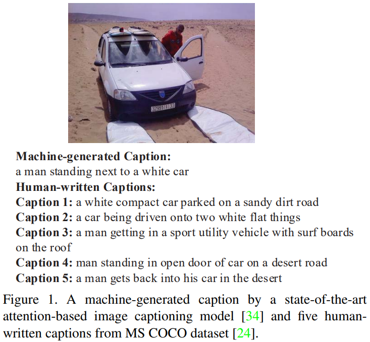  
コンピューターは，非常に高頻度の表現を使用した「安全な」出力文を好み，重要な詳細を無視して明らかな事実のみを記述する傾向がある．  
人間は，より多様な表現(like sandy dirt road and standing in open door, etc.)を使用することにより多様性のあるキャプションを書き，より重要な詳細(like in the desert and with surfboards, etc.)を説明することにより記述性を高めることを好む．

生成したキャプションの多様性と記述性を改善するために，visual paraphrases を用いて2段階のデコーディングを行うモデルを提案．  


# 先行研究との差分
人間が書いたキャプションに似た良いキャプションにはいくつかの特性があるべき
1. Fluency : キャプションは流暢な文章であるべき
2. Relevance : キャプションは視覚的な内容を正しく説明し，画像と密接に関連しているべき
3. Diversity : 良いキャプションには，多様な言葉遣いと豊かな表現が含まれているはず
4. Descriptiveness : 良いキャプションは画像内の重要で，特定の，詳細なアスペクトを参照して画像を説明する．  

通常画像キャプション生成に用いられるデータセットには，1画像に対して複数のアノテーションがある．  
従来の方法ではこれらを独立したサンプルとして扱っている．

これら複数のアノテーションは同じ画像について記述しているので，visual paraphrases と見なすことができるはず．  
提案モデルは視覚意味情報だけでなく，visual paraphrases からテキストの関係も利用して多様で説明的な画像キャプションを生成する．


# 提案モデル
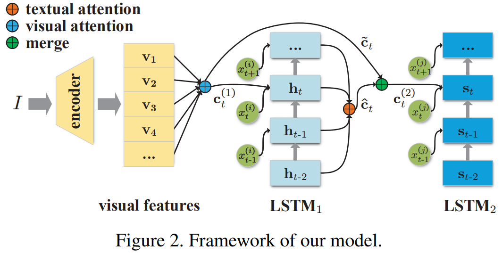  

## Visual Paraphrase Pairs Selection
各画像 $I$ は $d$ 個のキャプション $C={C_1,...,C_d}$ を持っている．  
score function を用いて visual paraphrase を選択する：  
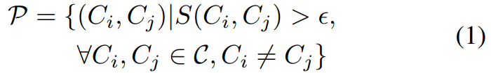  
$S()$ : score function  

##  Caption Generation
2段階のデコーダーを用いる．  
1つ目のデコーダーは $C_i$ を生成する．  
2つ目のデコーダーは $C_i$ を visual paraphrase である $C_j$ に言い換える．  

まず encoder を用いて画像 I から画像特徴 $V={v_1,v_2,...,v_{|V|}}$ を得る．  
1つ目のデコーダー LSTM_1 を用いてキャプション $C_i=\{x_t^{(i)}\}_{t=1}^{|C_i|}$ を生成する．  
[Att2i](https://arxiv.org/pdf/1612.00563.pdf) モデルを用いる．  
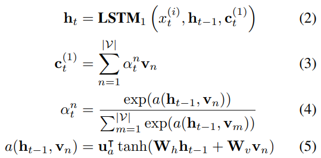  

式 3~5 をまとめて $c_t^{(1)}=\text{Attn}(h_{t-1},V)$ と表す． 
$C_i$ を生成した後，LSTM_1 の隠れ状態と画像特徴量 $V$ を2つ目のデコーダー LSTM_2 に入力する．  
各単語を生成する時に $C_i$ と $V$ をマージする．  

アテンションを用いて $V$ , $C_i$ から $C_j$ に関する情報を得る：  
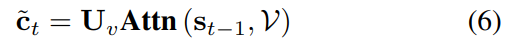  
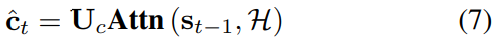  
$s_t$ は LSTM_2 の隠れ状態．  
$H, V$ は異なるモダリティなので，全結合層を用いて同じ埋め込み空間にマッピングする．  

ゲート $g_t$ を用いてマルチモーダルな特徴を結合する：  
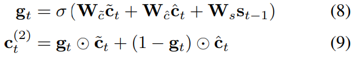  
$\sigma$ はシグモイド関数．$\bigodot$ は要素積．  

$C_j$ を生成する時，LSTM_2 は次の単語を生成するために visual attention によって画像内の異なる領域に注目し，textual attention によって $C_i$ とは異なる単語に注目する．  

Softmaxを使って単語分布を計算する：  
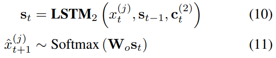

Loss :  
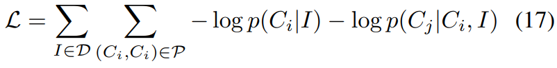  

トレーニング時には teacher forcing strategy．  
テスト時には beam search strategy を用いる．

## Scoring Functions
### Sentence Length
有益な情報を提供したり，多様な表現を使用するキャプションの文長は長い場合が多い：

```math
S_{len}(C_i, C_j) = length(C_j) - length(C_i)
```

閾値 $\epsilon\geq0$ として，$C_j$ が $C_i$ より長い時 visual paraphrase ペアとして選択する．

### Syntactic Complexity
詳細な情報を提供するようなキャプションは，多くの修飾子が含まれているような複雑な構文構造を含む場合が多い．  
構文の複雑さの尺度として，文の構文木の枝の数を測定する [Yngve score](https://www.jstor.org/stable/985230?seq=1#page_scan_tab_contents) を用いる：

```math
S_{Yngve}(C_i, C_j) = Yngve(C_j) - Yngve(C_i)
```

閾値 $\epsilon\geq0$ として，$C_j$ が $C_i$ より構文が複雑な時 visual paraphrase ペアとして選択する．

### TF-IDF Diversity
TF-IDF は n-gram の重要性を反映しているので，n-gram の TF-IDF 値の合計を C のスコアとして用いる．  
TF-IDF Diversity(Tdiv) と score function を次のように定義： 

```math
Tdiv(C)=\sum^N_{n=1}\frac{\sum_{\text{n-gram}\in C}\text{TF-IDF}(\text{n-gram})}{V_n} \\
S_{Tdiv}(C_i, C_j) = Tdiv(C_i) - Tdiv(C_j)
```

$V_n=\frac{1}{M}\sum_{C\in D}\sum_{\text{n-gram}\in C} \text{TF-IDF}$ は正規化項．  
N=3 としてキャプションの unigram, bigram, trigram について計算する．  
キャプション中によく使用される単語やフレーズが含まれる場合 Tdiv スコアは低くなる．  
閾値 $\epsilon\geq0$ として，$C_j$ が $C_i$ より稀な表現を含む時 visual paraphrase ペアとして選択する．

### Image Retrieval Rank
先行研究では，生成したキャプションから画像検索で元の画像が検索できるかによってキャプションの明瞭性や識別性に焦点を当てていた．  
同様の [画像検索ネットワーク](https://arxiv.org/pdf/1803.04376.pdf) を用いる．  
画像と対応するキャプションからCNN,LSTMを用いて特徴を抽出．同じ埋め込み空間にマッピングして画像とキャプションの類似度を計算する．  

```math
sim(I,C) = \frac{f(I)^{\text{T}}g(C)}{||f(I)|| ||g(C)||}
```

bi-directional ranking loss ：  
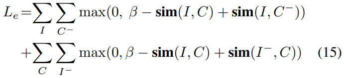  
(I, C) はトレーニングデータ内の真値のペア，$C^-$ は I のペアでないキャプション．  

COCOトレーニングセットでプレトレイン済みの検索システムを使用して，Cをクエリとした時に元の画像Iを含むトレーニングセット内の多数の画像をランク付けする．  
正確で詳細なキャプションが生成できていれば，元の画像が上位のランクにあるはず．  
Cをクエリとした時のIのランクを rank(I|C) とする．  

```math
S_{IR}(C_i, C_j) = \frac{rank(I|C_i)}{rank(I|C_j)}
```

閾値 $\epsilon\geq1$ とする．  
画像検索ランクはキャプションの関連性と記述性の側面を反映している．

# 評価実験
データセットはMSCOCOを使用．  
画像特徴は bottom-up feature を用いる．  
LSTM の hidden size : 512  
vocabulary size : 9,488  

## 評価方法
- BLEU-4
- CIDEr 
- SPICE : オブジェクト，属性，およびそれらの間の関係をどの程度効果的に保持するかを測定

これらの評価方法では多様性と記述性を評価するには不十分．  
BLEU, CIDEr では n-gram の重複を見るので，非常に一般的な n-gram を持つキャプションは高いスコアを獲得するが，そのようなキャプションは多様性と記述性に欠けている．  
スコア関数にも用いた3つの評価：  
- length : average length
- Yngve : Yngve score
- Tdiv

多様性を評価する3つの評価方法を追加．スコアが高いほど多様なキャプション：  
- Dist-2 : distinct bigram の数
- Dist-3 : distinct trigram の数
- Dist-S : distinct sentence の数

AMTで20人のクラウドワーカーによる評価も行った．  
テスト画像から100枚の画像をサンプリングしキャプションを生成．  
各キャプションにつき4人が1~5段階で "fluency", "relevance", "diversity", "descriptiveness" を評価．

## ベースライン
- Attention : bottom-up feature を用いた Att2in モデル．
- GAN：Conditional GAN[CGAN](https://arxiv.org/pdf/1703.06029.pdf)
- IS : Introspective Speaker method([pdf](https://arxiv.org/pdf/1701.02870.pdf))
- CL : Contrastive learning method([pdf](https://arxiv.org/pdf/1710.02534.pdf))
- CIDEr-RL : CIDErのスコアを報酬として学習([pdf](https://arxiv.org/pdf/1612.00563.pdf))
- DiscCap : mixed objective of CIDEr and discriminative objective rewards([pdf](https://arxiv.org/pdf/1803.04376.pdf))
- Stack-Cap : A coarse-to-fine strategy using twostep decoders with CIDEr optimization.([pdf](https://arxiv.org/pdf/1709.03376.pdf))

## 定量的評価
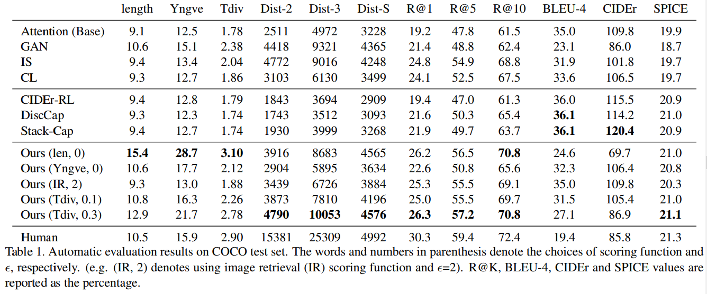  
Human は BLEU, CIDEr 以外のスコアが高い．  
Our(len) は多様なキャプションを生成できるが，長くなりすぎるとキャプションとしての品質が下がるので BLUE, CIDEr のスコアが下がる．  
Our(IR) は従来手法より高い BLUE, CIDEr スコアを獲得している．  
Our(Tdiv) は多様性と検索，SPICE の性能が良い．SPICEスコアが高いほどオブジェクト，属性，それらの関係を正しく記述している．  
$\epsilon$ の値を大きくすると多様性が上がるが，BLUE などのスコアは下がる．  
Our(IR) より Our(Tdiv) の方が検索の性能が良いのは，トレーニングと評価に使用される検索モデルの違いが原因である可能性がある．  
GANは非常に多様なキャプションを生成するが，BLEU, CIDEr, SPICE のスコアは低く，正確なキャプションが生成できないので検索の性能が悪い．  
IS, CLは主に検索で使用される識別キャプションの生成に焦点を当てているので，検索の性能は良いがBLEU, CIDEr, SPICE のスコアは提案モデルの方が良い．  
強化学習ベースの CIDEr-RL, DiscCap, Stack-Cap によって生成されるキャプションはCIDErを直接最適化するので，高いBLEUおよびCIDErスコアを獲得する．ただしDistスコアはAttentionベースラインよりもさらに低く，CIDErの最適化がキャプションの多様性を損なうことを示している．  
BLEUやCIDErなどのn-gramベースの評価方法が画像キャプションの詳細度[1]および多様性[40]と負の相関があるという以前の研究と一致している．  

## 人による評価
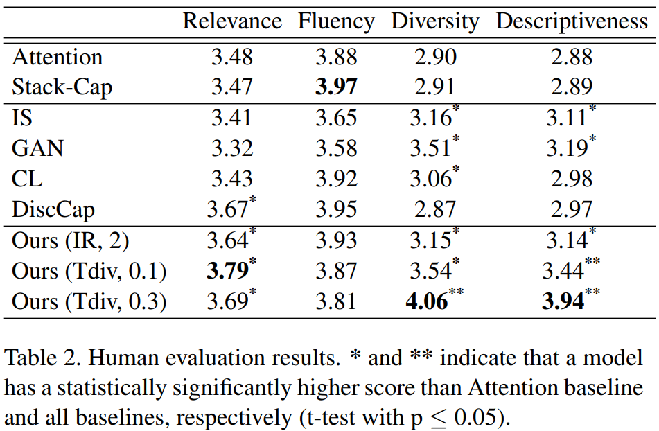  
Attention, Stack-Capと比較して提案モデルでは Fluency を維持しながら Diversity, Descriptiveness が大幅に向上する．  
IS, GAN では Diversity, Descriptiveness は高いが，Fluency, Relevance が低い．  
$\epsilon$ の値を大きくすると Diversity, Descriptiveness のスコアが上がるが，Relevance, Fluency は下がる．

## 2段階デコーダーの効果
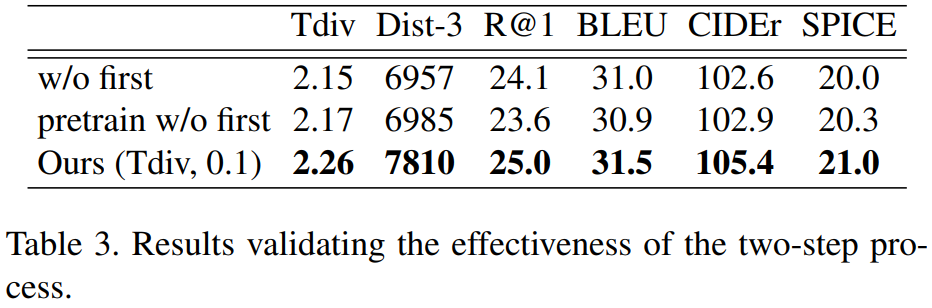  
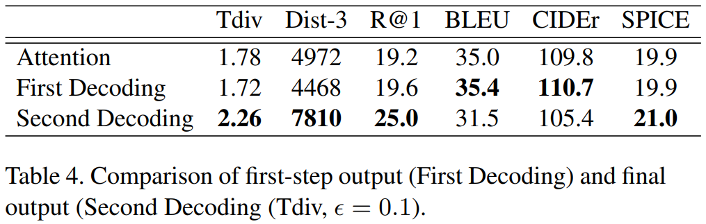  

## 定性的評価
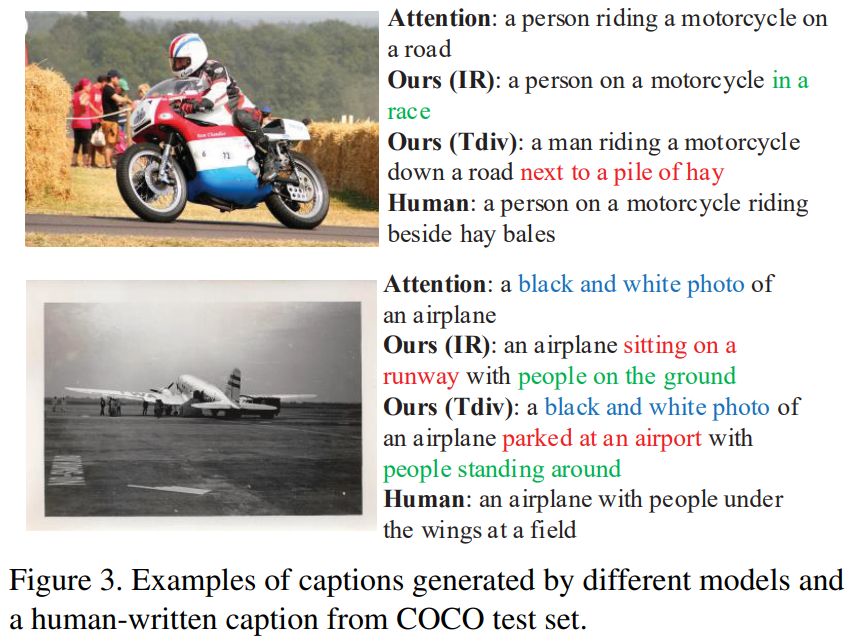  

各スコアモデルの生成結果  
  

2つのデコーダーそれぞれの生成結果  
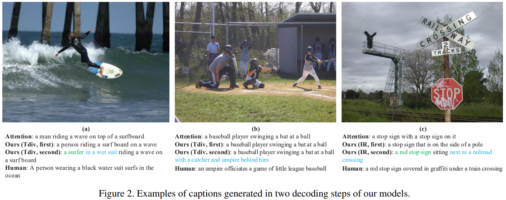  

その他の例  
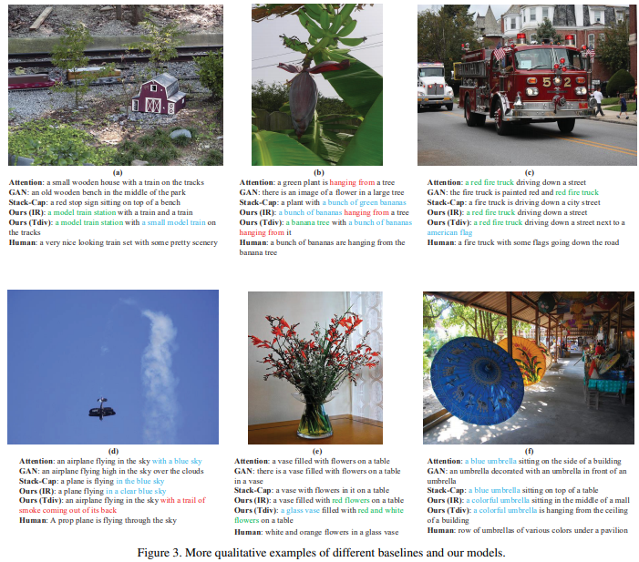  