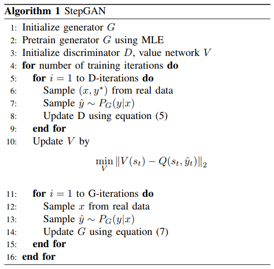
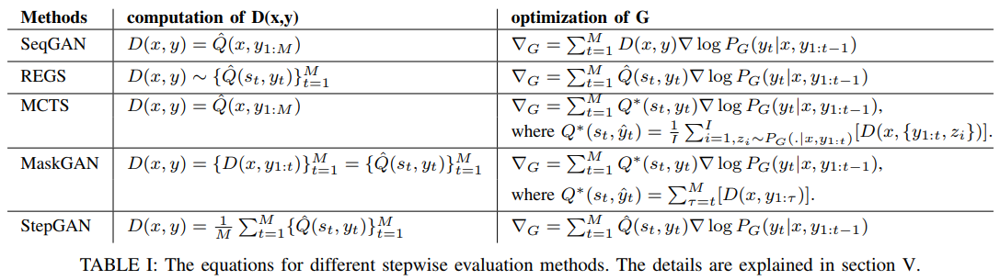
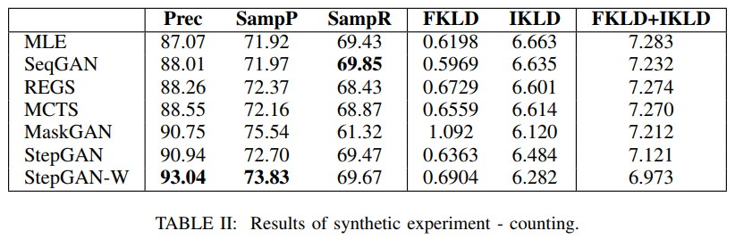
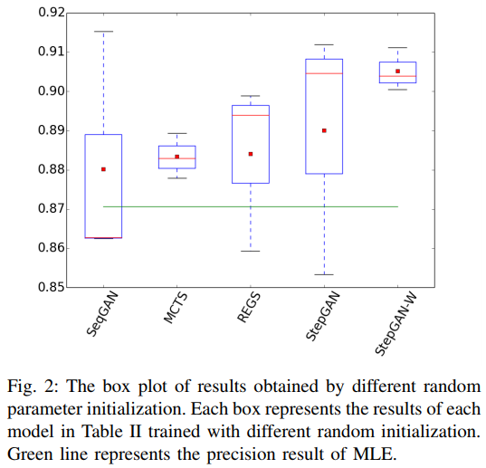
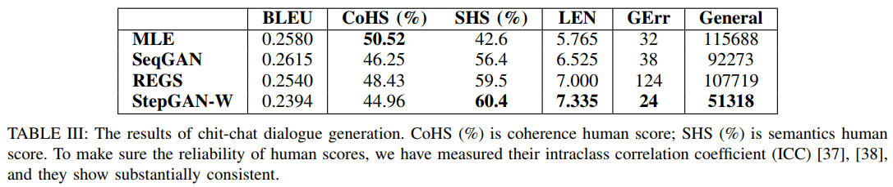
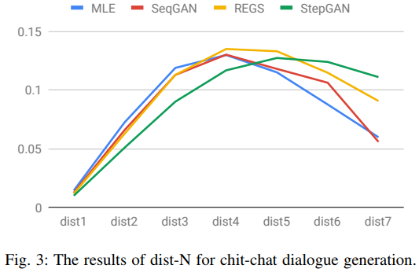
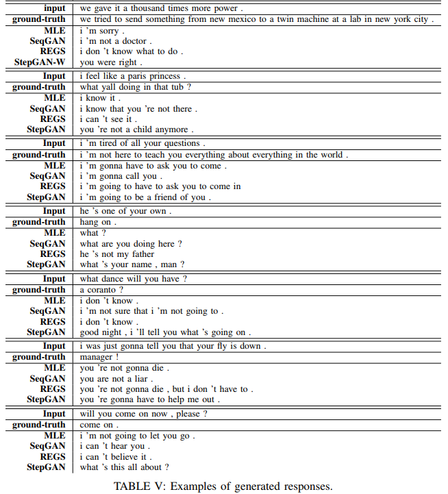

Yi-Lin Tuan, Hung-Yi Lee  
[arXiv](https://arxiv.org/abs/1808.05599), [pdf](https://arxiv.org/pdf/1808.05599.pdf), [GitHub](https://github.com/Pascalson/Conditional-Seq-GANs)  
IEEE/ACM Transactions on Audio, Speech and Language Processing (TASLP)  
Volume 27 Issue 4, April 2019, Page 788-798 

# どんなもの？
Sequence generative adversarial networks ([SeqGAN](https://arxiv.org/abs/1609.05473)) はダイアログ生成などの条件付きシーケンス生成タスクを改善するために使用されてきた．  
(条件付きシーケンス生成とは，入力に従って応答が生成されるタスクを指す．e.g. 機械翻訳，要約，質問応答，ダイアログ生成など．これらのアプリケーションでは，入力メッセージと出力応答は通常1対多のプロパティを持つ．)  
SeqGANの学習を安定させるために，Monte Carlo tree search(MCTS) または reward at every generation step(REGS)を使用して，生成されたサブシーケンスの良さを評価する．MCTSは計算コストが高いが性能が良く，REGSは計算コストは低いが性能がMCTSより低い．  

シーケンスの毎生成段階で各サブシーケンスの良さを定量化するスコアを割り当てて discriminator を修正する StepGAN を提案．  
提案する StepGAN は MCTS よりも計算コストが大幅に少なくなる．

# 先行研究との差分
一般に条件付きシーケンス生成は，cross-entropy lossを最小化することによって(MLE)seq2seqモデルを学習する．  
MLEの問題点：
1. Exposure bias : decoderの入力としてトレーニング時はターゲット，推論時は生成された応答が用いられるので，推論時に誤差が累積する  
2. One directional KL divergence : forward KL divergence は最小化するが，backwardは無視している．
3. General Responses : 一般的な反応(e.g., “i don’t know.”)を生成する傾向があり，ほとんど情報のない対話につながる．   

SeqGANではモデル応答と真値との間の差を評価する discriminator を用いることで(2)を解消．  
最適化にpolicy gradientを用いて(1)のバイアスを排除．  
SeqGANは従来手法より創造的な文を生成することができるが，まだ最適化は非効率．  

SeqGANはpolicy gradientを使用するが，sparse reward(最後のタイムステップのみ非ゼロの報酬)の問題がある．これによってトレーニングが非効率になる．  

またchit-chat chatbotでは誤った応答と正しい応答が同じ接頭語を共有する可能性がある．  
e.g. “I’m John.”，“I’m sorry.” は同じ "I’m" という接頭語だが，“What ’s your name?” という質問に対する応答には後者は不適切．  
従って同じ接頭辞にもかかわらず反対のフィードバックを受け取りる．この現象はトレーニング中に継続的に発生し，トレーニング信号は非常に多様になり，学習が安定しない．

そこで MCTS を使用するとトレーニングを安定させるが，大規模なデータセットを扱う場合は計算上困難．  
大規模データセットを扱うためにREGSが提案されているがMCTSよりも性能が悪い．  
先行研究から stepwise evaluation は結果に著しく影響を与える可能性があることが分かっているが，それは徹底的に検討されていない．

MCTSに代わる stepwise evaluation 方法を提案する(StepGAN)．ツリー検索を計算せずに即時の報酬を推定するためにdiscriminatorを使用することでMCTSよりも計算コストが大幅に少なくなる．


# 従来のシーケンス生成
入力 $x=\{x_1, x_2,...,x_t,...,x_N\}$，出力 $y=\{y_1, y_2,...,y_t, ...,y_M\}$ とする．
## Maximum Likelihood Estimation
conditional sequence generator $G$ はseq2seqモデルベースのRNNを用いる．  
encoderが入力 $x$ を受け取った後，decoderは $P_G(y|x)=\prod_{t=1}^M P_G(y_t|x,y_{1:t-1})$ からシーケンスを生成．  
モデルは出力 $\hat{y}$ と真値 $y^*$ のクロスエントロピーを最小化することによってトレーニングする．  
しかしトレーニングと推論でdecoderの入力が異なるので exposure bias をもたらす．

## Generative Adversarial Network (GAN)
入力 $x$ を受け取ると，discriminatorはスコア $D(x,y^*)$ を最大化し，スコア $D(x,\hat{y})$ を最小化するように学習する．generatorは $D(x,\hat{y})$ を最大化するように学習する．

```math
min_G max_D \mathbb{E}_{(x,y^*)\backsim P_G(x,y)}[\log D(x,y^*)] + \mathbb{E}_{x\backsim P_r(x), \hat{y}\backsim P_G(y|x)}[\log (1-D(x,\hat{y}))]
```

言語の離散的な性質による扱いにくい勾配を克服するために，SeqGANではマルコフ決定過程としてシーケンス生成を定式化し，policy gradientを用いてGANを訓練した．  
基本的なアイデアは，generator $P_G$ のパラメータをpolicy，タイムステップ $t$ の状態を $\{x,\hat{y}_{1:t-1}\}$，行動を $\hat{y}_t$ として扱う．  
具体的には，最後のタイムステップ以外の報酬はゼロにし，最後のステップの報酬を $D(x,y)$ とする．  
これによりgeneratorがより高い $D(x,y)$ を持つ単語の確率を最大化し，他を最小化する．  
勾配は以下のようになる:

```math
\nabla_G = \sum_{t=1}^M D(x,\hat{y})\nabla \log P_G(\hat{y}_t|x,\hat{y}_{1:t-1})
```

MLEと比較して，generatorは一方向のKL divergenceの代わりにdiscriminatorによって定義されるあらゆるlossを最小化することが出来る．さらにトレーニング時と推論時で同じ $y$ を用いるので exposure bias の問題を解決する．

# STEPWISE EVALUATION APPROACH FOR SeqGAN
SeqGAN の sparse reward とトレーニングの安定性を改善するために StepGAN を提案する．  
Q-learningのアイデアを借りて少ない計算コストで自動的にstate-action value を推定する．  
  

## State-action Value
状態 $s_t=\{x,y_{1:t-1}\}$ に行動 $y_t$ をとったときのstate-action value を $Q(s_t,y_t)$ とする．  
SeqGANのstate-action valueの定義は以下の様になる：  

```math
Q(s_t,\hat{y}_t)=\mathbb{E}_{z\backsim P_G(.|x,\hat{y}_{1:t})}[D(x,\{\hat{y}_{1:t},z\})]
```

$z$ は現在のgeneratorが入力 $x$, 生成したprefix $\hat{y}_{1:t}$  から生成した単語のシーケンス．  
従って，$Q(s_t,\hat{y}_t)$ は同じprefix $\hat{y}_{1:t}$ を用いた全ての応答の期待値である．  
Q-functionの入力は $s_t, y_t$ でこれらは離散トークンである．  
Q-values は discriminator の出力なので，トークンはQ-function内で埋め込み形式に変換されると考えることができる．

REINFORCEアルゴリズムを安定させるために，勾配の式の $D(x,\hat{y}$ を $Q(s_t,\hat{y}_t)$ に置き換える：  

```math
\nabla_G = \sum_{t=1}^M Q(s_t,\hat{y}_t)\nabla\log P_G(\hat{y}_t|x,\hat{y}_{1:t-1})
```

上式の $Q(s_t,\hat{y}_t)$ は扱いにくいので，効率的に $Q(s_t,\hat{y}_t)$ を推定する方法を提案する．

## Discriminator for StepGAN
discriminatorはencoderの入力に $x$，deocderの入力に $y(\hat{y} \text{ or } y^*)$ のseq2seqモデルを用いる．  
普通のGANは以下のように学習する：

```math
\max_D \mathbb{E}_{(x,y^*)\backsim P_R(x,y)}[\log D(x,y^*)] + \mathbb{E}_{x\backsim P_R(x),\hat{y}\backsim P_G(y|x)}[\log (1-D(x,\hat{y}))]
```

先程のGANベースのシーケンス生成モデルとは異なり，StepGANの $D(x,y)$ は $Q(s_t, y_t)$ を推定するように設計されている．  
最終的なdiscriminatorスコアを生成する代わりに，タイムステップごとに自動的に $\hat{Q}(s_t, y_t)$ を推定する．  
$D(x,y)$ は $\hat{Q}(s_t, y_t)$ の平均とする：

```math
D(x,y) =\frac{1}{M} \sum_{t=1}^M \hat{Q}(s_t,y_t)
```

$\hat{Q}(s_t,y_t)$ は $Q(s_t, y_t)$ と同じ役割をするので，generatorの学習に $Q(s_t, y_t)$ の近似として $\hat{Q}(s_t,y_t)$ を使う．

## Generator for StepGAN
generatorは入力シーケンス $x$ を読み込み，生成した$\hat{y}_{1:t-1}$ に基づいて $\hat{y}_t$ を生成する．  
stepwise評価のために，式4の $Q(s_t,\hat{y}_t)$ を $\hat{Q}(s_t,\hat{y}_t)$ に置き換える．  
また先行研究と同様に，policy gradientを安定させるためのvalue baselineを生成するためにvalue network $V$ を学習する．  
discriminatorと同じ構造で，期待値 $V(s_t)$ を予測する．  
value networkは $s_t$ の $\hat{Q}(s_t,\hat{y}_t)$ を近似するように学習する： $V(s_t) = \mathbb{E}_{y_t}[\hat{Q}(s_t,\hat{y}_t)]$．  
generatorを以下のように学習する：

```math
\nabla_G = \sum_{t=1}^M \alpha_t(\hat{Q}(s_t,\hat{y}_t) - V(s_t)) \nabla\log P_G(\hat{y}_t|x,\hat{y}_{1:t-1})
```

図1ではgeneraterはseq2seqモデルだが，提案アプローチはネットワークアーキテクチャとは独立している．stepGANのトレーニングプロセスは以下の様になる：  
  

## Theory behind StepGAN
StepGANは $D(x,y) , Q(s_t,y_t)$ が以下のように直接関連している：

```math
\mathbb{E}_{\hat{y}\backsim P_G(y|x)}[D(x,\hat{y})]=\frac{1}{M} \mathbb{E}_{\hat{y}\backsim P_G(y|x)}[\sum_{t=1}^M Q(s_t,\hat{y}_t)]
```

上記の式は、すべての時間ステップtについてD（x、y）をM個の異なるスコアに分解し、分解されたスコアをQとすることができることを示唆しています。
  式（８）のため、式（６）に示されるように弁別器のアーキテクチャに単純な成分を追加することによって Q を推定する。
式(8)から以下の式を導出する：

```math
\mathbb{E}_{\hat{y}_{1:M}\backsim P_G(y|x)}[\sum_{t=1}^M Q(s_t,\hat{y}_t)] = \mathbb{E}_{\hat{y}_{1:M}\backsim P_G(y|x)}[\sum_{t=1}^M \mathbb{E}_{z\backsim P_G(.|x,\hat{y}_{1:t})}[r_{ter}(x,\hat{y}_{1:t},z)]]
```

$r_{ter}$ はシーケンス全体 $\{x,\hat{y}_{1:t},z\}$ の報酬．  
GANに基づいて $r_{ter}$ はdiscriminator score D から推定されるので：

```math
\begin{aligned}
\mathbb{E}_{\hat{y}_{1:M}\backsim P_G(y|x)}[\sum_{t=1}^M \mathbb{E}_{z\backsim P_G(.|x,\hat{y}_{1:t})}[r_{ter}(x,\hat{y}_{1:t},z)]] \\
&= \mathbb{E}_{\hat{y}_{1:M}\backsim P_G(y|x)}[\sum_{t=1}^M \mathbb{E}_{z\backsim P_G(.|x,\hat{y}_{1:t})}[D(x,\{\hat{y}_{1:t},z\})]] \\
&= \sum_{t=1}^M \mathbb{E}_{\hat{y}_{1:M}\backsim P_G(y|x)}[\mathbb{E}_{z\backsim P_G(.|x,\hat{y}_{1:t})}[D(x,\{\hat{y}_{1:t},z\})]] \\
&= \sum_{t=1}^M \mathbb{E}_{\hat{y}_{1:M}\backsim P_G(y|x)}[D(x,\hat{y}_{1:M})] \\
&= M \cdot \mathbb{E}_{\hat{y}_{1:M}\backsim P_G(y|x)}[D(x,\hat{y}_{1:M})]
\end{aligned}
```

Mで割る事で以下の式を得る：

```math
\mathbb{E}_{\hat{y}\backsim P_G(y|x)}[D(x,\hat{y})] = \frac{1}{M} \mathbb{E}_{\hat{y}\backsim P_G(y|x)}[\sum_{t=1}^M Q(s_t,\hat{y}_t)]
```

# 評価実験
ベースライン  
  

## counting task
入力シーケンス $x=\{x_1,x_2,...,x_t,...,x_N\}$ に対する正しい出力 $y=\{y_1,y_2,y_3\}$ は以下の規則に従う：  

```math
\begin{cases}
k &\backsim \{1,2,...,N\} \\
y_1 &= k-1 \\
y_2 &= x_k \\
y_3 &= N-k
\end{cases}
```

各トークン $x_t$ は0~9の数字で，$N(\leq 10)$ は入力長．  
ある入力に対して複数(平均4.97)の回答が正しい．  
ex : x = <1,8,3> , y = <0,1,2>, <1,8,1>, <2,3,0>  

100,000 training examples, 10,000 validation examples, 10,000 testing examples．  

### 評価方法
- Prec : the precision of argmax outputs  
- SampP : the precision of softmax outputs
- SampR : the recall of softmax outputs
- FKLD : forward KL divergence
- IKLD : inverse KL divergence 

```math
\begin{aligned}
FKLD &= \int_x \int_y P_R(y|x)\log \frac{P_R(y|x)}{P_G(y|x)} \\
IKLD &= \int_x \int_y P_G(y|x)\log \frac{P_G(y|x)}{P_R(y|x)}
\end{aligned}
```

### 結果
  
stepGAN-W : policy gradientに減衰する重み($\alpha_t = M-t$)を加えたモデル  
precisionはMLEよりGANベースの方が良いが，recallは過学習の為スコアが下がっている．  

パラメータの異なるランダム初期化の結果  
  
StepGAN-Wが他の方法よりも優れた性能を達成し，より安定していることを示している．  


## CHIT-CHAT DIALOGUE GENERATION
OpenSubtitles[39](http://opus.nlpl.eu/)でchit-chatダイアログ生成を学習．  

### 評価方法
- BLEU
- Coherence Human Score (CoHS) : 200例を5人によって各回答が入力シーケンスと一貫しているかどうかで評価．
- Semantics Human Score (SHS) : 200例を5人によって与えられた回答の情報量をランク付けで評価．
- LEN : 生成された回答の平均長
- GErr : 文法上のエラー．[オープンソフトウェア](https://github.com/languagetool-org/languagetool) で計測．
- General : 生成された一般的な回答の数．MLEによって学習されたモデルから生成された上位10％の回答を一般的な回答として定義．
- Dist-N : 個別のn-gramの数を数え，それを単語の総数で割る

### 結果
  

  

  
