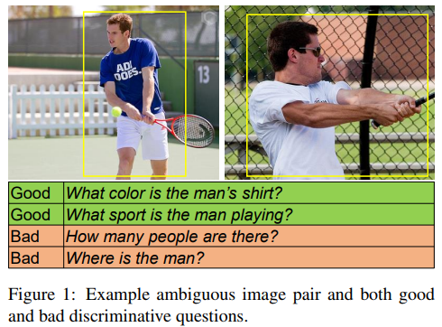
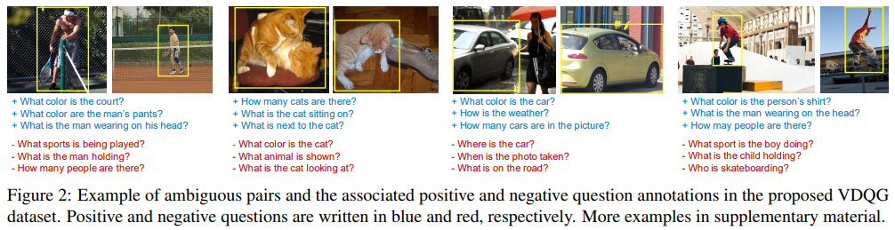
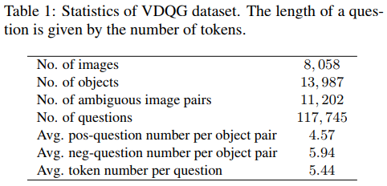
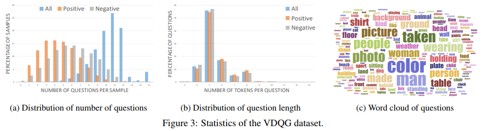
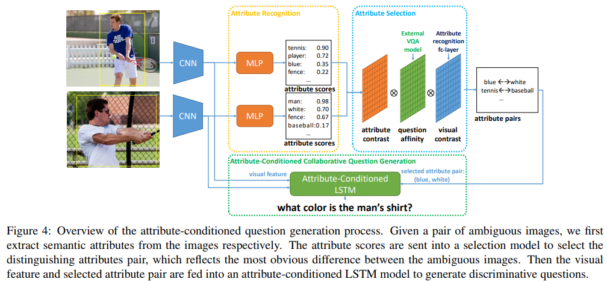

Yining Li, Chen Huang, Xiaoou Tang, Chen-Change Loy  
[arXiv](https://arxiv.org/abs/1708.02760) , [pdf](https://arxiv.org/pdf/1708.02760.pdf)  
ICCV2017  

# どんなもの？
2つの画像が与えられ，それらを区別したり明確にしたりするために良い質問を生成する Visual Discriminative Question Generation (VDQG)という新しいタスクを提案．  
Visual Genomeを拡張した10,000以上の画像ペア，100,000以上の識別と非識別の質問を含むVDQGデータセットを作成  

# 先行研究との差分
VDQGの目的は質問をしてオブジェクト間のあいまいさを解決すること．
したがって単一画像に基づいて文字通りの説明を生成することを目的とした画像キャプションとは異なる．

# abstract
視覚的な実体の曖昧さをなくすために差別的な質問を生成するという新しい問題を探る
ベンチマークを容易にするために、10,000を超える慎重に注釈が付けられた画像 - 質問タプルを含む最初の大規模データセットを紹介します。 特に、各タプルは、一対の画像と、平均して４．６の識別質問（ポジティブサンプルとして）および５．９の非識別質問（ネガティブサンプルとして）からなる。 
また、視覚的識別質問生成のための効果的な方法を提示します。 この方法は、識別可能な画像 - 質問タプルではなく、単に既存の視覚的質問回答データセットを用いて弱く監督された方法で訓練することができる。

# introduction
この研究では、ペア画像をあいまいなペアと呼びます - あいまいさは必ずしもそれらの微妙な視覚的な違いによるものではないかもしれません。 それらは、それらの深い表現において近接している同じオブジェクトクラスに属するだけでよい。 そのようなあいまいさは人間によって容易に解決することができますが、それらはマシンにとって困難である場合があります。 異なる画像ペアを区別するためには、色、動作、位置、数など、さまざまな種類の質問をする必要があります。 古典的な「二十の質問」ゲームのように、質問を慎重に選択すると、回答を絞り込むために質問者の可能性が大幅に向上します。 悪い質問はあいまいさを排除するのに失敗するでしょう。

この質問能力は、その後、一連の差別的な質問を生成し、それらに答えるようにループ内の人間に促すことに拡張することができる。 その過程で、機械は徐々に人間から言語表現を洗練し、最後に関心のあるオブジェクトを区別することができる証拠を蓄積します。
そのようなＶＤＱＧ能力は、機械がヒューマンコンピュータインタラクション（ＨＣＩ）においてより自然でインタラクティブな役割を果たすこと、または話者によってなされた参照をシーン内のオブジェクトにより正確に結び付けるためにロボットを改良することを可能にする。

機械は比較を実行するために二つの対象物の最も際立った特徴を正確に指摘することを要求される。
差別的な質問で注釈を付けられたペア画像に容易に来る既存のデータセットはありません。 したがって、私たちは直接の教師付き学習を実行することはできません。

この課題を克服するために、私たちは自然言語の質問を生成するためにLSTMネットワークを利用します。 差別的な質問をするには
これはオブジェクトフォーカスであり、LSTMを、きめ細かい属性を予測する視覚的な深い畳み込みネットワークで調整します。 ここで、視覚的属性は、LSTMから生成される可能性がある可能性のある質問の大きなスペースに対する厳しい制約を提供します。 我々は、考慮された２つのオブジェクト上のノイズの多い属性検出から最も識別力のある属性を識別するための新しい方法を提案する。 次に、選択した属性をLSTMネットワークに送ります。LSTMネットワークは、明確な質問を生成するためにエンドツーエンドでトレーニングされています。 訓練データの問題に取り組むために、我々はビジュアルゲノムデータセットから抽出された豊富な視覚質問情報を用いて、弱く監督された方法でＬＳＴＭを訓練するための新規なアプローチを紹介する［２５］。 さらに、大規模なVDQGデータセットが評価目的で提案されています。

既存の画像キャプション作成およびＶＱＧ方法とは異なり、提案されたＬＳＴＭは、識別スコア関数を通して選択された識別属性に基づいている。

# VDQG Datasetについて
既存のVQGおよびVQAデータセットは単一の画像にアノテーションが付けられた質問のみ → VDQGの定量的評価および分析には不十分なので新しいデータセットを作成

オブジェクトクラスが同じというだけでなく，視覚的にも似ている画像を集める．  
  

Visual Genomeの87のオブジェクトカテゴリから画像を収集し，同じカテゴリーラベル内で，Inception-ResNetで抽出した特徴が類似しているものを画像ペアとして選択．  

2段階のステップで質問を集める．  
最初のステップで2つの画像の違いを見分けることができる質問の生成を依頼し，2~3の差別的な質問を収集．  
次に他の視覚的に類似した画像ペアから質問を取得し，Visual Genome VQAアノテーションでトレーニングされたCNN-LSTMモデルを使用して自動的に質問を生成することによって，各画像ペアの質問セットを増やす．  
これによって各ペアは8つ以上の質問を持つが，集められた質問は差別的な質問とは保証されないので，クラウドワーカーに判断してもらう．

VDQGデータセットの統計量  
  

  

# Visual Discriminative Question Generation
  

2段階のステップからなる．
最初のステップでは識別属性ペアを見つける．属性認識，属性選択コンポーネントが用いられる．これにより，各領域は属性によって記述され，2つの領域を最も区別するペアを形成する． 
例：図4では野球用バットはほとんど見えないので，‘blue-white’属性は‘tennis-baseball’よりも識別力があると見なす． 

識別属性が与えられると，2番目のステップは識別質問を生成するために属性を使用してLSTMを調整する．

## Finding Discriminative Attribute Pairs
