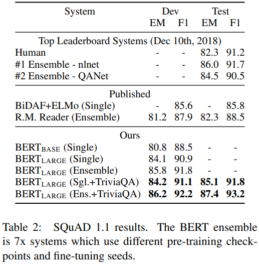

Jacob Devlin, Ming-Wei Chang, Kenton Lee, Kristina Toutanova  
Google AI Language  
[arXiv](https://arxiv.org/abs/1810.04805), [pdf](https://arxiv.org/pdf/1810.04805.pdf), [GitHub](https://github.com/google-research/bert)  

# どんなもの？
言語モデルのプリトレインは多くの自然言語処理タスク(言語推論や言い換え等のセンテンスレベルや，QAなどのトークンレベルのタスク)の改善に効果的であることが示されている．  
fine-tuningベースのBERTを提案．  
プリトレイン済みのBERTモデルに1つの出力層を追加しファインチューニングすることで，タスク固有のアーキテクチャを大幅に変更することなく，QAや言語推論などの幅広いタスク用のモデルを作成できる．

# 先行研究との差分
プリトレインされた言語表現をダウンストリームタスクに適用するための2つの既存の戦略：feature-based, fine-tuning  
[ELMo](https://arxiv.org/abs/1802.05365)などの feature-based アプローチでは，タスク固有のアーキテクチャにプリトレインされた表現を追加の特徴量として使用する．  
the Generative Pre-trained Transformer ([OpenAI GPT](https://s3-us-west-2.amazonaws.com/openai-assets/research-covers/language-unsupervised/language_understanding_paper.pdf))などのfine-tuningのアプローチでは，最小限のタスク固有のパラメーターを追加しファインチューニングする．  
fine-tuningのアプローチにおいて使用される標準言語モデルが単方向なので，使用できるアーキテクチャが限定され，プリトレインされた表現の力を制限していると著者は主張．  
  
例えばOpenAI GPTでは left-to-right アーキテクチャを使用しているが，このアーキテクチャでは前のトークンしか考慮できない．  
この制限はセンテンスレベルのタスクには最適ではなく，双方向からのコンテキストを組み込むことが重要なQAなどのトークンレベルタスクには適用が難しい．  

BERT は “masked language model(MLM)”を使用してdeep bidirectional Transformerのプリトレインを行う．  

# model
  
プリトレインではさまざまなプリトレインタスクからのラベル付けされていないデータを用いてトレーニングする．  
その後すべてのパラメーターはダウンストリームタスクからのラベル付きデータを使用してファインチューニングされる．  
BERTの特徴は，さまざまなタスクにまたがる統一されたアーキテクチャであり，プリトレインされたアーキテクチャと最終的なダウンストリームアーキテクチャの違いはわずかである．

## model architecture
Vaswani et al. (2017)の multi-layer bidirectional Transformer(tensor2tensor[GitHub](https://github.com/tensorflow/tensor2tensor))を使用．  
層数を $L$, hidden size $H$, self-attention head数 $A$ とする．  
2つのモデルを試す：
- $BERT_{BASE}$ : $L=12, H=768, A=12$, トータルパラメーター数 = 110M．OpenAI GPTと同じサイズ
- $BERT_{LARGE}$ : $L=24, H=1024, A=16$, トータルパラメーター数 = 340M  

## Input/Output Representations
さまざまなダウンストリームタスクを処理できるように，入力表現は1つのトークンシーケンスで単一のセンテンスとセンテンスのペアの両方を表せるようにする．  
そのためにセンテンスは，実際の文ではなく連続したテキストの任意の範囲とする．シーケンスはBERTの入力トークンシーケンスとし，これは1つのセンテンスでも，センテンスのペアでも良い．  

30,000トークンボキャブラリの WordPiece embeddingを使用する．  
すべてのシーケンスの最初のトークンは [CLS] とする．このトークンに対応する隠れ状態は分類タスクのaggregate sequence表現として用いられる．  
入力がセンテンスペアの場合2つの方法でセンテンスを区別する．まず [SEP] トークンで分離．次にすべてのトークンに対してどちらのセンテンスに属するかを示す学習した埋め込みを追加する．  

入力の埋め込みを $E$, [CLS] トークンの最後の隠れベクトルを $C \in \mathbb{R}^H$, i番目の入力トークンの最終隠れベクトルを $T_i \in \mathbb{R}^H$ とする．  
特定のトークンについて，その入力表現は対応するトークン，セグメント，および位置の埋め込みを合計することにより構築される．  
 

## Pre-training BERT
2つの教師なしタスクでプリトレインする．

### Masked Language Model
標準の条件付き言語モデル($p(w_n|w_1,...,w_{n-1})$)は，left-to-right または right-to-left にしか学習できない．双方向の条件付けを行うと，各単語が間接的に「自分自身を見る」ことができ，モデルがターゲット単語を簡単に予測できてしまう．  
そこで次の単語予測ではなく，入力トークンの一部をランダムにマスクし，これを予測する．(通常Cloze taskと呼ばれるが，Masked Language Model(MLM)と呼ぶ)  

各シーケンスのすべてのWordPieceトークンの15％をランダムにマスクし，入力全体を再構築するのではなく，マスクされた単語のみを予測する．  
ただし問題点として，ファインチューニング時には[MASK]トークンが無いので，プリトレインとファインチューニングで不一致が生じる．  
そこで選択されたトークンを常に[MASK]トークンに変えるわけではなく，80%を[MASK]トークンに，10%をランダムな別の単語に，10%を変化させない．  

### Next Sentence Prediction (NSP)
QAや言語推論などのタスクでは2つのセンテンスの関係の理解が重要になるが，通常の言語モデルでは直接的に扱うが難しい．  
これを学習するために，Next Sentence Prediction (NSP)でプリトレインを行う :  
センテンスAの次のセンテンスBを50%の確率でランダムに選択したセンテンスに置き換え，与えられたセンテンスペアが連続したものか予測する．  
図1の $C$ が予測に用いられる．  
簡単なタスクだが，QAと言語推論の両方にとって有益．  

プリトレインに使用するデータセットは，BooksCorpus (800M words) と English Wikipedia (2,500M words)

##  Fine-tuning BERT
タスクごとにタスク固有の入出力をBERTに適用し，すべてのパラメーターをend-to-endでファインチューニングする．  
  

# 評価実験
11のNLPタスクでファインチューニングの実験を行う．

## GLUE
General Language Understanding Evaluation([arXiv](https://arxiv.org/abs/1804.07461))  
  

[CSL]のトークンの最終隠れベクトルをaggregate representation として扱う．  
ファインチューニングで追加するのは，classification layer weights $W\in \mathbb{R}^{K\times H}$, Kはラベル数．  

  
BERTが全てのタスクで最良の結果．  

## SQuAD v1.1
Stanford Question Answering Dataset([arXiv](https://arxiv.org/abs/1606.05250))  
  
  

## SQuAD v2.0

  

## SWAG
Situations With Adversarial Generations([arXiv](https://arxiv.org/abs/1808.05326))  
  
与えられたセンテンスに続くセンテンスを4つの選択肢の中から選ぶタスク．  
  

## Ablation Studies

### Effect of Pre-training Tasks
  
No NSP : masked LM タスクのみでプリトレイン  
LTR & No NSP : masked LM の代わりに標準的な Left-to-Right LM タスクでプリトレインしたleft-context-only model．
Open AI と同等の性能だが，より大きなトレーニングデータを必要とする．  

双方向の情報を情報を用いないと，SQuADで性能が出ない．ファインチューニングの際にBiLSTMを追加することで，SQuADの性能は上がるが，プリトレインした双方向モデルほどの性能は出ない．  
ELMoのように，LTRモデルとRTLモデルを別々にトレーニングし，各トークンを2つのモデルのconcatの形で表現することもできるが，いくつか問題がある：
- 双方向モデルの2倍のコストがかかる
- RTLモデルは質問に対する回答を条件付けできないので，QAタスクには適用できない
- 全ての層で左右両方のコンテキストを使用できるdeep bidirectional modelよりは強力でない．

### Effect of Model Size
ファインチューニングをランダムに5回行った結果を平均．  
  
モデルサイズを大きくすると全てのデータセットで性能が上がる．  
モデルサイズを大きくすると，機械翻訳やなどの大規模なタスクにおいて継続的に性能が向上することが長く知られており，表6に示すように、LMの保持されたトレーニングデータの複雑さによって実証されています。
ただし，モデルが十分にプリトレインされていれば，小さなスケールのタスクでもモデルサイズを大きくして性能を上げることが出来る．  
モデルが少数のランダムに初期化された追加パラメータのみを使用し，ダウンストリームタスクで直接ファインチューニングされた場合，ダウンストリームタスクデータが非常に小さい場合でもプリトレインの恩恵を多く受けることが出来る．

### Feature-based Approach with BERT
  
BERTはファインチューニングでもfeature-baseでも効果的．  