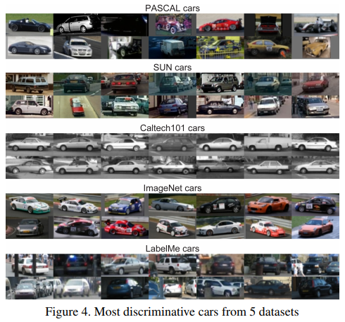

Antonio Torralba, Alexei A. Efros  
[pdf](http://citeseerx.ist.psu.edu/viewdoc/download?doi=10.1.1.208.2314&rep=rep1&type=pdf)  
CVPR2011  

# どんなもの？
ビジュアルの世界を表現することを目的として作成された複数のデータセットを用いて転移学習を行うと精度が下がることからバイアスがあることが考えられる．  
このバイアスについての認知を高めることが目的．

# データセットのバイアスとは？
Name That Dataset:有名な12のデータセットを用いて3枚の画像からデータセットを当てることが出来るか？というチャレンジも公開されている．  
使用したことがある人にはある程度分かってしまうらしい．  

SVMを用いて分類した結果，最大で39%の精度を達成(ランダムでは1/12=8%)  
  
UIUCはトレーニングとテストで異なるラベルを用いているので精度が低い．  
各データセットが一意の識別可能な "signature" を持っていることを示唆している．

SVMのdecision boundary付近の画像を集めて他のデータセットで偽造できることも示唆している．  
  

データセットには強いバイアスがあるように見える．もちろん，異なる目的でデータセットが作成されているので，バイアスの多くは説明することができる（プロが撮影 or 素人が撮影，シーン全体 or 単一のオブジェクトなど）．しかしそれらの特徴を分離してバイアスを制御しようとしても，何らかの形で存在している．

5つのデータセットの車の画像を用いてデータセットの分類を行った結果，61％の精度がでた．  
視覚的に確認しても違いが見て取れる．  
  

# データセットに関する問題点
人気のあるデータセットの大きな問題の1つ “creeping overfitting” : アルゴリズムがデータセットに適応しすぎて一般化する能力を失うこと  
→ データセットを定期的に変更するか，テストセットを保留し，チームがテストセットを評価できる回数を制限することで軽減できる．  

別の懸念：他の手法に対する改善が統計的に有意であるかどうかにかかわらず，特定のデータセットのコンペティションに「勝つ」ことを重視している．  
→ 新しいアルゴリズムの健全性チェックおよび複数のベースラインと比較する方が良い．このようにすることで発展し成熟するチャンスがある．

もっと根本的な問題：データセットは実世界で予想される性能を測定しているのか？  
→ 現実のオープンワールドで動作するモデルを訓練するのを助けるのではなく，データセット自体がクローズドワールドになっている．

## そのデータセットは実世界を表現しているか？
もしデータセットが本当に実世界を表現しているならば，ImageNetで学習してPASCAL VOCでテストできるはず．  
転移学習についての研究もあるが，この場合ターゲットデータセットは別の“domain”にあると見なされる．  
　→そもそもすべてのデータセットは実際には同じドメイン(visual world)を表現しようとしているはず．その良し悪しを測定したい．

あるデータセットで訓練された典型的なobject detectorが，それ自身のテストセットと比較して，他のデータセットでテストしたときにどの程度一般化されるかについて実験．

活発に研究されており，共通の注釈付きオブジェクトがいくつかある6つの代表的なデータセットで試す  
SUN09, LabelMe, PASCAL VOC 2007, ImageNet, Caltech-101, MSRC.   

オブジェクト検出タスクには Dalal＆Triggs を使用．
分類タスクには non-linear SVM (Gaussian kernel) を使用．  
分類の学習には500 positive and 2000 negative，検出の学習には100 positive and 1000 negativeを使用．
分類のテストには50 positive and 1000 negative，検出のテストには10 positive and 20000 negativeを使用．  

  
最良の結果は同じデータセットでトレーニングとテストを行った場合．  
一般的に，異なるテストセットでテストすると，すべてのタスクとクラスでパフォーマンスが劇的に低下する．

MSRCで"car"を学習して他のデータセットでテストした結果．うまく分類できていない．  
  

同じソース(インターネット)から収集されているにもかかわらず，一般化が難しい理由は以下のように考えられる．  
- selection bias : データセットには特定の種類の画像(street scenes, nature scenes, or images retrieved via Internet keyword searches)が優先されることがよくある．
- capture bias : カメラマンは同様の方法でオブジェクトの写真を撮る傾向がある．(ただしこのバイアスは異なるデータセット間では似ているかもしれない)
- category or label bias : 意味カテゴリの定義が不十分なことが多く，似たオブジェクトに異なるラベルを付けているから(“grass” vs. “lawn”, “painting” vs. “picture”)
- negative set bias : negative instancesは無数にあるが，データセットの都合上一部しか使用できない．その一部にバイアスがあるかもしれない．

## Negative Set Bias
データセットは、それが何であるか(positive instances)だけでなく，何でないか(negative instances)によっても視覚現象(object, scene, event)を定義する．
ただし，ビジュアルの世界で起こり得るすべてのnegativesのスペースは非常に大きいので，小さなサンプルだけに頼らざるを得ない．
このネガティブサンプルは代表的なものか、それとも十分なものか？

異なるデータセットのネガティブセットにおける相対的な偏りを評価するための実験を設計(e.g. PASCALの“not car”はMSRCの“not car”と異なるのか？)  
まず各データセットについてそれぞれののpositibe, negative のインスタンスのセットで分類器を訓練．  
テスト時のポジティブなデータは元のデータセットから用いられるが，ネガティブなものはすべてのデータセットを組み合わせたものを用いる．  
100 positives and 1000 negativesで検出タスクを実行．テストでは10 positive examples for 20,000 negativesを複数回実行．  

  
SUN09, LabelMe and PASCALではパフォーマンスが大幅に(20％)低下している．これは、他のデータセットから得られる新しいネガティブな例の一部がポジティブな例と混同されることを示している．  
一方ImageNet, Caltech 101 and MSRCでは低下していない．CaltechとMSRCは非常に簡単すぎるから．ImageNetはネガティブな例が多く，影響をあまり受けていない．

さらに難しい問題は，ネガティブデータサンプルが，分類器が認識するために重要な部分をいじるのに十分であるかどうか．これは，ネガティブ数が各クラスのポジティブ数よりもわずか数桁大きい分類タスクでは特に重要になる．  
　例：船の画像を分類する場合，水などの他の要素ではなく船自体に焦点が合っているか確認するにはどうすればよいか？  
　→大きなネガティブセット（川，湖，海などでボートなしの画像）が不可欠．今後AMTを用いてデータを用意し，評価する予定．

## データを増やす際の注意
特定の検出タスクとベンチマークにおいてパフォーマンスを向上させる方法：  
1. 特徴，オブジェクトの表現および検出器のための学習アルゴリズムを改善する 
2. トレーニングに利用できるデータ量を増やす

ただし，トレーニングデータの量を増やす際に問題がある 
- パフォーマンスを大幅に向上させるためには，トレーニングデータの大幅な増加が非常に重要 
- テストデータのバイアスと一致しないトレーニングデータを追加すると分類器の性能が低下する

  
データセットのサイズが大きくなるにつれて性能が向上し，他のデータセットのデータを使用すると下がる．  

  
あるデータセットの1つのサンプルは，他のデータセットでは1つ以下の価値しかない．  

# バイアス回避方法
新しいデータセットを作る際のバイアスを検出し回避するために，各タイプのバイアスを最小限に抑えるために以下の提案をする．

## Selection Bias
自動的に収集されたデータセットは，手動で収集されたデータセットよりも優れている．ただし，キーワード検索による画像の収集では公平さは保証できない．  
複数の検索エンジンを用いてラベルのない画像を集め，クラウドソーシングによってラベル付けするのが良い．

## Capture Bias
最もよく知られているバイアスは、オブジェクトがほぼ常に画像の中心にあるということ．
様々なデータ変換で対応する
- flipping images left-right
- small affine transformations
- automatic crops of the image

## Negative Set Bias
分類器の性能には豊かで偏りのない negative set が重要．  
他のデータセットからネガティブを追加する．
Mark Everinghamによって提案された別のアプローチでは，非常に大きなラベルのないセットから標準的なアルゴリズム(e.g. bag of words)を使ってhard negativesをマイニングし，手動でtrue positivesを取り除く． 

