VQAデータセットについてまとめました．  
随時更新予定です．

| データセット名 | タイプ                         | 画像数  | 画像のソース                        | 質問数    | 質問タイプ数      | 質問ごとの回答数 | Unique answers | 質問の作成方法                                              | 回答の作成方法                                                      | 特徴                                                                                                   |
|----------------|--------------------------------|---------|-------------------------------------|-----------|-------------------|--------------------|----------------|-------------------------------------------------------------|---------------------------------------------------------------------|--------------------------------------------------------------------------------------------------------|
| [VQAv2.0](#VQAv2.0)        | open-end                       | 207,721 | MS-COCO                             | 1,105,904 | 66(回答タイプは3) | 10                 |                | クラウドワーカー(AMT)                                       | 質問ごとにクラウドワーカー(AMT)10人                                 | 同じ質問に対する異なる画像と回答のペアを作成し，言語バイアスを軽減                                     |
| [VizWiz](#VizWiz)         | open-end                       | 31,173  | VizWiz application                  | 31,173    |                   | 10                 | 58,789         | 視覚障害のあるユーザの質問                                  | 質問ごとにクラウドワーカー(AMT)10人                                 | 視覚障害のあるユーザが撮影した写真を用いているので，対象物が映っていないなどの問題がある               |
| [DAQUAR](#DAQUAR)         | open-end                       | 1,449   | NYU Depth V2                        | 16,590    | 3                 | 1                  | 968            | テンプレートから自動生成，人が作成                          | 自動生成，質問作成者が作成                                          |                                                                                                        |
| [Visual Madlibs](#Visual-Madlibs) | Multiple-choice(4択)，空欄埋め | 10,738  | MS-COCO                             | 360,001   | 12                | 1                  |                |                                                             |                                                                     | 12種類の空欄がある                                                                                     |
| [FM-IQA](#FM-IQA)         | open-end                       | 158,392 | MS-COCO                             | 316,193   |                   | 1                  |                | クラウドワーカー(Baidu)                                     | 質問作成者が回答も作成                                              | The Visual Turing Test という方法で12人が回答を採点                                                    |
| [COCO-QA](#COCO-QA)        | open-end                       | 123,287 | MS-COCO                             | 117,684   | 4                 | 1                  | 430            | 自動生成                                                    | 自動生成                                                            | 回答が1単語                                                                                            |
| [Visual 7W](#Visual-7W)      | Multiple-choice(4択)           | 47,300  | MS-COCO                             | 327,939   | 7                 | 1                  | 25,553         | クラウドワーカー(AMT)                                       | 質問作成者が回答も作成，作成したQAペアを3人のクラウドワーカーで評価 | 7種類のquestion type(what, where, when, who, why, how, which)                                          |
| [CLEVR](#CLEVR)          | open-end                       |         | Synthetic Shapes                    | 1,773,358 | 6                 | 1                  | 207,675        | 自動生成                                                    | 自動生成                                                            | 質問が複雑(attribute identification, counting, comparison, spatial relationships, logical operations)  |
| [Visual Genome](#Visual-Genome)  | open-end                       | 108,000 | MS-COCO , YFCC100M                  | 1,445,322 | 7                 |                    |                |                                                             |                                                                     |                                                                                                        |
| [KB-VQA](#KB-VQA)         | open-end                       | 700     | MS-COCO                             | 2,402     | 23                | 1                  |                |                                                             |                                                                     | 回答するためにexternal knowledgeを要求する質問の割合が大きい                                           |
| [FVQA](#FVQA)           | open-end                       | 2,190   | MS-COCO(validation), ImageNet(test) | 5,826     | 32                | 1                  |                | 38 volunteers                                               | 38 volunteers                                                       | 質問に答えるためには，画像だけではなく一般的な知識も必要．データセットにはsupport factも含まれている． |
| [TDIUC](#TDIUC)          | open-end                       | 167,437 | MS-COCO, Visual Genome              | 1,654,167 | 12                | 1                  | 1,618          | COCO-VQA, Visual Genomeから取得，自動生成，クラウドワーカー | 自動生成，質問作成者が回答も作成                                    | 2種類の評価方法を提案．また質問タイプの分布や回答の分布のバイアスを考慮して正規化する方法を提案．      |

# VQAv2.0
質問作成者：Crowd workers (AMT)  
open-ended tasks , 1つの質問に対し10の回答  
[arXiv](https://arxiv.org/abs/1612.00837) , [pdf](https://arxiv.org/pdf/1612.00837.pdf), [HP](https://visualqa.org/)  
目的：視覚障害のあるユーザに対して視覚情報を提供するのを手助けする  
v1.0 では言語バイアスが強かった．  
v2.0 では，同じ質問に対する異なる画像と回答のペアを作り，データセットを拡張する．  
yes/no , number , other の3種類の回答タイプ  
  
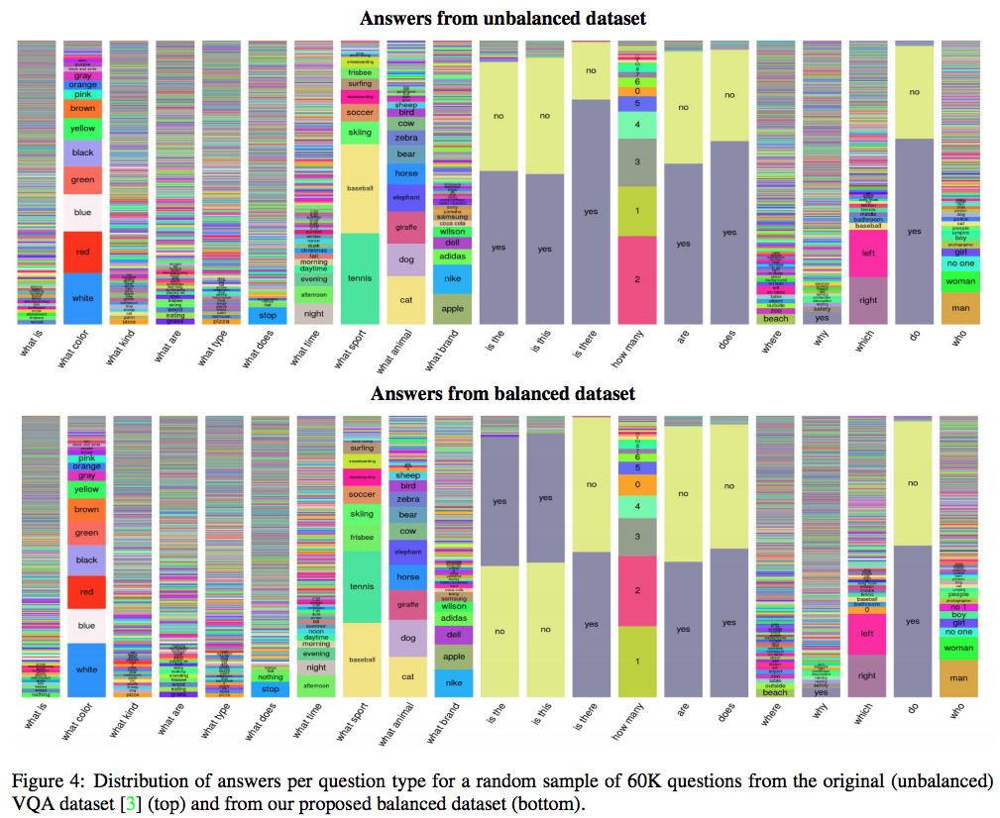

# VizWiz
質問作成者：視覚障害のあるユーザが携帯電話を用いて写真と質問をしているデータを収集  
open-ended tasks , 1つの質問に対し10の回答  
[arXiv](https://arxiv.org/abs/1802.08218) , [pdf](https://arxiv.org/pdf/1802.08218.pdf) , [HP](http://vizwiz.org/data/)  
目的：視覚障害のあるユーザに対して視覚情報を提供するのを手助けする  
視覚障害のある人が撮影した写真とそれに関する質問から作成  
回答はVQAv2.0と同様にAMTを用いて10人のクラウドワーカーから収集．  
ピントが合っていなかったり，そもそも質問に答えることが出来ない画像も含まれている．  
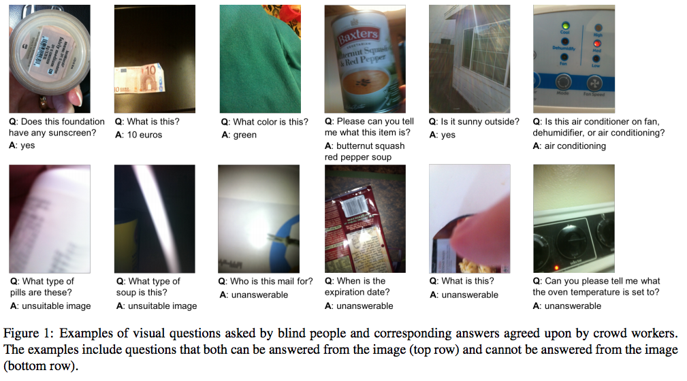  

# DAQUAR
質問作成者：In-house participants, Automatically generated (templates)  
open-ended tasks , 1つの質問に対し1つの回答  
DAtaset for QUestion Answering on Real-world images(DAQUAR)  
[arXiv](https://arxiv.org/abs/1410.0210), [pdf](https://arxiv.org/pdf/1410.0210.pdf) , [HP](https://www.d2.mpi-inf.mpg.de/visual-turing-challenge)  
M. Malinowski and M. Fritz.   
NIPS2014  
NYU Depth V2 の画像を使用．

synthetic と human の2種類のアノテーション．
- synthetic question-answer はテンプレートに従って自動生成される．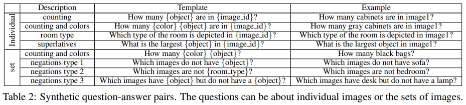
- 5人から12,468の question-answer を集めた.色，数字，オブジェクトなどの894カテゴリから適切な回答を付けている．
人は分かりやすいオブジェクトに焦点を当てているので，データセットにはバイアスがある．（机，イスの回答が400以上．オブジェクトカテゴリの平均は14.25）

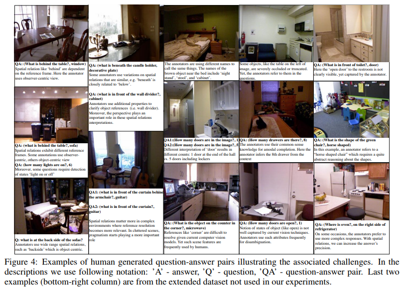  
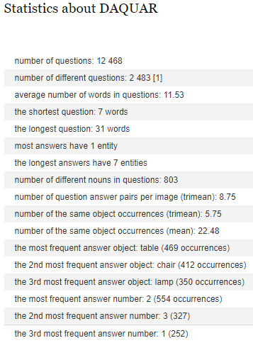  

## NYU Depth V2
[pdf](https://www.microsoft.com/en-us/research/wp-content/uploads/2016/11/shkf_eccv2012.pdf) , [HP](https://cs.nyu.edu/~silberman/datasets/nyu_depth_v2.html)  
- 1449 densely labeled pairs of aligned RGB and depth images
- 464 new scenes taken from 3 cities
- 407,024 new unlabeled frames
- Each object is labeled with a class and an instance number (cup1, cup2, cup3, etc)
- 894 classes are considered

# Visual Madlibs
質問作成者：Automatically generated (templates)  
[arXiv](https://arxiv.org/abs/1506.00278) , [pdf](https://arxiv.org/pdf/1506.00278.pdf) , [HP](http://tamaraberg.com/visualmadlibs/index.html)  
L. Yu, E. Park, A. C. Berg, and T. L. Berg  
ICCV2015  
360,001 focused descriptions for 10,738 images.   
12 types of fill-in-the-blanks:
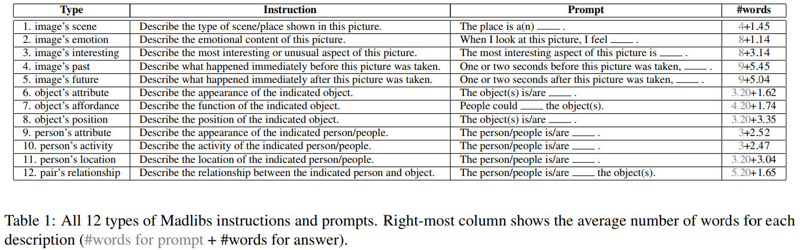  

Two evaluation tasks:
- Multiple-choice question-answering(4択)
- Fill-in-the-blank image description(空欄埋め)

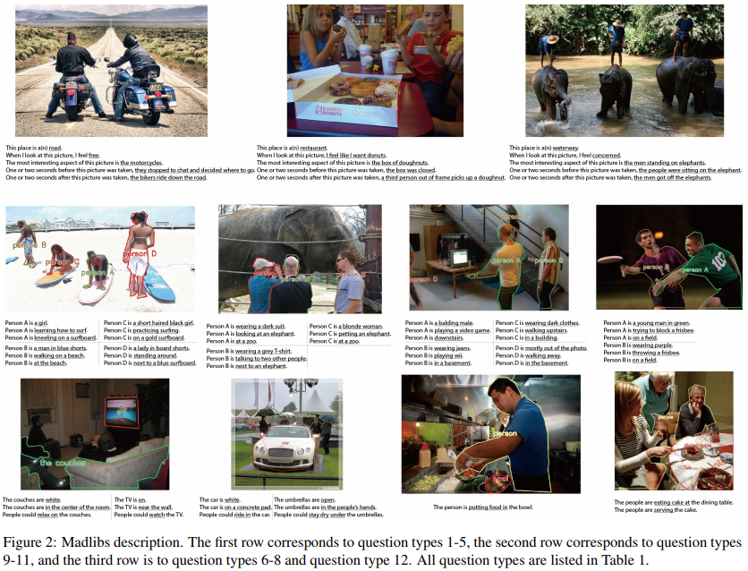  

# FM-IQA
質問作成者：Crowd workers (Baidu)  
open-ended tasks , 1つの質問に対し1つの回答  
[arXiv](https://arxiv.org/abs/1505.05612) , [pdf](https://arxiv.org/pdf/1505.05612.pdf) , [HP](http://research.baidu.com/Downloads)
H. Gao, J. Mao, J. Zhou, Z. Huang, L. Wang, and W. Xu  
NIPS2015  
158,392 images with 316,193 Chinese question-answer pairs and their English　translations.
Baidu’s online crowdsourcing serverから質問回答を集めた．画像に関する質問を作成し，その回答も同時に集める．
The Visual Turing Test という方法で採点．12人が採点している．

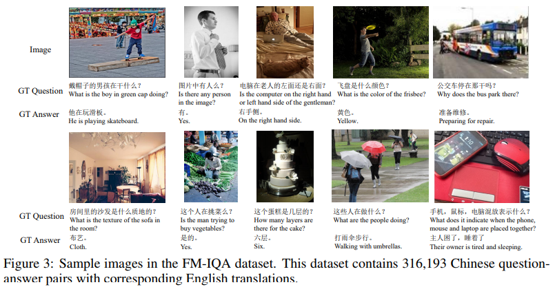

# COCO-QA
質問作成者：Automatically generated (captions)  
open-end  
[arXiv](https://arxiv.org/abs/1505.02074) , [pdf](https://arxiv.org/pdf/1505.02074.pdf) , [HP](http://www.cs.toronto.edu/~mren/imageqa/data/cocoqa/) (403 Forbidden)  
M. Ren, R. Kiros, and R. S. Zemel.  
NIPS2015  
- 123287 images
- 4 types of questions: object, number, color, location
- Answers are all one-word.

# Visual7W
質問作成者：Crowd workers (AMT)  
multiple-choice(4択)  
[arXiv](https://arxiv.org/abs/1511.03416) , [pdf](https://arxiv.org/pdf/1511.03416.pdf) , [GitHub](https://github.com/yukezhu/visual7w-toolkit)  
Y. Zhu, O. Groth, M. Bernstein, and L. Fei-Fei.  
CVPR2016  
7種類のquestion type(what, where, when, who, why, how, which)   
クラウドワーカーに QA pair の作成を依頼．作成したQA pair の質を3人のクラウドワーカーで評価し，2人以上がpositiveだった場合accept．

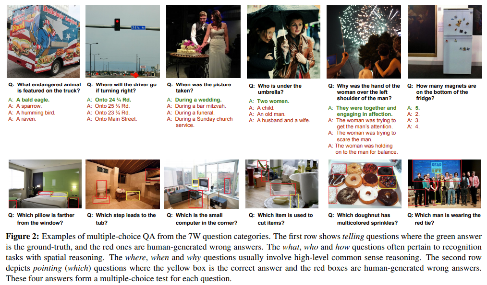
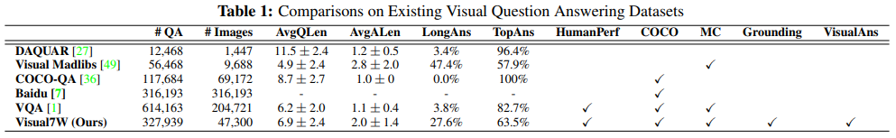

# CLEVR
質問作成者：Automatically generated (templates)  
open-end  
Compositional Language and Elementary Visual Reasoning diagnostics dataset(CLEVR)  
[arXiv](https://arxiv.org/abs/1612.06890) , [pdf](https://arxiv.org/pdf/1612.06890.pdf) , [GitHub](https://github.com/facebookresearch/clevr-dataset-gen) , [HP](https://cs.stanford.edu/people/jcjohns/clevr/)  
Justin Johnson, Bharath Hariharan, Laurens van der Maaten, Fei-Fei Li, Larry Zitnick, Ross Girshick   
CVPR2017  

Questions in CLEVR test various aspects of visual reasoning including attribute identification, counting, comparison, spatial relationships, and logical operations.

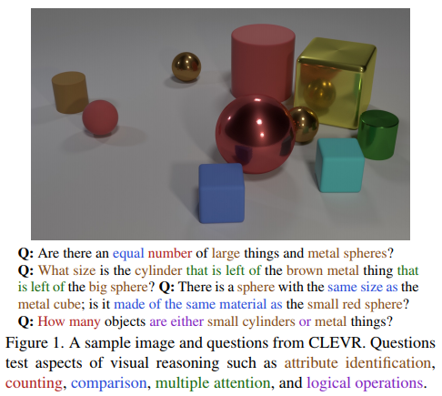

# Visual Genome
質問作成者：Crowd workers (AMT)  
[arXiv](https://arxiv.org/abs/1602.07332) , [pdf](https://arxiv.org/pdf/1602.07332.pdf) , [HP](https://visualgenome.org/)  
R. Krishna, Y. Zhu, O. Groth, J. Johnson, K. Hata, J. Kravitz, S. Chen, et al.  
IJCV2017  

Visual Genome is a dataset, a knowledge base, an ongoing effort to connect structured image concepts to language.
各画像につき annotations of objects, attributes, and relationshipsを集めた．平均で21 objects, 18 attributes, and 18 pairwise relationships between objects．  
WordNet synsetsでQA pairを正規化．  
2種類のQA type:
- freeform QAs, based on the entire image 
- region-based QAs, based on selected regions of the image 
質問タイプは6種類(what, where, how, when, who, and why)  

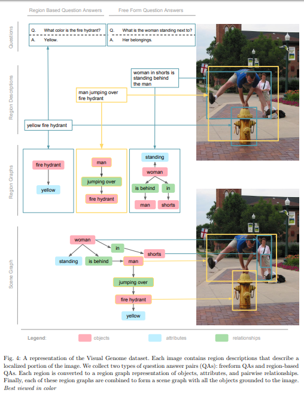  
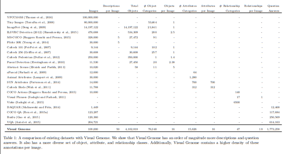

# KB-VQA
質問作成者：In-house participants  
[arXiv](https://arxiv.org/abs/1511.02570) , [pdf](https://arxiv.org/pdf/1511.02570.pdf)  
P. Wang, Q. Wu, C. Shen, A. Hengel, and A. Dick  

MSCOCO からオブジェクトの情報を多く含む700枚の validation image を集めた．150の object classes と100の scene classes，6~7のオブジェクトを含んでいる．  
5人に25のテンプレートを使用して画像ごとに3~5の question/answer pair の作成を依頼．  
提案手法の結果と人の回答を提示し，アンケート調査．

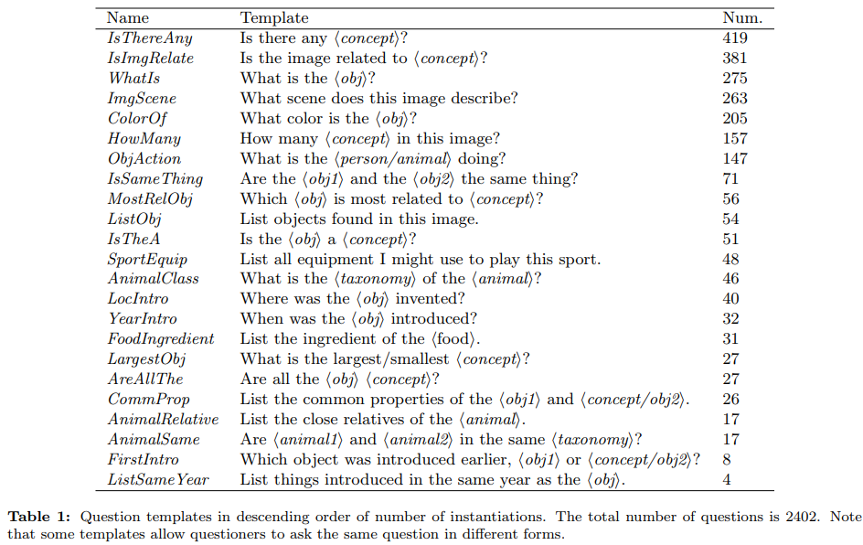

The “Visual” questions can be answered directly using visual concepts gleaned from ImageNet and MS COCO (“Is there a dog in this image?”); 
“Common-sense” questions should not require an adult to refer to an external source (“How many road vehicles in this image?”);  
“KB-knowledge” questions is expected to require Wikipedia or similar (“When was the home appliance in this image invented?”).
“Visual”：1256, “Commonsense”：883, “KB-knowledge”：263  
他のVQAデータセットと比較して，KB-VQAは回答するためにexternal knowledgeを要求する質問の割合が大きい．

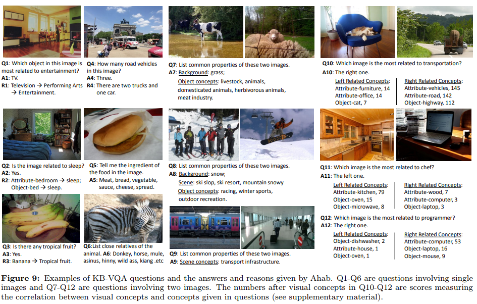

# FVQA
質問作成者：In-house participants  
[arXiv](https://arxiv.org/abs/1606.05433) , [pdf](https://arxiv.org/pdf/1606.05433.pdf) , [GitHub](https://github.com/GokuMohandas/casual-digressions/blob/master/notes/fvqa.md)  
P. Wang, Q. Wu, C. Shen, A. Dick, and A. Hengel  
PAMI2017  

画像だけでなく一般的な裏付けとなる事実(supporting-facts)も考慮して質問に答えるデータセット  
画像内の概念と一般的な知識を結び付けた Visual Concepts を提供．
- object : 人間，車など 326クラス
- scene : オフィス，寝室，ビーチなど　221クラス
- action : 歩く，泳ぐ，ジャンプするなど　24クラス

各Visual Concepts の知識は既存のデータセットを使用
- [DBpedia](https://cis.upenn.edu/~zives/research/dbpedia.pdf) : Wikipediaから構造情報を取得．[SKOS Vocabulary](https://www.w3.org/2004/02/skos/)に基づいてconceptのカテゴリとスーパーカテゴリを結びつける．
- [ConceptNet](http://alumni.media.mit.edu/~hugo/publications/papers/BTTJ-ConceptNet.pdf) : UsedFor，CreatedBy，IsAなどの常識的な関係で構成されている．Open Mind Common Sense（OMCS）プロジェクトの文から自動的に生成
- [WebChild](http://iiis.tsinghua.edu.cn/~weblt/papers/csk-comparative.pdf) : Faster，Bigger，Heavierなどの比較関係を含む常識的な知識の形式を検討．webから取得．
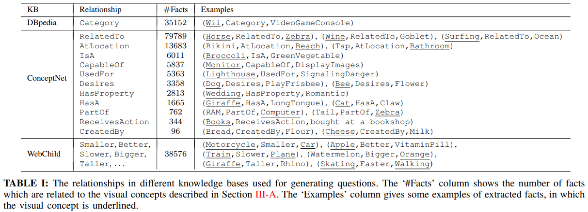  

質問作成の流れ：
1. Selecting Concept : 与えられた画像に関するconceptを選ぶ
2. Selecting Fact : 選ばれたconceptに関連する事実(例：{Train,Slower,Plane}→‘Train is slower than plane’)が与えられるので，適切なものを選ぶ
3. Asking Question and Giving Answer : 画像と選んだ事実に関連する質問を作成する．これによって回答は Visual Concepts もしくは KBの概念に制限される． 

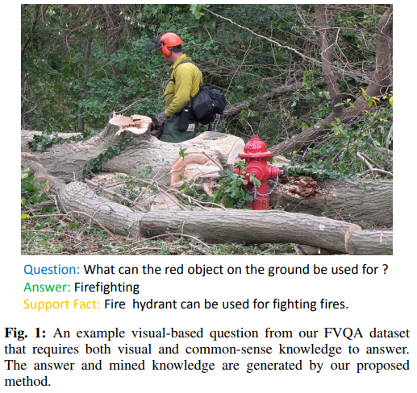  

# TDIUC
質問作成者：Crowd workers (AMT), In-house participants, Automatically generated  
Task Driven Image Understanding Challenge (TDIUC)  
[arXiv](https://arxiv.org/abs/1703.09684) , [pdf](https://arxiv.org/pdf/1703.09684.pdf) , [HP](https://kushalkafle.com/projects/tdiuc)  

VQAの目的：ある特定のタスクに関する専門知識だけを持つのではなく，多くのタスクを実行できるコンピュータービジョンシステムを構築すること

VQAアルゴリズムの性能(一般化できているか？など)を比較しやすくするために12のタスクを作成している．  
質問タイプの分布に偏りがあるので，12種類それぞれの精度の平均(Arithmetic MPT)と全体的な精度(Harmonic MPT)を計算  
回答の分布にも偏りがあるので，質問タイプ内のUnique answerごとに精度を計算し平均をとることによって正規化する．

12種類の質問．どの質問タイプが難しいか判断できる．  
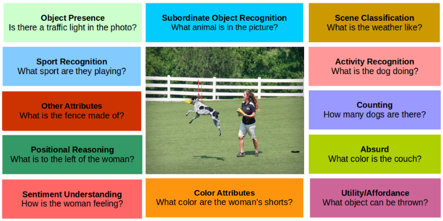  
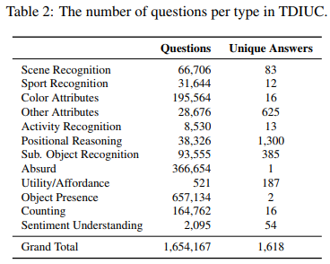  

