Meet Shah, Xinlei Chen, Marcus Rohrbach, Devi Parikh  
[arXiv](https://arxiv.org/abs/1902.05660), [pdf](https://arxiv.org/pdf/1902.05660.pdf)  
CVPR2019  

# どんなもの？
VQAモデルを質問の言語的変動に対してよりロバストするために，サイクルの一貫性を利用するモデルにとらわれないフレームワークを提案．  
言語的変動に対するVQAモデルのロバスト性を評価する新しい評価プロトコルと関連するデータセット(VQA-Rephrasings)を作成．  
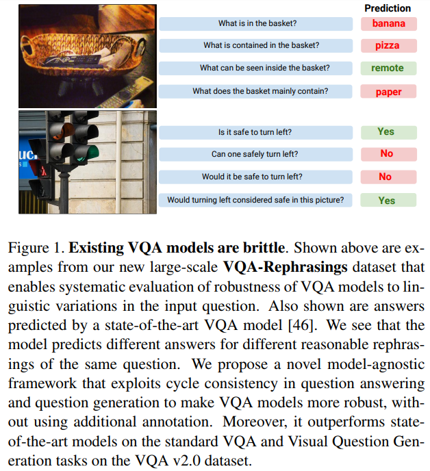  

# 先行研究との差分
視覚的チャットボットと対話しているユーザーや補助機器を使用している視覚障害のあるユーザーでも，VQAアプリケーションを使用すると画像について機械に質問することができる．  
そのためにVQAモデルは入力モダリティの変動に対してロバストで一貫性があることが望ましい．

先行研究では，画像内の意味的変動[10](https://arxiv.org/abs/1612.00837)，回答分布の変更[2](https://arxiv.org/abs/1712.00377)，および画像への敵対攻撃[44](https://arxiv.org/abs/1709.08693)に対するVQAモデルのロバスト性とsensitivenessを研究している．

この論文では入力質問の言語的変動に対するVQAモデルのロバスト性を研究する．  
これはVQAがmulti-modal AI capabilities(VQAモデルは質問に答えるとき本当に質問を「理解」しているか？)をテストするためのベンチマークであるという観点や，VQAアプリケーション(ユーザは様々な言語形式で同じ質問を言い換える可能性がある)にとっても重要である．


# model
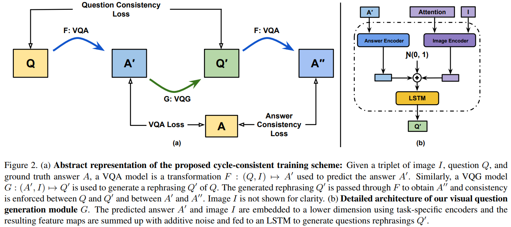  

画像 $I$，質問 $Q$，真値回答 $A$ が与えられると，VQAモデルは回答を予測する $F : (Q,I) \to A`$  
同様にVQGモデルは $Q$ に似た質問を生成する $G : (A,I) \to G`$  
最後に生成した質問 $Q`$ の回答 $A``$ を予測する  

$A,I$ から意味的，構文的に正しい質問を生成することができるモデルは，cross-modal connections をよりよく理解しているはず．
次に $Q`$ が $Q$ の有効な言い換えであるならば，ロバストなVQAモデルは $Q`$ の回答 $A``$ は $A$ と同じである必要がある．

```math
L_{total}= L_F(A,A`) + \lambda_G L_G(Q,Q`) + \lambda_C L_{cycle}(A,A``)
```

$L_F(A,A`), L_{cycle}(A,A``)$ : cross-entropy loss  
$L_G(Q,Q`)$ : sequence generation loss[30](https://arxiv.org/abs/1806.08730), Q-consistencyと呼ぶ  
$L_{cycle}(A,A``)$ を A-consistencyと呼ぶ  

## Question Generation Module
低い情報モダリティ(回答)から高い情報モダリティ(質問)への変換を学習する為にattentionを用いる．  
$Q`$ を生成するために，VQGはVQAが $Q$ に答えるために使用したattention付き画像領域を使用する．  
これによって "yes" からオリジナルの質問により似た質問を生成できる．

先行研究では回答の埋め込みやone-hotベクトルをVQGに入力していたが，提案モデルでは回答の予測分布を入力する．  
これにより，VQGは生成された質問への回答に対するモデルの信頼度マップを学習できる．

## Gating Mechanism
生成された質問は常に意味的にも構文的にも正しいと仮定しているが，実際にはそうではない．  
そこでVQGによって生成された望ましくない質問をVQAに渡す前に自動的にフィルタリングする Gating Mechanism を使用する．  
VQAモデル $F$ が正しく答えることができる，もしくは元の質問と生成した質問のコサイン類似度が閾値 $T_{sim}$ よりも大きい質問のみを保持する．

## Late Activation
VQAモデルとVQGモデルの両方が妥当なアウトプットを生成するように学習していることを確認するために，トレーニングプロセスで一定の $A_{iter}$ 後にサイクルの一貫性に関連した損失 $L_{cycle}(A,A``)$ を有効にする．

また，VQAモデルのロバスト性を高めるために，元の質問に答えるVQAモデルと生成された言い換えに答えるVQAモデル間の重みを共有する．  


# VQA-Rephrasings Dataset
VQAv2.0のvalidation(214,354 questions spanning over 40,504 images)をベースにした．そこから1枚の画像からランダムに1つの質問をサンプリングしサブセットを作成．  
2段階のフローを用いて各質問につき3つの人が作成した言い換えを収集．  
1段階目では，元の質問とそれに対応する真の答えを提示し，答えが同じになる別の言い換えた質問の作成を依頼した．  
2段階目では，作成された質問のフィルタリングを行う．文法的や構文的に正しくないもの，元の質問と回答が変わっていると思われるものを取り除いた．  
最終的なデータセットは40,504枚の画像にまたがる162,016の質問(元の40,504の質問を含む)で構成．  

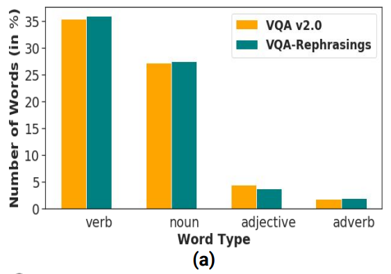  
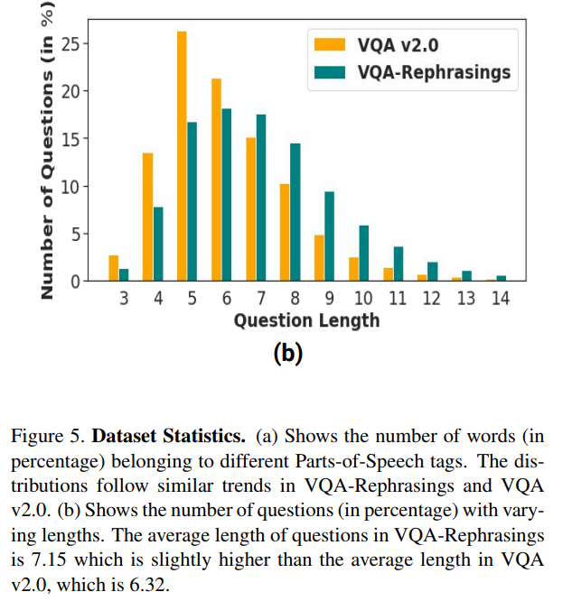  

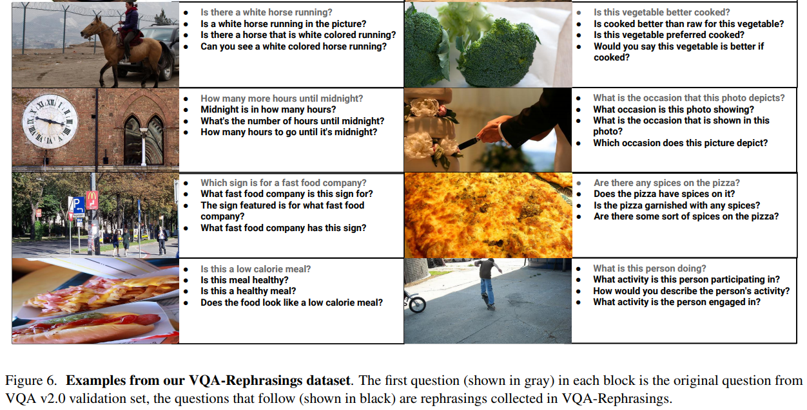

## Consensus Score
言い換えた質問に対するVQAの回答が同じかどうかをConsensus Score $CS(k)$ で計測する．  
$CS(k)$ は回答が正しいサブセットの数とサイズ $k$ のサブセットの総数の比として定義．質問に対する答えは，[1]で定義されているようにゼロ以外のVQA精度 $\theta$ を持っていれば正しいと見なす：

```math
CS(k) = \sum_{Q`\sub Q, |Q`|=k} \frac{S(Q`)}{^nC_k} \\
```

```math
S(Q`) = \begin{cases}
   1 &\text{if } \forall q\in Q` \text{ }\theta(q)>0,\\
   0 &\text{otherwise} 
\end{cases}
```

$^nC_k$ : サイズ $n$ からサンプリングされたサイズ $k$ のサブセットの数  
ゼロでないConsensus Scoreを達成するためには，モデルは質問グループ $Q$ において少なくとも $k$ 個の質問に正しく答えなければならない．  

# 評価実験

## Consistency Performance
既存のVQAモデルを使用してVQA-Rephrasingsデータセットのベンチマークを計測する．

### 既存VQAモデル
- MUTAN : [GitHub](https://github.com/Cadene/vqa.pytorch)
- Bottom-Up Top-Down Attention (BUTD) : [GitHub](https://github.com/hengyuan-hu/bottom-up-attention-vqa)
- Pythia : [GitHub](https://github.com/facebookresearch/pythia)
- Bilinear Attention Networks (BAN) : [GitHub](https://github.com/jnhwkim/ban-vqa)

### Implementation Details
$T_{sim} = 0.9, \lambda_G=1.0, \lambda_C=0.5, A_{iter}=5500$  
validation split, VQA-Rephrasingsの結果を報告する時はtrain splitのみで学習．test splitの結果を報告する時はtrain, validation splitsで学習．  
VQA-Rephrasingsで学習はせずに，評価のみで使用する．  
hidden size of the LSTM(VQG) : 1024  
VQGの回答と画像をエンコードするlinearの次元 : 300  
一部のVQAモデルはadaptive learning ratesを使用しているが，VQGモデルは学習率を0.0005で固定．


### 各モデルのConsensus Scoreの結果
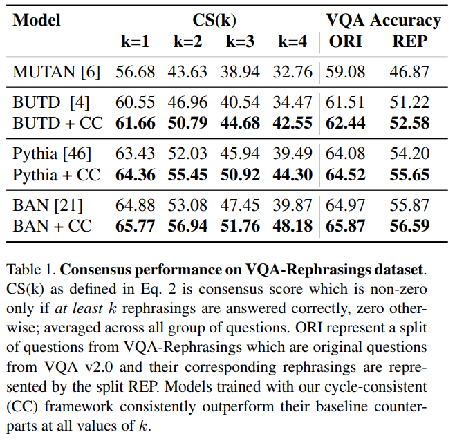  
全てのモデルでkを増加させると性能が下がる．  
提案したフレームワークを用いると性能が上がっている．  

### 定性的評価
同じPythiaモデルで，下が提案したフレームワークを使用  
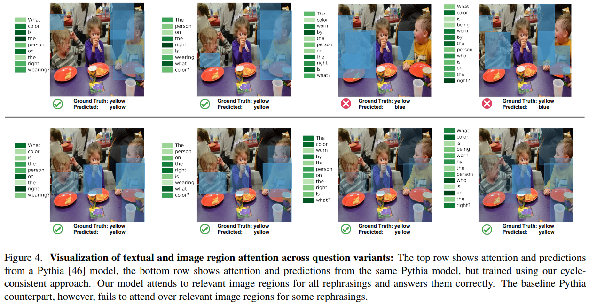  


## VQA Performance
VQAv2.0のvalidationとtest-dev splitsで各VQAモデルのablation結果を比較．  
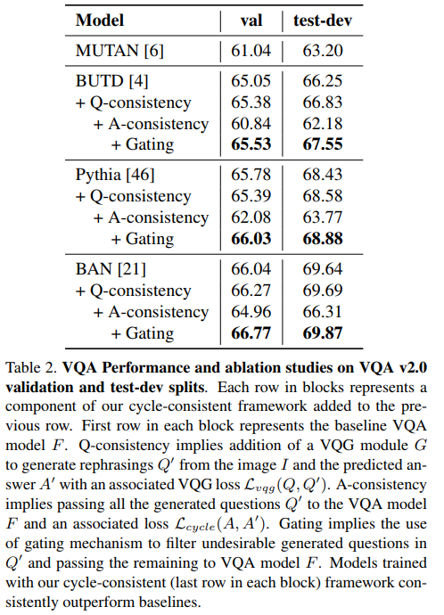  
Q-consistencyを追加することでわずかに性能が向上することから，回答から質問を生成できるモデルが確かによりマルチモーダルを理解していることが分かる．  
また生成した質問をそのままVQAに渡すと性能が下がることから，生成された質問すべてが有効な言い換えではないことを示している．  
Q-consistencyのみ使用するよりも，ゲーティングを使用することで全てのモデルで性能が上がる．

またVQGに入力する画像特徴量にattentionを用いないモデルでも実験を行った．この構成でもベースラインよりもパフォーマンスが向上した．  
ただし質問生成の質は比較的低く，attentionを使用する場合(8.08% in CS(k=4), 0.5% in VQA accuracy)と比較して，全体的なゲインは小さくなる(3.58% and 0.2%)  


## VQG Performance
VQAv2.0データセットを使用してCIDEr, BLEU, METEOR, ROUGE-Lで評価．  
- [iVQA](https://arxiv.org/abs/1710.03370) : 強化学習で訓練されたvariational LSTMモデルを使用
- [iQAN](https://arxiv.org/abs/1709.07192) : 質問生成を質問応答との2重タスクとしてモデリングし，回答固有の質問を生成．
iQANは特定の種類の質問しか生成できないので，公正な比較のために，これらの特定の種類の質問を含むデータセットのサブセットについてのみiQANと比較する．

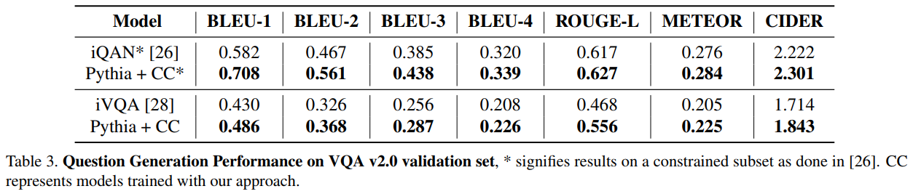  

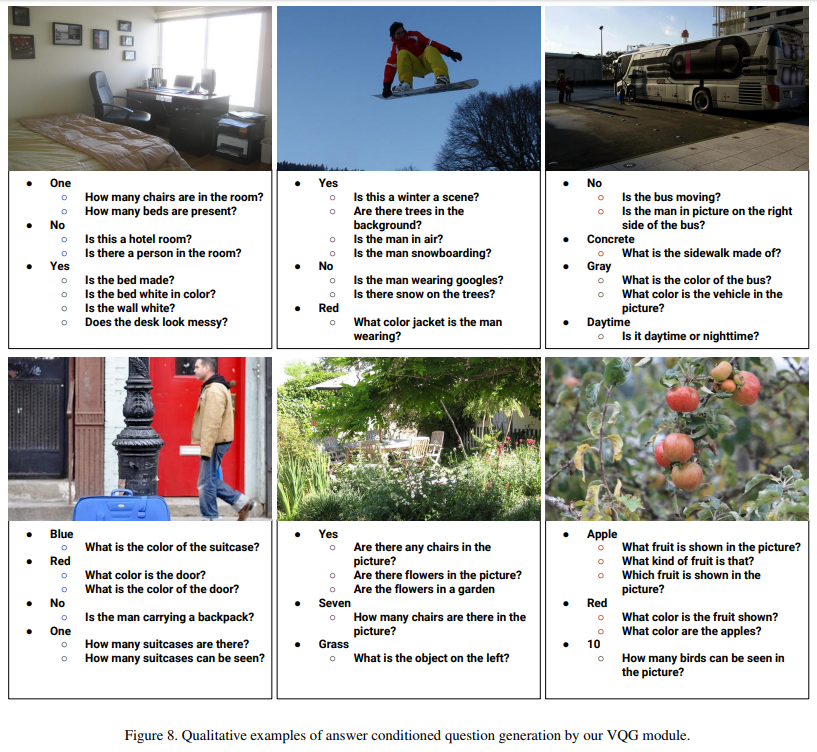  


## Failure Prediction Performance
ロバストモデルは誤った回答をする際には自信がないはず．これに動機づけられて，モデルが予測した誤回答を識別できるかどうかを確かめる．

2つの失敗予測スキームを使用
1. 予測された回答の信頼性に閾値を設定し，閾値以下の回答なら失敗とする．
2. $I,Q,A`$ から予測回答が正しいかどうかを識別する失敗予測バイナリ分類モジュール(FP)を設計．$I,Q,A`$をエンコードしたものをconcat -> linearで予測．

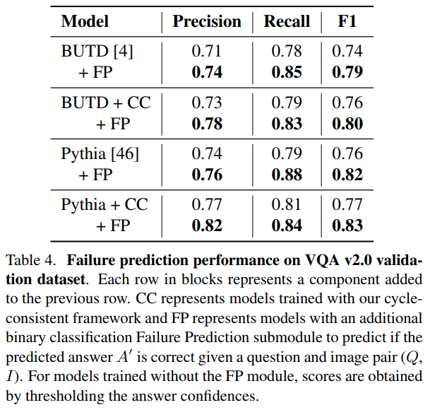  
FPがなくても，CCフレームワークがモデル自身の失敗を検出する能力をより高めることを示している．  
BUTD, Pythiaにおいても同様の改善が見られまることから，CCフレームワークがモデルに依存しないことを示している．  
これはCCトレーニングがモデルを言語の変動に対してロバストにするだけでなく，モデルがそれらの失敗を認識できるようにすることも示している．

