Amanpreet Singh, Vivek Natarajan, Meet Shah, Yu Jiang, Xinlei Chen, Dhruv Batra, Devi Parikh, Marcus Rohrbach  
Facebook AI Research, Georgia Institute of Technology  
CVPR2019  
[arXiv](https://arxiv.org/abs/1904.08920), [pdf](https://arxiv.org/pdf/1904.08920.pdf), [HP](https://textvqa.org/)


# どんなもの？
視覚障害のあるユーザーが画像に関して尋ねる質問は，画像内のテキストの読み取りに関する質問が多い(約21%)．  
画像内のテキストに関する TextVQA データセットを作成．  
画像内のテキスト情報を読み取り，テキストを回答として扱ったり，追加の推論ができる新しい Look, Read, Reason&Answer(LoRRA)モデルを提案．

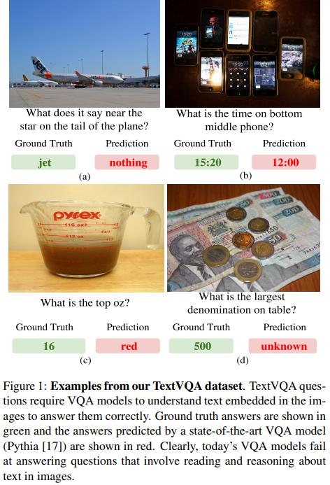

# 先行研究との差分
VQAv2.0, Visual7w では視覚障害のあるユーザーを模倣した設定では収集されなかったので，テキストに関する質問が少ない．  
視覚障害のあるユーザーからデータを収集した VizWiz では，答えることが出来ない質問が58％あるため使用できるデータが少ない．  

このような状況では問題を体系的に研究したり，効果的なモデルをトレーニングしたりすることは困難なので，TextVQA を作成．  

画像内のテキストに関する質問に回答するために，VQAモデルは以下を学習する必要がある：
- 質問がテキストに関するものであるかを理解する
- テキストを含む画像領域を検出する
- これらの領域のピクセル表現を記号またはテキスト表現に変換する
- 検出されたテキストと視覚的コンテンツに関する推論を結合する
- 検出されたテキストを回答として「コピーペースト」するか，回答スペース内の回答を用いるか決める  

このデータセットで適切に機能するモデルは，従来のVQAのように画像と質問を解析するだけでなく，画像内のテキストを読み取り，質問に関連する可能性のあるテキストを特定し，検出されたテキストが直接答えになるか(e.g.‘what temperature is my oven set to?’)，追加の推論が必要かどうか(e.g. ‘which team is winning?’)を認識する．


# Look, Read, Reason&Answer (LoRRA)
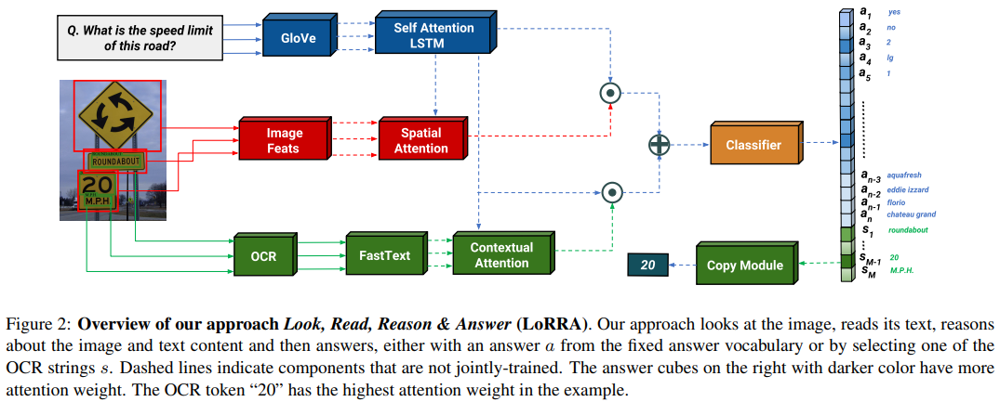  

モデルは3つのコンポーネントを持つ：  
1. VQA component : 画像と質問に基づいて回答を推論する
2. reading component : 画像内のテキストを読み取る
3. answering module : 回答空間，もしくは読み取ったテキストから回答を予測する  

## VQA component
既存のVQAモデルと同じ．  

```math
f_{VQA}(v,q) = f_{conv}(f_A(f_I(v), f_Q(q)),f_Q(q))
```

## reading component
OCRは画像から単語のトークンを読み取ることができると仮定．  
OCRで読み取った単語をembeddingして VQA componet と同様に特徴量を得る．

```math
f_{OCR}(s,q) = f_{conv}(f_A(f_O(s), f_Q(q)),f_Q(q))
```

$f_A, f_{conv}$ は VQA component と同じアーキテクチャだが，重みは共有しない．

## answering module
画像のテキストは，トレーニング時に出てこない単語も含まれているので，事前に定義された回答スペースだけに基づいて質問に答えることは困難．  
そこで OCR の予測結果を用いる場合は，テキストをコピーして回答にする．  


# TextVQA データセット
## Image
[Open Images v3](https://arxiv.org/pdf/1901.01703.pdf) データセットの billboard, traffic sign, whiteboard などのカテゴリの画像を使用．  
画像にテキストが含まれている傾向があるカテゴリを識別するために，各カテゴリからランダムに100枚の画像を選択し，最先端のOCRモデル [Rosetta](https://research.fb.com/wp-content/uploads/2018/10/Rosetta-Large-scale-system-for-text-detection-and-recognition-in-images.pdf)  を用いてOCRボックスの平均数を計算する．  
これを画像をサンプリングするためのカテゴリごとの重みとして用いる．  

得られた画像セットをクラウドワーカーによってフィルタリング(テキストを含まない画像を取り除く)し，28,408枚の画像を収集．

## Questions and Answers
アノテーターに画像を提示し，画像のテキストを読んで回答する必要がある質問の作成を依頼．  
‘Please ensure that answering the question requires reading of the text in the image. It is OK if the answer cannot be directly copied from the text but needs to be inferred or paraphrased.’  

別の質問を収集するためにアノテーターに最初の質問を提示し，画像内のテキストについての推論を必要とするが，回答が異なる質問の作成を依頼．  

他のVQAデータセットと同様に各質問に対して 10人 の回答を収集．  
回答を集める際に，以下のものが含まれているか確認し，含まれていたらそれを削除：  
(i)画像内にテキストがない (ii)質問ではない (iii)質問に答えるためにテキストを読む必要がない (iv)答えられない(テキストの意味についての推測を含む質問)  

## Statistics and Analysis
TextVQAには45,336の質問が含まれており，そのうち37,912(83.6％)がユニーク．

質問の長さの分布  
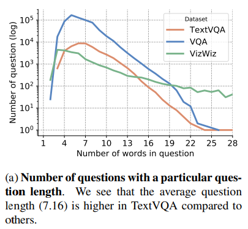  
TextVQAの平均質問長は 7.18で，VQAv2.0(6.29) VizWiz(6.68)よりも長くなっている．  
多くの場合，テキストの場所を指定するなど回答を明確にするために長い質問を作成している．  

頻出質問上位15個  
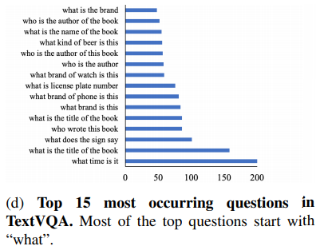  

頻出質問上位500個  
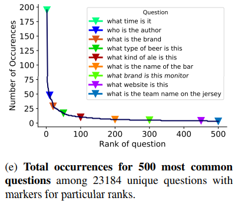  
「時間」に関する一般的な質問から「チーム名」などの特定の状況で発生する質問への一様なシフトが見られる．

質問の最初の4単語の分布  
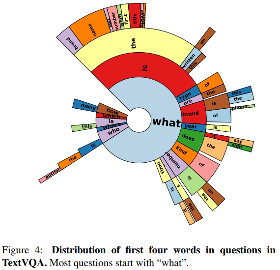  
ほとんど "What" から始まる．

回答の26,263(49.2%)がユニークで，VQAv2.0(3.4%), VizWiz(22.8%)よりも高い．  
10人のアノテーター全員が22.8％の質問に対し最も一般的な回答？(agree on the most common answer)をし，3人以上のアノテーターが97.9％の質問に対する最も一般的な回答をした．  
最も一般的な回答("yes")は4.71%のみ，"yes/no" の質問も5.55%のみしかない．  

ワードクラウドの結果  
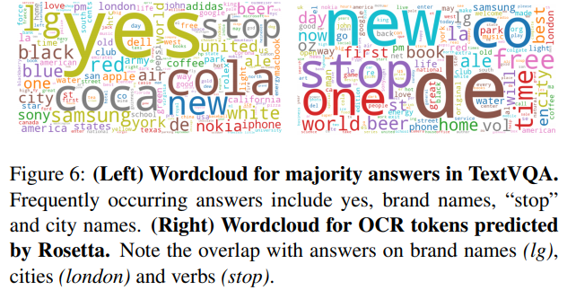  

回答の長さの分布  
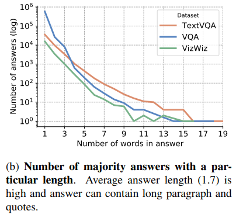  

頻出回答上位500個  
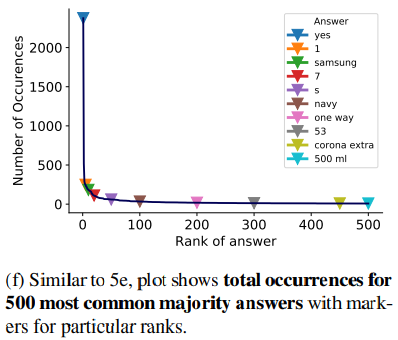  

OCRトークンを持つ画像の数  
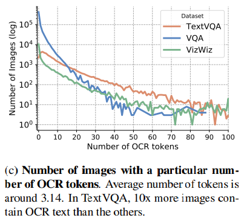  


#  Experiments
## baseline
1. OCR UB : 答えがOCRトークンから直接構築できる場合に得られる上限精度
2. LA UB : 答えがLAの場合に常に正解の回答を予測した場合に得られる上限精度
3. LA + OCR UB : 1 + 2
4. Rand 100 : 頻出回答上位100の回答からランダムに選択した場合の精度
5. Wt. Rand 100 : 頻出回答上位100の回答から出現頻度で重み付けした場合の精度
6. Majority Ans : "yes"のみを予測した精度
7. Random OCR token : 画像内で検出されたOCRトークンからランダムに選択
8. OCR Max : 画像内で最も多く検出されたOCRトークンを予測回答とした場合の精度
9. Question Only (Q)
10. Image Only (I)
11. I+Q
12. Pythia + O : OCR featureを用いるが copy moduleを用いない
13. Pythia + O + C : copy module を用いるが，OCRトークンを直接予測することしかできない

vocab :  
- SA : トレーニングセットに少なくとも2回以上出てくる 3,996 の回答セット  
- LA : 8,000以上の頻出回答セット  

## 定量的評価
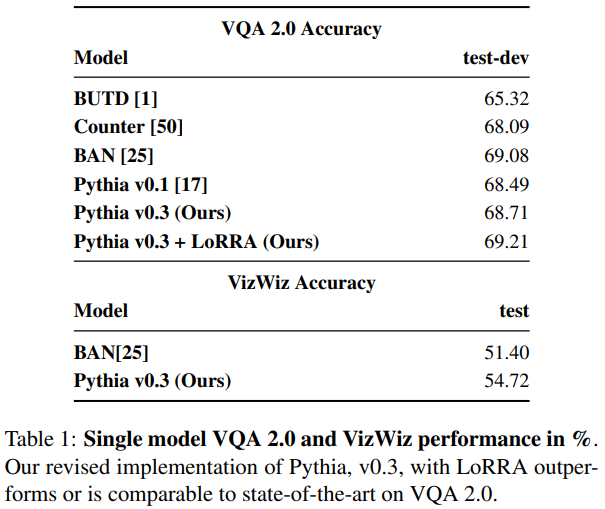  

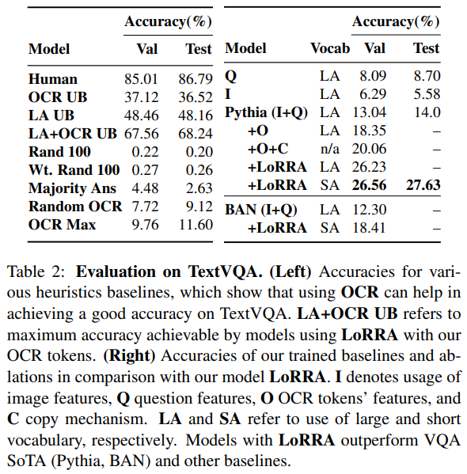  
OCR UBよりも提案モデルが悪いので，改善の余地がある．  
語彙空間を LA -> SA にすることで，OCRトークンの回答を予測しやすくなり，精度が上がった．  

## 定性的評価
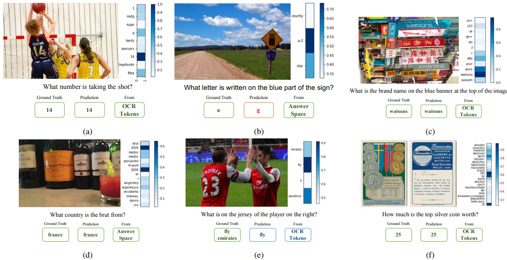  
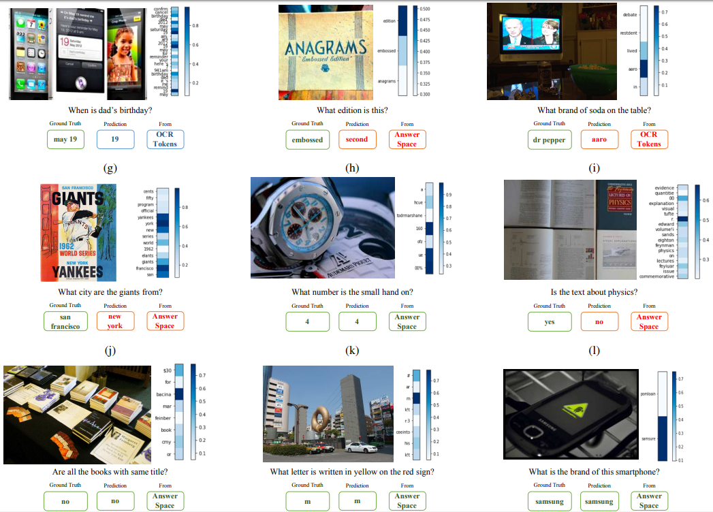  
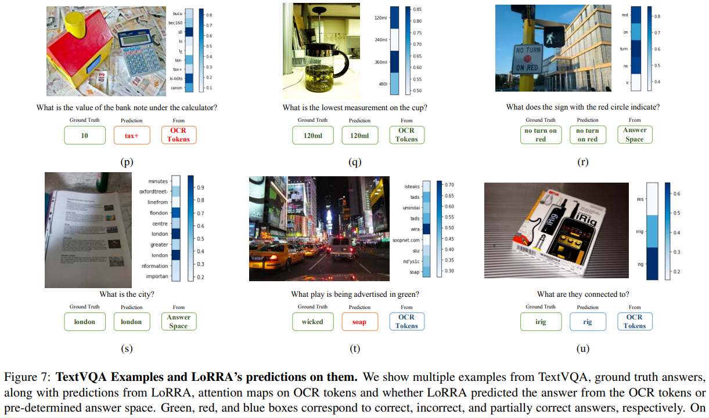

