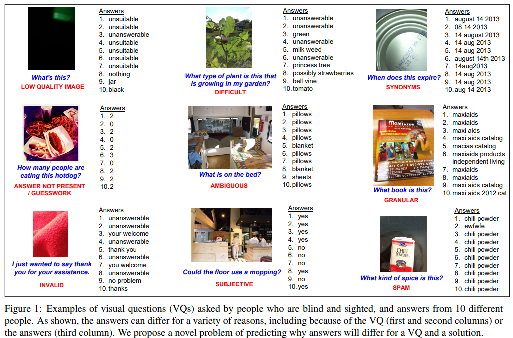
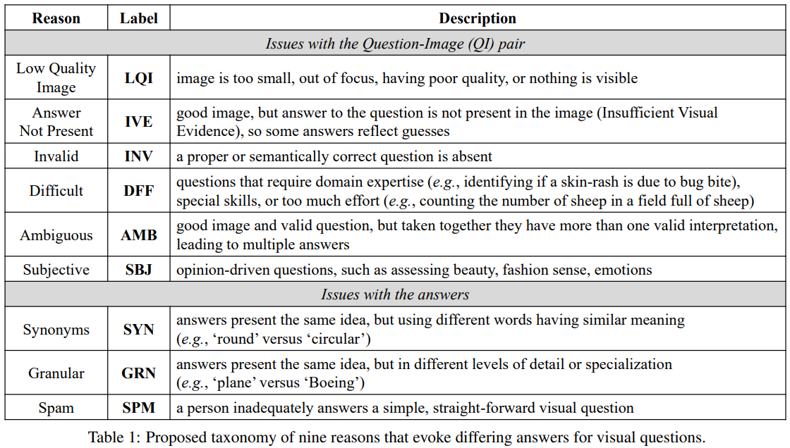
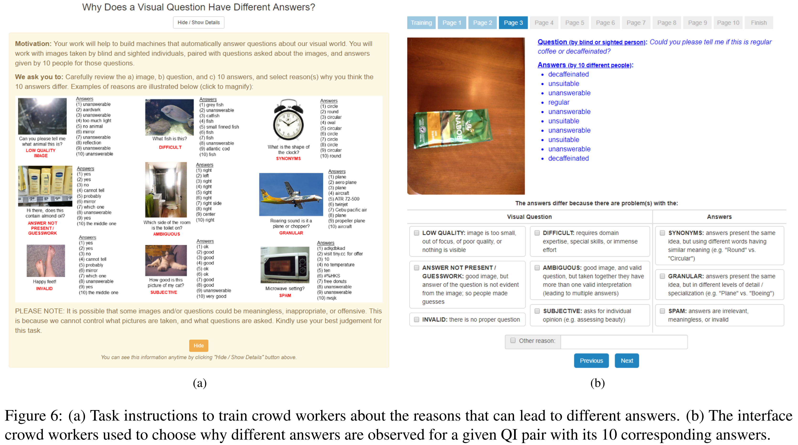
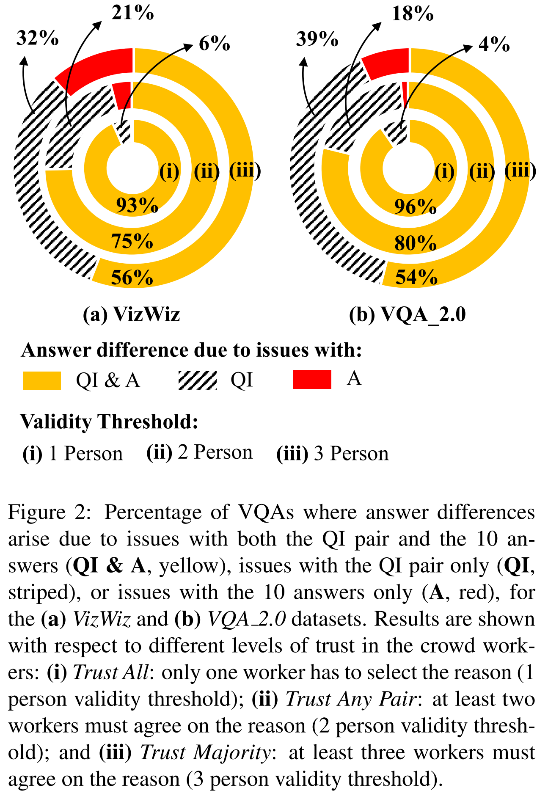
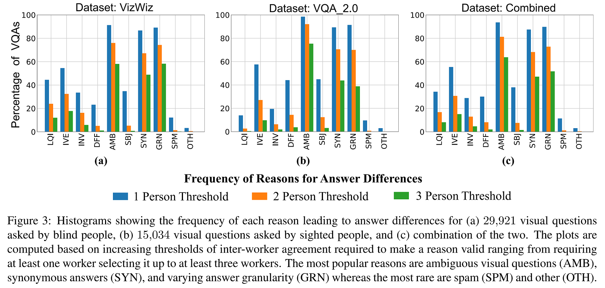
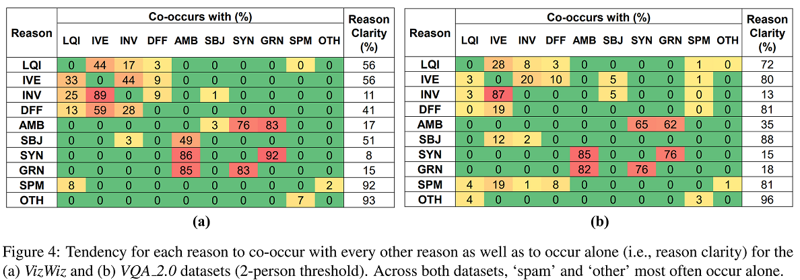
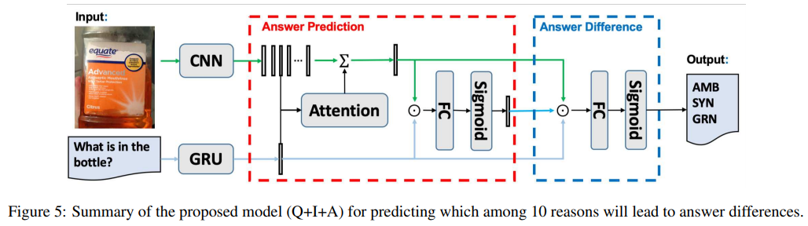
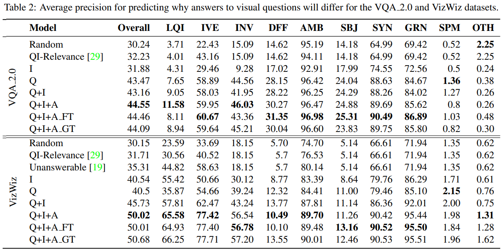

Nilavra Bhattacharya, Qing Li, Danna Gurari
University of Texas at Austin, University of California, Los Angeles
ICCV2019  
[arXiv](https://arxiv.org/abs/1908.04342), [pdf](http://openaccess.thecvf.com/content_ICCV_2019/papers/Bhattacharya_Why_Does_a_Visual_Question_Have_Different_Answers_ICCV_2019_paper.pdf), [HP](https://vizwiz.org/tasks-and-datasets/vizwiz-answer-diff/)  


# どんなもの？
VQAでは同じ質問でも人によって異なる回答をすることが多いことが問題なので，その理由を理解することを目的とする．  
9つの理由の分類法を提案し，ラベル情報として用意したデータセットを作成．  
  

# 先行研究との差分
一般的な仮定として，VQAの目標は単一の回答を返すこと．  
しかし，[先行研究](http://www.cs.utexas.edu/~grauman/papers/2017_CHI_GurariGrauman.pdf) では視覚的な質問が異なる回答を引き出すことが一般的であることが示されている（3つのVQAデータセットにおいて約50万件の視覚的質問の半分以上で発生）．  

目標は、異なる答えが生じる理由を特定すること．
したがって，視覚的な質問に対して複数の回答が存在する可能性があるという前提に基づいている．

図1のような分類ができれば：
1. ユーザーが視覚的な質問を修正して単一の回答に到達する方法を特定できるようになる．e.g. 画像が低品質であったり，解答が表示されていない場合は画像を撮り直す．
2. 単一の回答が与えられたときに、単一の回答になる理由がわかる．
3. 複数の回答が収集されたときに，異なる回答を自動的に集約する方法を明らかにする．


# Labeled Datasets
## Reasons for Differing Answers. 
予備実験から以下の9つの理由でほとんどのデータを分類できる．  
  


## Approach for Labeling VQAs.
アノテーションを付けるために，インターフェースを作成．  
画像と質問，10個の回答をクラウドワーカーに提示し，解答が異なる理由となるもの全てを選択してもらう．  
適切だと思われる理由が無かった場合には，自由記述で記入してもらう．  
1サンプルにつき5人のクラウドワーカーからアノテーションを収集．  

  

# Understanding Why Answers Differ
224,775件のアノテーション結果を分析

## (Un)Common Reasons for Answer Differences
回答が異なるのは QI と A の両方に問題がある．  
Aのみが問題であることはほとんどない．  
QIのみが問題になる割合はある程度多いので，この部分は修正が容易．  
  

## Frequency of Each Reason.
どちらのデータセットでも，AMB, SYN, GRN の割合が高い．  
全体的にVizWizとVQAv2.0の傾向は似ていた．  
  

AMBの例：  
- VizWiz : 複数のオブジェクトが映っている画像でオブジェクトに関する質問をする(e.g. Q:"What (object) is this ...?", A:"store","shopping area", "shopping cart")  
- VQAv2.0 : 長い質問(e.g. ‘What weather related event can be seen under the clouds in the horizon?’)

GRNとSYNは質問を明確にするか，回答の粒度を変える(同義語をまとめる)ことで解決できる．  
spam(SPM)の影響は小さいので，スパムの検出精度を上げるよりも他を改善した方がいい．  


## Co-Occurring Reasons for Answer Differences
VizWiz, VQAv2.0 それぞれ55%以上で3つの理由から回答が異なる．  
2つの理由が15%, 4つの理由が16%．  

```math
\text{co_occurrence}(d_i,d_j) = \frac{P(d_j|d_i)-P(d_j|\bar{d_i})}{1-P(d_j|\bar{d_i})}
```

共起性の確認  
  
Reason Clarity : 理由が単独で現れる割合  
QIが曖昧だと，回答の粒度が異なったり，どの同義語(e.g.‘money’, ‘currency’, ‘10 dollar bill’)を使うかについてばらつきが出る．  


# Predicting Why Answers Will Differ
'other' を含めた10ラベルの分類問題として回答が異なる理由を予測する．  
真値ラベルは5人のクラウドワーカーのうち2人以上がそのラベルの存在を示した場合に '1' とする．  

## 提案モデル
  
Answer Prediction ではすべての候補回答についての信頼度を表すベクトルを出力する．  
binary cross entropy lossで学習  


## baseline
- QI-relevance : 画像と質問が関連しているかを予測するモデル([pdf](https://arxiv.org/pdf/1705.00601.pdf))．関連しているなら“LQI”, “IVE”, “AMB” を0,他を1として予測する．関連していなかったらランダム．
- unanswerable : 回答可能なら“LQI”, “IVE”, “AMB” を0,他を1として予測する．


## Result
  
既存のタスクを解くアルゴリズムをそのまま使うのでは性能が悪いので，専用のモデルを学習する必要がある．  
subjective, difficult の性能が悪く，常識などの抽象的な概念を学習する必要がある．

