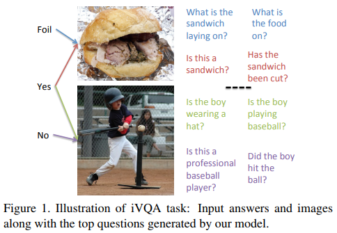
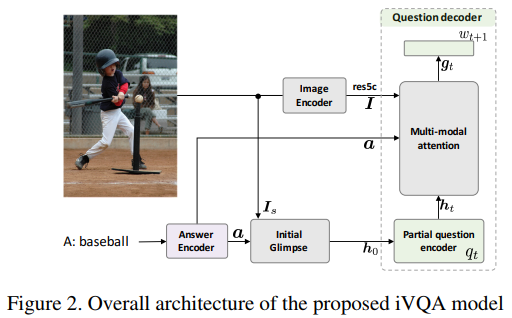
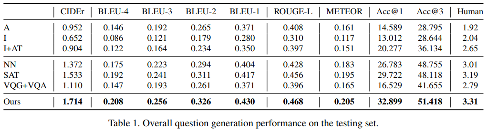
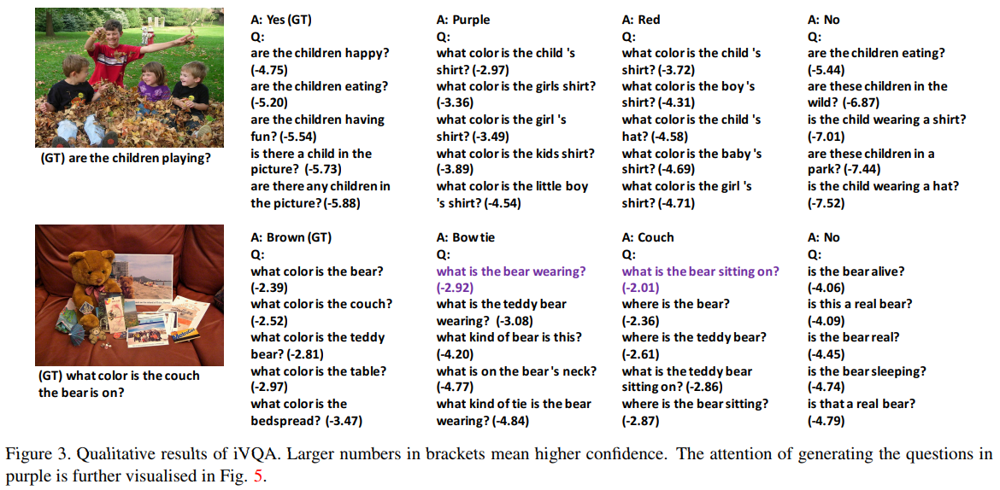
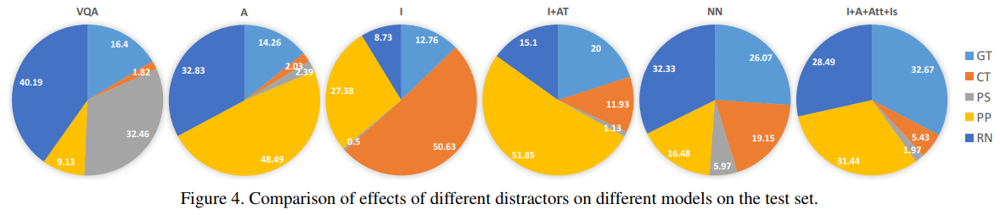
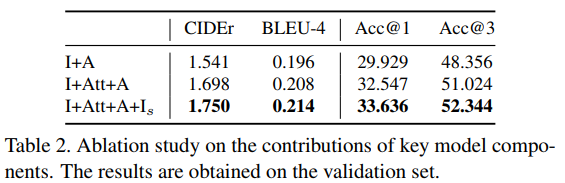
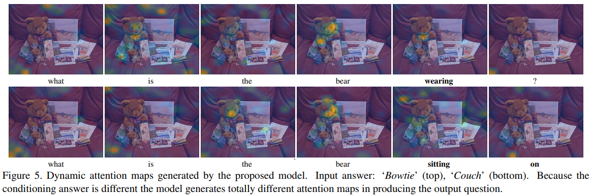

iVQA: Inverse Visual Question Answering  
Feng Liu, Tao Xiang, Timothy M. Hospedales, Wankou Yang, Changyin Sun  
CVPR2018  
[arXiv](https://arxiv.org/abs/1710.03370) , [pdf](https://arxiv.org/pdf/1710.03370.pdf)  

# どんなもの？
与えられた画像と回答ペアに対応する質問を生成するVQAの逆問題(iVQA)を提案．  
回答と生成した質問からアテンションを調整できるiVQAモデルを提案．  
既存の言語的評価（CIDErなど）とは別にランキング評価指標を提案．  
  

# 先行研究との差分
従来のVQAの成功がデータセットバイアス及び質問文からの情報理解に依存しており，画像の内容に対する理解がまだVQAにおいて深く利用されていないことが指摘された．  
そこで，画像と回答文から質問文を予測する問題設定iVQAを提案．
回答は質問よりも情報量が少ないため，iVQAで性能を出すためにはVQAよりも画像の理解が重要になる．  

回答によっては全く異なる質問が生成されても間違いでない可能性がある．  
既存の言語的評価だとこの部分を正しく評価できない．  
人に評価してもらい，この問題を解決する．  
また提案する評価方法では，真値の質問を評価する確率に基づいてスコア付けする．この評価方法は言語的評価よりも人が評価したスコアと高い相関があった．  

# 提案モデル
回答と生成した質問からアテンションを調整できる動的マルチモーダルアテンションベースのiVQAモデル  

  

Image Encoder にはResNet-152を使用．得られた特徴量 $I=\{v_{i,j}\} , v_{i,j}\in \mathbb{R}^{2048}$ は local feature として扱う  

semantic concept feature $I_s\in \mathbb{R}^{1000}$ を global feature として扱う．$I_s$は画像キャプション中の頻出単語から既存の[コンセプト予測器](https://arxiv.org/abs/1611.05490)を使用して得られる．
  
Answer Encoder, Question Decoder にはLSTMを使用．  

## Dynamic multi-modal attention
iVQAでは複数のdecodingステップを必要とするので，アテンションはそれに応じて動的に変更される必要がある．

ex:“Q: What colour is the dress the girl is wearing?”; “A: Pink”.  
回答が与えられると，モデルは色に関する質問であることを推論する．  
モデルがタイプ固有の部分質問 $q_t = \{what,color,is,the\}$ を予測した後，アテンションネットワークは $q_t$ を $a = \{pink\}$ と統合する．その後ピンク色のオブジェクトを捜し，アテンション特徴を出力する．  
このアテンション特徴に基づいて次の単語を予測する．  
提案するアテンションモジュールは以下のサブセットから構成される．  

### Initial glimpse
$I_s, a$を統合してデコーダーの初期値として利用．  
$h_0 = \delta(W_{ih}I_s + W_{ah}a)$  
$\delta()$はtanhを使用．  

### Encoding of partial question
LSTMを用いて部分質問$q_t$の隠れ表現$h_t$を生成．  
$x_t = Ew_t$  
$h_t,m_t = \text{LSTM}(x_t,h_{t-1},m_{t-1})$  
$w_t$ : 単語のone-hotベクトル  
$E$ : 単語埋め込み行列  

### Multi-modal attention network
local features $I$, 部分質問特徴 $h_t$, $a$ を入力として，部分質問と回答コンテキスト $z_t$ によって指定されたアテンション付き特徴 $c_t$ を出力する．  
$z_t = \text{ReLU}(W_q h_t + W_a a)$  

multi-modal low rank bilinear pooling (MLB) によって$c_t$を得る．  
$f_{ij} = \delta(U\delta(W_v v_{i,j}) \odot \delta(W_z z_t))$  
$a_{ij}^t = \text{softmax}(p^T[f_{ij}])$  
$c_t = \sum_{ij} \alpha_{ij}^tv_{ij}$  
$U, W_v, W_z, p$ : corresponding embedding weight

$c_t, z_t$ を用いて  
$g_t=\delta(U'\delta(W_c c_t) \odot \delta(W_z'z_t))$  
$U', W_c, W_z'$ : embedding weight

### Word predictor
$w_{t+1} \sim \text{softmax}(W_og_t)$  
$W_o$ : classifier weight  

# 評価方法
- Linguistic Metrics : CIDEr, BLEU, METEOR, ROGUE-L
- Human study : 1,000サンプルを0~4段階で人が評価し平均をとる．
- Ranking Metric : 提案．conditioning score $p(q|I,a;\theta)$ をランキングに使用．真値の質問のランクが一番高い時，この(I,A)ペアは Rank-1 で正解とみなす．以下のQuestion Poolから質問候補を作成し，multi-choiceの問題にしている？

## Question Pool
(I,A)ペアについて，質問候補は以下のサブセットから集められる
- Correct questions (GT)
- Contrastive questions (CT) : I に似ているが回答が異なる場合の質問．
- Plausible questions (PS) : モデルが質問間の微妙な違いを示し，文法の正確さを維持できるかどうかをテスト．真値の質問の単語の1つをランダムに置き換える．
- Popular questions (PP) : 同じ回答タイプ内で多い質問．モデルがラベルバイアスにどの程度依存しているかを見る．
- Answer-related (RN) : 別画像で$A$の回答を持つ質問．モデルが視覚的特徴にどの程度依存しているかを見る．

# 評価実験
データセットはVQAv2.0を使用．テスト回答は利用できないので，40,504のvalidationデータから5,000ずつvalidationとテストに使用．  
生成した質問と真値の質問のクロスエントロピーを最小にすることで学習．  
最大文章長20のビームサーチを使用して質問を生成．定量結果に3，定性結果に10を使用．

各(I,A)ペアについてQuestion Poolは24の質問を持っている．1-3 are GT, 3-5 are CT (so that the total of GT+CT is 6), 6 are PP, 6 are PS, and 6 are RN .

## baseline model
- Answer only (A)：入力が回答のみ
- Image only (I, VQG)：入力が画像のみ．既存の[VQG](https://arxiv.org/abs/1603.06059)のモデルを使用．
- Image+Answer Type (I+AT)：↑のモデルにone-hotの回答タイプの情報を追加
- NN：既存の[nearest neighbourを用いた画像キャプション](https://arxiv.org/abs/1505.04467)を使用
- SAT：アテンションキャプション手法であるShow attend and tell([SAT](https://arxiv.org/abs/1502.03044))を使用
- VQG+VQA：VQGで質問を10個生成し，$p(q|I,A;\theta)$を基にVQAで選択する．VQAには既存モデル([multimodal low-rank bilinear attention network](https://arxiv.org/abs/1610.04325))を使用
- Ours

## 結果
  
VQG+VQAはキャプションモデル(NN, SAT)や提案モデルよりも性能が悪い．理由としてVQGモデルの性能が悪く，VQAモデルに質の良い質問候補を提供できないから．

人間による評価と提案したランキングの評価に高い相関がある．  
人間による評価とacc@1,acc@3それぞれのピアソン相関係数は0.917,0.981であり，言語尺度の中で最も高かったCIDErは0.898だった．→提案したランキング評価は良い評価指標

### 定性的評価
  
同じ答えでも異なる画像に対して異なる質問が生成されている．また，同じ画像を異なる回答と組み合わせると，まったく異なる質問が生成されている．

### 各モデルのRank-1予測結果．
どのタイプで間違っているか考察する．  
  
VQAではRNが支配的→画像情報よりも回答に関する質問を単に生成しているだけ．  
提案モデルではGTが他のモデルよりも多い．ただPPも比較的高い．  

### Ablation study  
  
動的アテンションが性能を出すために最も重要．  

### アテンションマップ  
  
生成された単語に応じて動的に変化している  

### iVQAを用いてVQAの性能を向上させることができるか？  
テスト中に、VQAスコアが上位3つの回答を回答候補として選択，次にiVQAモデルで2番目のスコア?を計算．それらをスコア融合ネットワークによって結合し，出力を最終予測の信頼度として利用．  
VQAとiVQAの融合前は57.85，最終モデルでは58.86の精度に到達した．  
VQAをアシストできそう．

