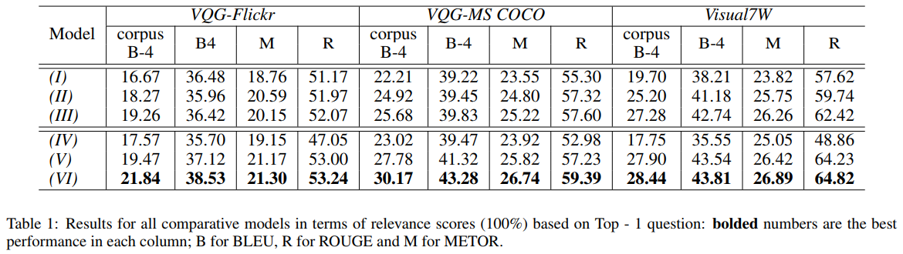

Zhihao Fan, Zhongyu Wei, Piji Li, Yanyan Lan, Xuanjing Huang  
[pdf](https://www.ijcai.org/proceedings/2018/0563.pdf)  
IJCAI 2018

# どんなもの？
  
与えられた画像に関する質問にはさまざまな種類(質問タイプ)があり，単一の質問タイプでも焦点が異なると様々な質問が生成されるかもしれない．  
質問タイプは様々な情報ニーズに合わせて質問を作るために使用できると考え，多様な質問生成をするために質問タイプをどのように用いるか調べる．  


# 先行研究との差分
異なる人は同じ画像について異なる質問をするかもしれないが，従来のVQGでは単一の質問しか生成していない．  
VQGシステムも様々な焦点で質問を生成すべき．  
テキスト生成結果を多様化する研究があるが，どれも質問の特別な特徴を考慮していない．  
提案モデルでは，入力画像に対して焦点を変えて複数の質問を生成することができる．  
質問タイプをサンプリングして，どの種類の情報が要求されているかを判断する．質問の内容は，サンプリングされた質問タイプと画像情報に基づいて生成される．  
質問の多様化を強化するために，2つの要素を提案．


# メモ
VQGの利用シーン：児童教育での実演[Kunichika et al., ICCE, 2004](https://www.researchgate.net/publication/228948179_Automated_question_generation_methods_for_intelligent_English_learning_systems_and_its_evaluation)，チャットボットなどの初期会話 [Mostafazadeh et al., IJCNLP, 2017](https://arxiv.org/abs/1701.08251)，VQAにおいて質問生成の負担軽減


# 提案モデル
  

## Question Type and Image Encoder
疑問語に基づいてN個の質問タイプ(e.g. who, which,など)を事前定義し，word2vecでベクトル化する．
VGGNetを用いて画像特徴を抽出．

質問タイプと画像特徴との間の相関関係を学ぶために，それらを連結し3層MLPに供給する．$c_{i,j}=f_1([v_i,t_j])$


## Question Generation via Conditional Variational Auto-Encoder
特定の質問タイプ $t_j$ に関する質問を生成する．  
RNNを用いて質問を生成するが，特定の質問タイプから複数の質問が存在する可能性があることを考慮すると，deterministic decoderでは十分ではない．  
そこでconditional variational auto-encoder(C-VAE)を用いて複数の質問を生成する．  

  

目的はターゲット分布 $P_\theta(q_{i,j}|I_i,t_j)$ を近似する分布 $P_\phi(z_{i,j}|I_i,t_j)$ を学習すること

```math
\begin{aligned}
\log(P_\theta(q_{i,j}|I_i,t_j)) &= KL(P_\phi(z_{i,j}|q_{i,j},I_i,t_j)||P_\theta(z_{i,j}|q_{i,j},I_i,t_j)) + E_{P_\phi(z_{i,j}|q_{i,j},I_i,t_j)}[\log(\frac{P_\theta(q_{i,j},z_{i,j}|I_i,t_j)}{P_\phi(z_{i,j}|q_{i,j},I_i,t_j)})] \\
&\geq E_{P_\phi(z_{i,j}|q_{i,j},I_i,t_j)}[\log(\frac{P_\theta(q_{i,j},z_{i,j}|I_i,t_j)}{P_\phi(z_{i,j}|q_{i,j},I_i,t_j)})] \\
&= -KL(P_\phi(z_{i,j}|q_{i,j},I_i,t_j)||P_\theta(z_{i,j}|I_i,t_j)) + E_{P_\phi(z_{i,j}|q_{i,j},I_i,t_j)}[\log(P_\theta(q_{i,j}|z_{i,j},I_i,t_j))]
\end{aligned}
```

$P_\theta(z_{i,j}|I_i,t_j)$ を正規分布 $N(0,I)$ とみなす ＋ 第二項は $P_\phi(z_{i,j}|q_{i,j},I_i,t_j)$ から標本をサンプリングすることによって推定できる．  
$\log(P_\theta(q_{i,j}|I_i,t_j))$ の下界もVAEのlossとみなせるので，

```math
L_{C-VAE} = -KL(P_\phi(z_{i,j}|q_{i,j},I_i,t_j)||N(0,I)) + \frac{1}{L}\sum_{l=1}^L \log(P_\theta(q_{i,j}|z_{i,j}^{(l)},I_i,t_j))
```

$z_{i,j}^{(l)} = g_\phi(q_{i,j},I_i,t_j,\varepsilon) , \varepsilon\sim N(0,I)$
標本サンプルにはRNN $g_\phi$ を使用．  

潜在空間からサンプリングされた変数のみを使用して復号化する従来のVAEとは異なり，視覚情報を考慮する必要がある．  
$c_{i,j} , z_{i,j}$ はRNNデコーダーの第一，第二状態に供給される．  
トレーニングでは $z_{i,j}$ は $g_\phi$ から得られ，モデルは生成した質問を潜在空間にエンコードし，$N(0,I)$ を近似する．  
テストでは $z_{i,j}$ は学習した潜在空間から直接サンプリングされる．  
より多様な質問を生成するために，$N(0,5I)$ のようにより分散が大きい分布からサンプリングも出来る．  

## Question Type Distribution Learner
入力画像が各質問タイプによって質問される可能性がどの程度あるかを知るために確率分布を計算する．

全ての $c_{i,j}$ を重ねて $N\times d_f$ 次元の行列を作る．  
この行列を 3層のMLP -> 3層の畳み込み層 -> 2層のFC層 -> softmax層　に通す．  
学習にはクロスエントロピーを使用

```math
L_t(I_i) = -\sum_{j=1}^N p_{i,j} \log \hat{p}_{i,j}
```

##  Question Selection
生成した質問に確率を割り当て，出力する質問を選択する．  

```math
P(q_{i,j}|I_i) = P(q_{i,j}|I_i,t_j)P(t_j|I_i)
```

出力する質問は

```math
\text{argmax}_{q_{i,j}\in Q} \{P(q_{i,j}|I_i,t_j)\}
```

各時間ステップのデコーダーは以下の様になる

```math
\text{argmax}_{w_{i,j,t}\in W} \{P(w_{i,j,t}|I_i,t_j,w_{i,j,1},...,w_{i,j,t-1})\}
```

デコーダーの各時間ステップで全ての確率を計算できるが，各単一の確率を最大化することは最終目標を最大化することを保証しない．  
従ってビームサーチを用いて $\max{P(q_{i,j}|I_i,t_j)}$ を得る．

$p(q_{i,j}|I_i,t_j)$ に基づいて生成する目標質問の確率を $S_1$ と表わす．

```math
S_1(I_i,t_j,q_{i,j}) = \log(P(q_{i,j}|I_i,t_j)) / lp(q_{i,j})
```

短い質問を生成しないように長さのペナルティ $lp(q_{i,j})$ を導入

```math
lp(q_{i,j}) = \frac{(5+|q_{i,j}|)^\alpha}{(5+1)^\alpha} , \alpha \in (0,1)
```

$|q_{i,j}|$ ：生成した質問の単語数

入力画像に対応する質問タイプの確率の対数を $S_2$ とする．

```math
S_2(I_i,t_j) = log(P(t_j|I_i))
```

テスト中に生成された質問の最終スコアを計算するために，$S_1, S_2$ のスコアを考慮する．このスコアに基づいて生成された質問をランク付けすることができ，出力としてトップkを選択することができる．

```math
S(I_i,q_{i,j}) = S_1(I_i,t_j) + S_2(I_i,t_j,q_{i,j})
```

# 評価実験
データセットはVQG-MS COCO, VQG-Flickr, Visual7W-tellingを使用．  
質問タイプを(‘what’, ‘who’, ‘where’, ‘when’, ‘why’,
‘how’, ‘is’, ‘do’, ‘can’)の9タイプとした．  

評価方法はBLEU-4, corpus-BLEU-4, METEOR, ROUGEを使用．  
また多様性の評価としてmBLEUを使用．画像に対して生成された質問間の類似性が低いほど優れているとみなす．  
$B(h,R)$ をBLEU，$Q_i = \{q_{i,k},k=1,2,...,K\}$ を$K$個の生成した質問とすると，mBLEUは以下のように計算される

```math
mB(Q_i,I_i) = \frac{1}{K}\sum_{k=1}^K B(q_{i,k}, Q_i\ q_{i,k})
```

## 比較手法
- NN-generator (I) : ターゲット画像に似ている質問を出力
- i2q (II) : seq2seqモデル
- i2q+C-VAE (III) : C-VAEを質問生成に利用
- i2q+QT (IV) : 質問生成のガイドとして質問タイプを考慮．トップの質問は $S_1$ のみ考慮
- i2q+QT+QTD (V) : ↑に加えて質問タイプの分布を学習
- i2q+QT+C-VAE+QTD (VI) : 提案モデル

## 言語モデルの評価
  
NN-generator(I) は性能が比較的良いが，画像に関係ない質問が生成されることが多い．  
i2q(II)はi2q+QT(IV)よりも性能がよい．質問タイプがなくてもi2qは質問タイプ間で質問を比較して最も確率が高いものを選択する能力があると考えられる．  
質問タイプの分布を学習することでi2qよりも性能が上がる．  
提案モデルが最も性能が良かった．

## 多様性の評価
  
値が低いほど良いという指標．

## 定性的評価
  
i2q+QTはさまざまな種類の質問生成が出来ているが，質問の焦点は主に"temple"という単語に集中している．  
→ モデルがキーワード生成に高いスコアを与えるため．  
提案モデルでは真値にない質問も生成できている．