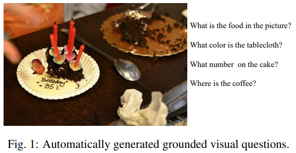
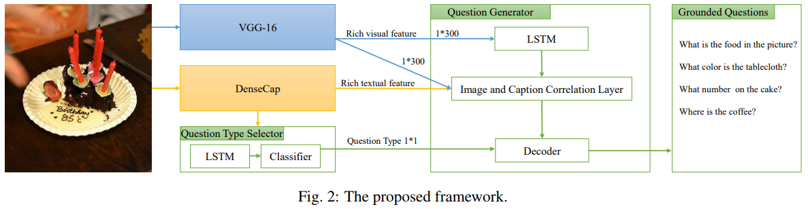
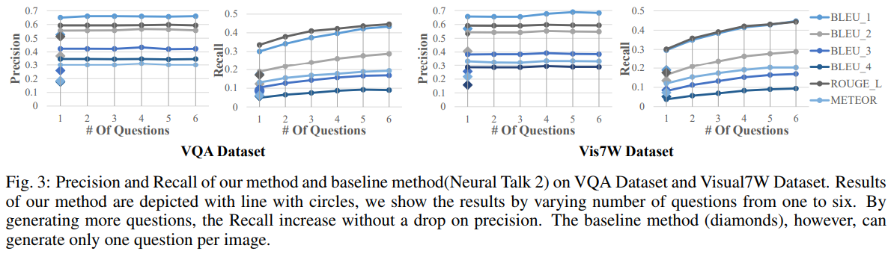
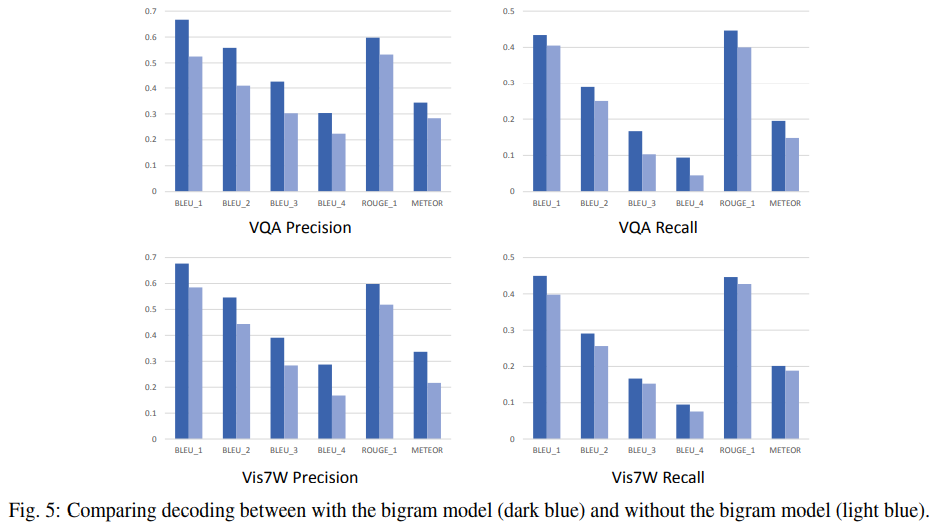
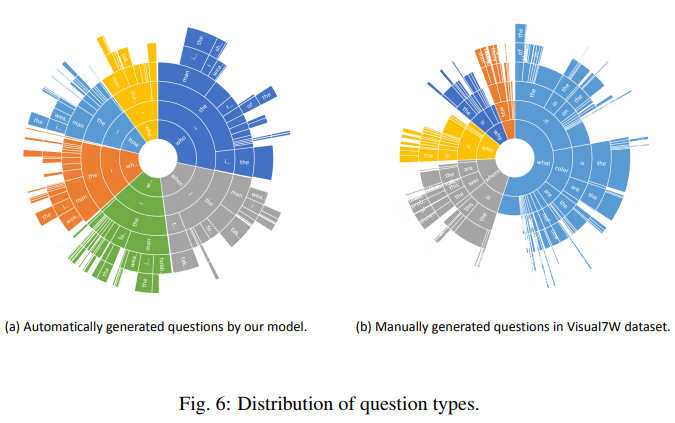

Shijie Zhang, Lizhen Qu, Shaodi You, Zhenglu Yang, Jiawan Zhang  
[arXiv](https://arxiv.org/abs/1612.06530) , [pdf](https://arxiv.org/pdf/1612.06530.pdf)  
IJCAI2017  


# どんなもの？
一つの画像に対して多様な種類の視覚的根拠のある質問を生成できるモデルを提案．  

  

# 先行研究との差分
既存のVQGシステムは，少数の限られたテキストパターンで質問を生成するようなルールベースのものや，生成された質問に視覚的な根拠がないものである．  

提案モデルでは画像だけでなく，dense captionモデルによって生成されたキャプションを用いる．  
DenseCapによって生成される各キャプションは異なる領域に関連付けられているため，異なる領域を参照する複数のタイプの質問を生成できる．  


# モデル
  

1. 各画像 $x_i$ について，Visual Genomeで学習したDenseCapを用いてキャプションセット $C_i$ を生成  
2. $C_i$ からキャプション $c_n$ を選択
3. $c_n$ の質問タイプ $t_n$ を選択
4. $c_n, t_n$ の条件で質問 $q_n$ を生成

```math
P(q_n,t_n,c_n|x_i,C_i;\theta)=P(q_n|c_n,x_i,t_n;\theta_q)P(t_n|c_n;\theta_t)P(c_n|C_i)
```

$Q_i$ を $x_i$ の質問セットとすると，トレーニングデータセット $D$ の確率は

```math
P(D|\theta)=\prod_i \prod_{n\in Q_i}P(q_n, t_n|x_i,C_i;\theta)
```

## Sample captions and question types
各キャプション $c$ は領域と提案された領域の信頼度 $o_c$ に関連付けられる．事前確率を次のように定義：

```math
P(c_k|C_i)=\frac{\exp(o_k)}{\sum_{j\in C_i} \exp(o_j)}
```

キャプションの質問タイプ(what, when, where, who, why, how)を推論する．  
メインアイデアは，質問タイプとキーワード/キーフレーズの関連を学習すること．  
$P(t_n|c_n)$ モデルはLSTMとSoftmax層からなる．  
LSTMの最後の隠れ状態 $h_t$ を用いて各質問タイプの確率ベクトル $p_t$ を計算する．

## Generate questions
以下の3つのモジュールからなる
- キャプションの埋め込みを生成するLSTMのエンコーダー
- 画像とキャプション間の関連性を学習するための相関モジュール
- LSTMデコーダおよびnグラム言語モデルからなるデコーダー

### LSTMエンコーダー
予備実験によって，$\text{LSTM}(x_t, h_{t−1}, m_{t−1})$ がキャプションを読む前に画像特徴を読ませることが有用であることが分かった．  
具体的には $t=0$ において，$m_0=0$ として，$x_0$ に画像特徴を使う．  
$t=1$ で文の始まりを示すトークン $S_0$ を読み込む．  
長さ $L$ のキャプション全体を読み取り，$m_L$ を生成．


### 相関モジュール
$m_L$ と画像特徴を受け取り，300次元の特徴結合マップを出力．  
300×600の全結合層とPReLU層を順に適用．  
画像は全体的なコンテキストを示し，選択されたキャプションは画像内の一部を提供するので，結合表現は根拠のある質問を生成するのに十分なコンテキストを提供する． 


### デコーダー
LSTMデコーダーのみでも質問を生成できるが，”the the”のようなフレーズが頻繁に生成されてしまう．ビームサーチを適用しても解決しなかった．  
これは，補助タイムステップで生成された状態ベクトルが似ている傾向があるため．→ bigram言語モデルを適用し，前の単語を考慮する．

シーケンス $\textbf{w}=\{w_1,...,w_N\}$ が与えられると，bigram言語モデルは次のように定義される

```math
P(\textbf{w}) = \prod_{i=2}^N P(w_i|w_{i^1})P(w_0)
```

$P(w_i|w_{i^1})$ を推定するためにニューラルモデルの代わりに，KneserNey平滑化を適用し，単語数に基づくモデルパラメータの推定を行う．

```math
\frac{\max(\text{count}(w_{i-1},w_i)-d,0)}{\text{count}(w_i)}+\lambda(w_{t-1})P_{KN}(w_i)
```

$d$ は過学習を防ぐためのパラメータで0.75に設定．  
$\lambda(w_{t-1})$ は $w_i$ の正規化定数  
$P_{KN}(w_i)$ は，$(w_i,w_{i-1})$ がトレーニングコーパスに現れない場合の $w_i$ のバックオフ統計?(back-off statistic)  

LSTMデコーダは質問の最初の単語をうまく予測できるので，$t=1$ からbigram統計をLSTMデコーダに組み込む．  

```math
P(q_t|q_{<t})=(1-\beta)P_l(q_t|q_{<t})+\beta P_b(q_t|q_{t-1})
```

## 学習方法
トレーニングセット $\{(x_1,q_1),...,(x_N,q_N)\}$ が与えられると，lossは以下のようになる．  

```math
l(\theta)=\sum_{i=1}^N \sum_{n\in Q_i} - \log P(q_n,t_n|x_i,C_i;\theta)
```

$\sum_n Q(c_n)=1 , Q(c_n)\geq 0$ となる $Q(c_n)$ を定義し，Jensensの不等式を使用してlossの上界を得る：

```math
\begin{align}
\log P(q_n,t_n|x_i,C_i;\theta) &= \log\sum_{c_k \in C_i} Q(c_k)\frac{P(q_n,t_n,c_k|x_i,C_i;\theta)}{Q(c_k)} \\
& \geq \sum_{c_k \in C_i} Q(c_k)\log\frac{P(q_n,t_n,c_k|x_i,C_i;\theta)}{Q(c_k)}
\end{align}
```

境界が厳しい時，$Q(c_k)=P(c_k|q_n,t_n;\theta)$  

EMループを節約するために，$P(c_k|q_n,t_n;\theta)$ のノンパラメトリック推定を提案する．結果として各 $(x_n,q_n)$ について最適化によって下界を最大化する  


```math
\text{arg}\min_\theta -P(c_n|q_n,t_n;\theta_c)log[P(q_n|c_n,x_n,t_n;\theta_q)P(t_n|c_n;\theta_t)]+\text{const}
```

これは実際には各インスタンスに重み $P(c_n|q_n,t_n;\theta_c)$ を割り当てている．  

トレーニングセットから質問 $q$ とキャプションセット $C$ が与えられると，カーネル密度推定量を使って $P(c_k|q,t;\theta)$ を推定する

```math
P(c_k|q,t;\theta) = P(c_k|q;\theta) = \frac{s(q,c_k)}{\sum_{c_j\in C}s(q,c_j)}
```

$s(q,c)$ は質問とキャプションの類似度計算関数．  
最初の数単語を見ることによって $q$ から直接質問タイプを抽出できるので，$c_k$ は $t$ から条件付きで独立していると仮定．  
与えられた質問に対して，DenseCapによって生成されたキャプションが一致していることはほとんどない．したがって，毎回ランダムにキャプションを選択することで十分．

キャプションのと質問との文字列類似度を計算するために Jaccard Indexを使用

```math
\text{sim}_s(q,c)=\frac{q\cap c}{q\cup c}
```

類義語を考慮して，word embeddingの類似度を計算する．

```math
\text{sim}_e(q,c)=\cos(\sum_{w_i \in q}\frac{\text{IDF}(w_i)}{\sum_j \text{IDF}(w_j)}Ew_i, \sum_{w_k \in c}\frac{\text{IDF}(w_k)}{\sum_j \text{IDF}(w_j)}Ew_k)
```

最終的な類似度は以下の様になる：

```math
s(q,c) = \alpha\text{sim}_s(q,c)+(1-\alpha)\text{sim}_e(q,c)
```


# 評価実験
データセットはVQAv1.0とVisual7Wを使用．  

ベースラインとして画像キャプション生成モデルである [NeuralTalk2](https://arxiv.org/abs/1411.4555) を使用．  

評価指標：BLEU, METEOR, ROUGE-L  
また生成された質問の多様性を測定するために，各参照文を同じ画像の最も一致する生成された文と比較することによって、同じ評価尺度のセットを計算


# 結果
## 生成された質問の網羅度を測定  
  
質問数が増えるにつれてすべての尺度が向上する．  
6つの質問が生成されると，ベースラインよりも130％高い結果が得られた．  
特にMETEORではベースラインに対してVQAとVisual 7Wそれぞれで216％と179％の改善を示す．  

## 定性的評価  
  
提案モデルは手動の質問よりもさらに多くの種類の質問を提供することが出来る  

## bigramモデルの効果  
  
bigramモデルを使用することで ”the the” のような繰り返しのある用語が効果的に排除され，性能が良くなる．  
これはバイグラムモデルによって収集された統計が文法的に正しい文を優先するため．  

## 質問タイプの分布  
  
手動で生成した質問は "What" から始まる質問が多いが，提案モデルではバランスよく生成できている．  
