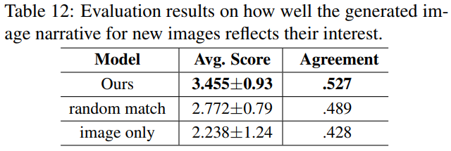

Andrew Shin, Yoshitaka Ushiku, Tatsuya Harada  
[arXiv](https://arxiv.org/abs/1805.00460) , [pdf](https://arxiv.org/pdf/1805.00460.pdf)  
CVPR2018  

# どんなもの？
人によって画像内で注目する領域が異なり，ユーザの興味に応じた物語を作成したい．  
  
提案モデルは対話の対象ユーザにカスタマイズ可能であり，単一画像から広範囲のトピックをカバーする様々な記述を生成できる

# 先行研究との差分
従来のキャプション生成などでは，一般的な真値のキャプションが存在するという前提だった．  
しかし実際には，人によって異なるキャプションを生成する可能性があり，従来の手法ではこの多様性を表現できない．  
-> 画像から自動的に物語を生成できるモデルと，ユーザに質問を提示しユーザの興味を反映した物語を生成するモデルを提案．  
またユーザの興味を学習し，新しい画像に対する物語生成も試している．


# Automatic Image Narrative Generation
self Q&Aモデルを提案

## Region Extraction
まずアノテーション付きバウンディングボックス上で訓練されたlinear SVMを用いて画像の特徴マップから領域候補を抽出する．
次に検出されたオブジェクトをよりよくローカライズする為に，候補領域をCNNに通す．  
最終的に画像ごとに上位5つの領域を抽出する．  

## VQG, VQA


入力画像 $I$，質問 $Q=(q_0,...,q_N)$ が得られると，学習プロセスは  

```math
x_{-1}=CNN(I), x_t=W_eq_t, p_{t+1}=LSTM(x_t)
```

候補領域 $r_0,...,r_N\in I$ ごとに質問を生成する

```math
x_{-1} = CNN(r_i), x_t=W_eq_t \\
q_t=\max_{q\in p}p_{t+1}= \text{argmax} LSTM(x_t)
```

  
異なる領域に注目しているので，単一画像から複数の質問を生成できている．  

## Natural Language Processing
ルールベースの変換を適用することによって得られた質問と回答のペアを宣言的な文に結合する．  

まず単語の位置を切り替えて質問を宣言的な文に言い換え，次に答えを適切な位置に挿入する(wh-単語と置き換える)．  
PennTree I Tags で使用されている品詞タグ表記を使用．  
  

# Interactive Image Narrative Generation
Automatic Image Narrative Generationをユーザが画像に関する質問に答えることでプロセスに参加する対話型環境に拡張する．  
生成される物語は提供されるユーザ入力によって異なる．

視覚的な内容の質問をすることでユーザーの興味を反映したい．  
そのために質問は一意の回答が得られるものではなく，複数の回答が予想されるものが良い．  
VQGによって生成された質問はVQAに渡され，確率分布 $p_{ans}$ を予測する．  

$c_i = \max p_{ans} , c_i \in C$ について単一の回答にならないように，閾値 $\alpha(=0.33)$ を用いる．  
以下の条件が満たされるまで繰り返し質問を生成する．  

```math
c_i < \alpha, c_i = \max p_{ans}
```

yes/noの質問タイプは除外．  
  

生成された質問にユーザが回答する．これはユーザの興味を反映していると考えられる．  

次にユーザの反応に対応する画像内の領域を抽出する．  

[SAN](https://arxiv.org/abs/1511.02274) で導入されたアテンションネットワークを少し修正する．  
↑では質問自体がネットワークに入力されているが，回答はすでに与えられているのでこれを利用する．  
アテンションの第2層が反応した座標の最大値と最小値を用いて領域を抽出する．

得られた領域を用いて物語を生成する．  

同一ユーザから複数の回答を集めることによって，新しい画像に対するユーザの選択を予測も試す．  
  


# 評価実験
データセットは MS COCOを使用．  

参考のために実際の人間が書いた画像の物語でどのような特徴が示されるのかを確認．  
MS COCOの画像を用いて画像に関するストーリー形式の5つのセンテンスの作成を依頼．  
  
求めた要素やスタイルに加えて，ユーモア，質問，提案などを含む他の多くの要素を非常に独創的な方法で記述している．  
これは従来のキャプションではこのような多様性に対応出来ない．  

## 自動生成モデルの評価

ベースラインは以下の3つ  
- COCO
- SIND
- DenseCap 

### 各モデルの生成例：  
  


###  BLEUの結果
  
人による評価と似たような傾向が見られる．

### 人による評価
Diversity, Interestingness, Accuracy, Naturalness, Expressivity (DIANE)　の5つの基準で評価を依頼．  
1画像につき2人のワーカーで5,000の画像を評価し，すべての測定基準は1~5までのスケールで評価．  

  

MS COCOは accuracy, expressivity に弱い．  
これは画像全体を記述する目的に制限されるので，画像内の特定の領域のキャプション生成がうまく機能しない．  

MS SINDはすべての測定基準の中で最も低いスコアだった．  
表6の例からも画像と割り当てられたキャプションとの間の相関が非常に低いことがわかる．  

DenseCapはベースラインモデルの中で最も性能が良かった．  
accuracyが最も高いが，不変トーン(invariant tone)と事実記述の目的のためにinterestingness, expressivityが弱い．  

提案モデルでは記述の正確さを犠牲にすることなく，すべての測定基準で高くランク付けされている．

### 提案モデルと各ベースラインとの比較：  
  


## Interactiveモデルの評価
ユーザーの個人的傾向を反映したデータを作成するためにクラウドワーカーに依頼．  
10,000の質問を生成し，10の質問ごとに1つのタスクにグループ化し，タスクごとに3人のワーカーに依頼した．  


### VQGの評価
単一の回答ではなく，様々な回答が得られるような質問を生成できているか確認するためにAMTのクラウドワーカーに依頼．  
VQGのみで生成した質問1,000個と，VQGとVQAの両方を用いて生成した質問1,000個を用意し，画像が与えられたときに質問の回答が様々な方法で答えられるかどうかを聞いた．  

  
VQGのみでは，学習対象の質問はVQAを学習するための質問なので，明確な回答が得られるような質問になっている．  
提案モデルでは回答ラベルの確率を均等に分散させた質問を選択しているので，VQGのみより結果が良い．  

生成した質問の例：  
  
  

### ユーザー依存の画像物語生成の評価
3,000枚の画像とそれに関連する質問，回答として3つの選択肢をワーカーに提示．  
各ワーカーは自由に選択肢の1つを選択し，選択した回答に対応する物語を評価する．  
評価は1~5で行われ，5が良い．  
ベースラインとして学習とテストに質問がないモデルを用意．  

  
Agreement scoreは[先行研究](https://academic.oup.com/poq/article-abstract/18/3/303/1907993?redirectedFrom=fulltext)に基づいて計算．  
提案モデルでは 'moderate' の範囲，ベースラインはそれより低い ‘fair’ の範囲．  

ユーザの回答から生成した物語の例：  
  
  

## 新しい画像にユーザの興味を反映
前の実験と同様に，各ワーカーには画像と質問，回答として3つの選択肢を提示．
回答をを選んだ後，新しい画像と物語を提示し，物語が選択した興味を反映しているかどうかを評価．  
ベースラインは前の実験と同じ．  
加えて回答をランダムに選択して学習したモデルを用意し，ユーザの選択に一貫性があるかどうかを調べる．  

  
システムがユーザーの特定の嗜好を学習し反映するために，コンテキストを提供することが非常に重要．  
また同一のユーザーによる一貫した選択でトレーニングすることが重要．  

ユーザの興味を考慮した新しい画像に対する生成物語例：  
  
  