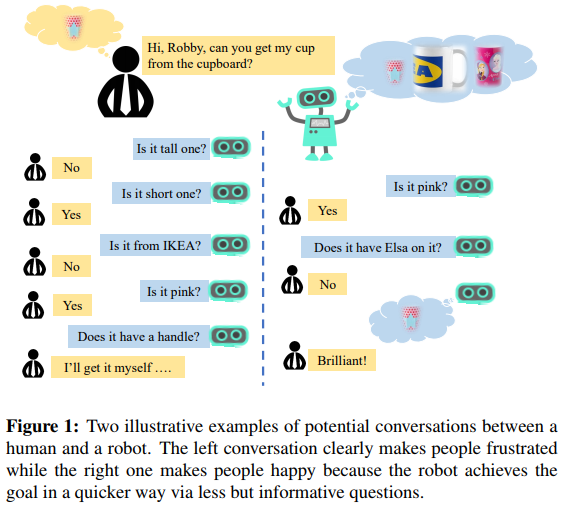

Junjie Zhang, Qi Wu, Chunhua Shen, Jian Zhang, Jianfeng Lu, Anton van den Hengel  
[arXiv](https://arxiv.org/abs/1711.07614) , [pdf](https://arxiv.org/pdf/1711.07614.pdf)  
ECCV2018

# どんなもの？
限られた試行回数の中で必要な情報を取得する必要があるシナリオを考える(GuessWhat?!)．  
  
オブジェクトを特定できるような(すべてのオブジェクトで答えが異なる)質問を生成する．  
GuessWhat?! データセットで学習済みのOracle and Guesserを用いて評価．

# 先行研究との差分
ゲーム設定を使用するVisual dialog generation の先行研究では，より人間的な対話を生成することに焦点を当てている．[[7]](https://arxiv.org/abs/1611.08669), [[8]](https://arxiv.org/abs/1703.06585)  
dialog generater の報酬に最終目標のみを用いる研究もある．これはダイアログ生成には適しているかもしれないが，生成された質問の質や有効性などを制御できない．[[26]](https://arxiv.org/abs/1703.05423)  

提案手法では目標を達成するためにエージェントが短くて有益な質問をすることを奨励するために3つの報酬を使用．  

# GuessWhat?! game
VQGをゲームの目標指向バージョン [GuessWhat?!](https://arxiv.org/pdf/1711.07614.pdf) として扱う．  
3つの役割：Oracle, Questioner, Guesser  

まず画像内のランダムなオブジェクトが Oracle に割り当てられる．  
Questioner はこのオブジェクトを見つけるために Oracle に yes/no の質問をすることができる．このとき，Questioner はオブジェクトリストを見ることが出来ない．  
Questioner が十分な情報を集めると，Guesser は推測を始める．  
Guesser が正しいオブジェクトを選択した場合，ゲームは成功したと見なされる．  

Questioner がVQGのタスクになる．  
各質問は画像情報と前回の(Q,A)ペアに基づいて生成される．  
この場合のVQGの目的はゲームを成功させること．  


# model
各ゲームはタプル $(I, D, O, o^*)$ で定義される．  
$I$ : 画像  
$D$ : $J$ ラウンドのQAペア $(q_j, a_j)_{j=1}^J$ のダイアログ  
$O = (o_n)_{n=1}^N$ : 画像内の$N$個のオブジェクトリスト  
$o^*$ : ターゲットオブジェクト  

各質問 $q_j=(w_m^j)_{m=1}^{M_j}$ は $M_j$トークンのシーケンス．  
質問は <?> で終了し，ダイアログは < End > で終了する．  
$a_j \in \{< Yes >, < No >, < NA >\}$  
各オブジェクトはオブジェクトカテゴリ $c_o\in \{1...C \}$とセグメントマスクを持つ．  

## Oracle
Oracleは画像内のオブジェクトに関するあらゆる種類の質問に対する回答を生成する必要がある．  
MLPに続くSoftmax層で $p(a|o_{spa}, c_o, q)$ を予測．  
$o_{spa}$ : オブジェクトのバウンディングボックスを8次元の特徴に埋め込む．  
$o_{spa} =[x_{min},y_{min},x_{max},y_{max},x_{center},y_{center},w_{box}, h_{box}]$

## Guesser
画像と一連の(Q,A)ペアが与えられると，オブジェクトリストからターゲットオブジェクトを予測する．  
  

## VQG baseline
画像 $I$ と過去の(Q,A)ペア $(q,a)_{1:j-1}$ が得られると，新しい質問 $q_j$ を生成する．  
RNNジェネレーターに基づいてベースラインを作成．  
今回のケースでは状態ベクトル $s$ は画像全体と過去の(Q,A)ペアになる．  
次のトークンを予測 : $p(w_m^j|I,(q,a)_{1:j-1}, w_{1:m-1}^j)$  
ロス関数は以下の様になる  

```math
\begin{aligned}
L &= -\log p(q_{1:J}|I,a_{1:J}) \\
  &= -\sum_{j=1}^J \sum_{m=1}^M \log p(w_m^j | I,w_{1:m-1}^j , (q,a)_{1:j-1})
\end{aligned}
```

テストでは，質問は初期状態 $s_1^j$ からモデルを通してサンプリングされる．  

# Reinforcement Learning of VQG
VQGを Markov Decision Process (MDP) とみなす．VQGはエージェント．  
時間ステップ$t$で画像$Ｉ$に基づいて生成された対話について，エージェントの状態は，(Q,A)ペアの履歴と生成された現在の質問のトークンを有する画像視覚的内容として定義 : $S_t = (I,(q,a)_{1:j-1},(w_1^j,...,w_m^j))$ , $t = \sum_{k=1}^{j-1} M_k+m$  
エージェントのアクション $A_t$ は語彙 $V$ から次の出力トークン $w_{m+1}^j$ を選択する．  

エージェントが取るアクションに応じて，2つの状態間の遷移は次のいずれかの場合に分類される：  
1. $w_{m+1}^j = <?>$ : 現在の質問が終了し，Oracleは回答 $a_j$ を生成し，対話履歴に追加される．次の状態は $S_{t+1} = (I,(q,a)_{1:j})$  
2. $w_{m+1}^j = <End>$ : 対話が終了し，Guesserはオブジェクトを選択する．  
3. それ以外は新しいトークン $w_{m+1}^j$ が生成され，現在の質問 $q_j$ に追加され，次の状態は $S_{t+1} = (I,(q,a)_{1:j-1},(w_1^j,...,w_m^j,w_{m+1}^j))$  

質問の最大長は $M_{max}$ , ダイアログの最大ラウンドは $J_{max}$．従ってダイアログの時間ステップ $T\leq M_{max} * J_{max}$．  

stochastic policy $\pi_\theta(A|S)$ のもとでVQGをモデル化する．  
各$(S_t,A_t)$ペアに対して3種類の中間報酬を作成する．

  

## Goal-Achieved Reward
最終目標が達成されたかどうかを反映する．質問が少ないほど，ゲーム終了時にVQGエージェントに与える報酬が多くなるようにする． 

```math
r_g(S_t,A_t) = \begin{cases}
   1+\lambda*J_{max}/J &\text{if } Guesser(S_t)=o^* \\
   0 &\text{Otherwise}
\end{cases}
```

## Progressive Reward
各ラウンドでGuesserと対話して，ターゲットオブジェクトを予測する確率を取得する．確率が増加するならば，生成した質問は高品質と見なしプラスの報酬を与える．  

```math
r_p(S_t,A_t) = p_j(o^*|I,(q,a)_{1:j}) - p_{j-1}(o^*|I,(q,a)_{1:j-1})
```

## Informativeness Reward
すべての候補オブジェクトに対して同じ答えになるような質問をしないようにしたい．Oracleからの回答に基づいて質問を評価する．  
Oracleは$I, q_j, O$を受け取り，回答セット$a_{jO}=\{a_{jo1},...,a_{joN}\}$を出力する．

```math
r_i(S_t,A_t) = \begin{cases}
   \eta &\text{if all} a_{jon} \text{are not indentical} \\
   0 &\text{Otherwise}
\end{cases}
```


## Training with Policy Gradient
3つの報酬を用いて，最終的な報酬は  

```math
r(S_t, A_t) = r_g(S_t, A_t) + r_p(S_t, A_t) + r_i(S_t, A_t) 
```

policy gradientを用いて学習する．  
policy objective function : 

```math
J(\theta) = E_{\pi_\theta}[\sum_{t=1}^T r(S_t,A_t)]
```

$J(\theta)$の勾配は $\pi_\theta$ からサンプリングされたエピソード $\tau$ のバッチから推定される．

```math
\nabla J(\theta) \approx <\sum_{t=1}^T\sum_{A_t\in V} \nabla_\theta \log \pi_\theta (S_t,A_t)(Q^{\pi_\theta}(S_t,A_t)-b_\phi)>_\tau
```

$Q^{\pi_\theta}(S_t,A_t)$ は累積報酬の期待を返す state-action value function 

```math
Q^{\pi_\theta}(S_t,A_t) = E_{\pi_\theta}[\sum_{t`=t}^T r(S_{t`},A_{t`})]
```

```math
\nabla J(\theta) \approx <\sum_{j=1}^J \sum_{m=1}^{M_j} \nabla_\theta \log \pi_\theta(w_m^j|I,(q,a)_{1:j-1},w_{1:m-1}^j)(Q^{\pi_\theta}(I,(q,a)_{1:j-1},w_{1:m-1}^j,w_m^j)-b_\phi)>_\tau
```

$b_\phi$は勾配の分散を減らすベースライン関数．MSEでトレーニングする．  

```math
\min_\phi L(\phi)=<[b_\phi(S_t)-\sum_{t`=t}^T r(S_{t`},A_{t`})]^2>_\tau
```

  


# 評価実験
データセットは GuessWhat?!を使用．  
テストの際にオブジェクト(NewObject)や画像(NewImage)をランダムにサンプリングして評価する．  
各テストランにおいて3つの推論方法(sampling, greedy, beam-search)を試した．  
Jラウンドのダイアログが得られたとき，Guesserによってターゲットオブジェクトが特定された時，ゲームは成功したとみなす．  

Oracle, Guesser, VQGベースラインは[[26]](https://arxiv.org/abs/1703.05423)を使用．  
Oracle, Gesserのテストセットでのエラーは21.1%, 35.8%．  
トレーニング環境を初期化し，提案手法によるVQGの学習を開始する．  
$J_{max}=5, M_{max}=12$ とし，$\lambda=0.1, \eta=0.1$ とする．  

  
  
VQG-$r_g$ の時点で先行研究より性能が高いのは，ダイアログラウンドを制御することで，エージェントにもっと賢明な質問をさせることができているから．  

  

ダイアログラウンドごとの成功率の変化  
  
提案手法では3ラウンドでターゲットオブジェクトを特定する．

## 質問のクオリティ
全ての候補オブジェクトに対して異なる回答になる質問を良い質問と定義．  
各ラウンドでOracleがすべてのオブジェクトに対して質問に回答して，成功したゲームにおける良い質問の率をカウントした．  
ベースライン 84.7%, Sole-r 86.3% に対して提案手法では87.7%であり， $r_i$ の貢献が確認された．  

## human study
Guesserを人間が行い，3人中2人がゲームに成功した場合に成功と見なす．50枚の画像で実験する．  
ベースライン 52%, Sole-r 70% に対して，提案手法では 76% の成功率だった．