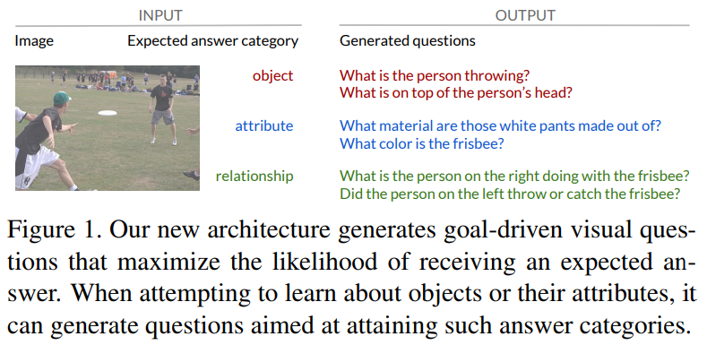
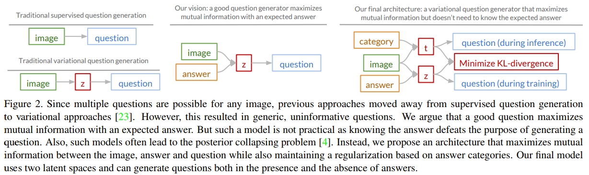
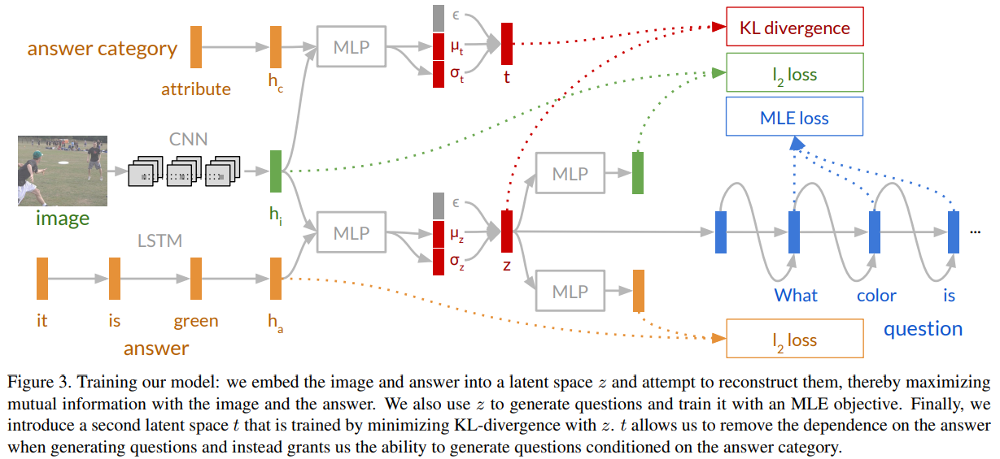
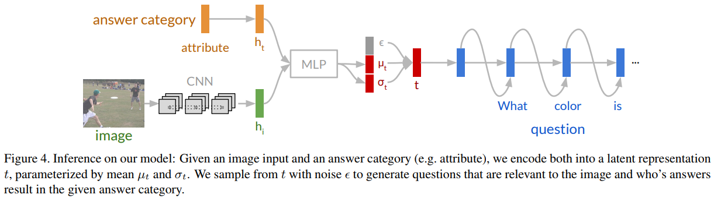
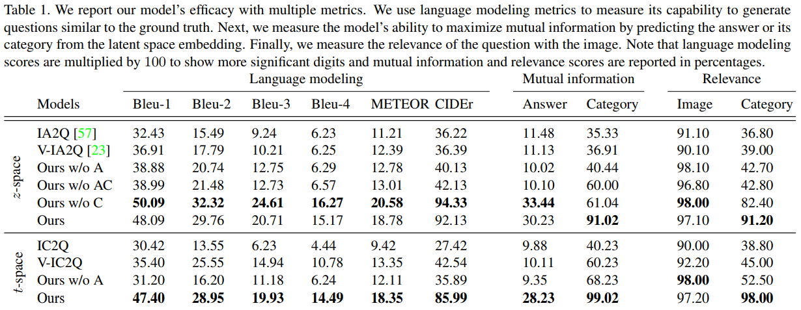
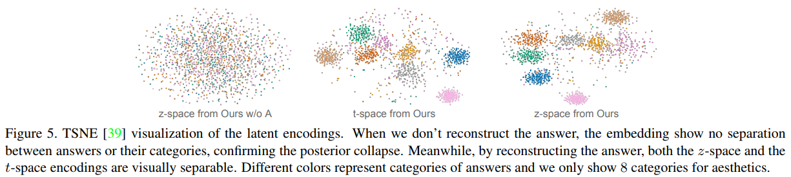
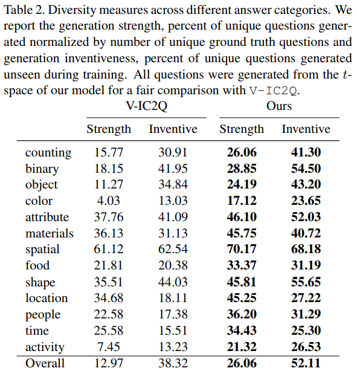
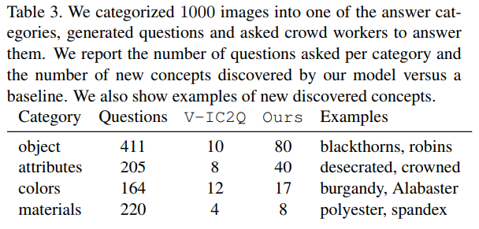
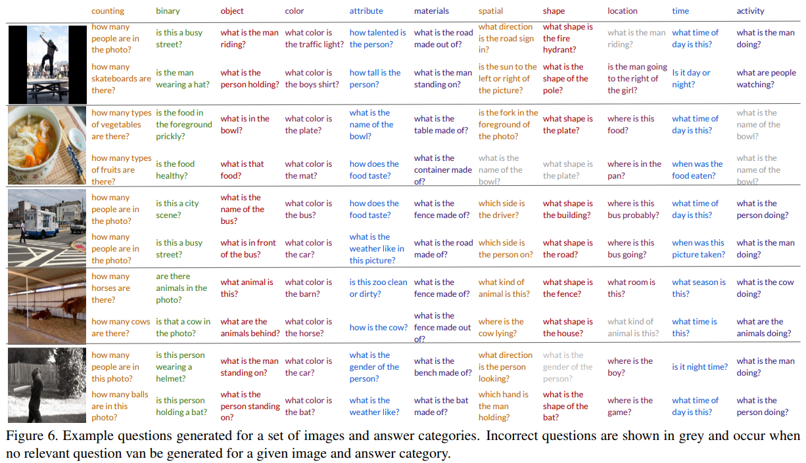

Ranjay Krishna, Michael Bernstein, Li Fei-Fei  
[arXiv](https://arxiv.org/abs/1903.11207#) , [pdf](https://arxiv.org/pdf/1903.11207.pdf), [GitHub](https://github.com/ranjaykrishna/iq) , [HP](https://cs.stanford.edu/people/ranjaykrishna/iq/index.html)  
CVPR2019


# どんなもの？
VQGは画像から特定のカテゴリの概念を抽出することを目的としたタスクであるべき．
良い質問は，画像に関連するだけでなく，特定の回答カテゴリを想定するように設計されている質問と定義．  

画像，期待される回答，生成した質問間の相互情報量を最大化するモデルを構築．
  

# 先行研究との差分
従来の最尤推定法(MLE)によってトレーニングしたVQGは有益でない回答(e.g. "yes")や質問(e.g. “What is the person doing?”)，会話(e.g. “I don’t know”)につながる一般的な質問を生成する．  
一般的な質問を単純に生成するだけでは新しい概念を発見するのに役立たない．  

VQGモデルは一般的な質問を生成するのではなく，目標主導型(goal-driven)にする必要があると考える．  
  
教師あり学習から潜在空間をサンプリングして複数の質問を生成する変分アプローチに移行したが，質問が特定のタイプの回答になることを保証しないのでまだ目標主導型ではない．  
提案モデルでは，質問を生成する前に画像と答えを潜在空間にエンコードする．  
ただし実際に質問を生成する際に回答が分かっているのは不自然なので，回答の代わりに回答カテゴリをエンコードする．この時に(画像，回答)の潜在空間と(画像，回答カテゴリ)の潜在空間のKL-divergenceを最小にすることによって，回答カテゴリから質問を生成できるようにする．


# 提案モデル
  

## 問題の定式化
画像 $i$ から生成したい質問を $q$ とする．この質問はカテゴリー $c$ の答え $a$ になるはず．  
最終目標はモデル $p(q|i,c)$ を定義すること．  
まず，$(i,q)$ ，$(a,q)$ の相互情報量を最大化するより単純なモデル $p(q|i,a)$ を定義する．

```math
\max I(i,q)+\lambda I(a,q) \\
\text{s.t.} q\sim p(q|i,a)
```

直接最適化することは，相互情報の正確な計算が困難なため不可能．  
さらに、推定器が低バイアスと低分散の両方を有する必要があるので，離散ステップ間の勾配を推定することによって最適化することは困難．  
そこで潜在空間 $z$ を導入する．画像と回答から $p_\theta(z|i,a)$ を学習する．

```math
\max_\theta I(q,z|a,i)+\lambda_1 I(a,z)+\lambda_2 I(i,z) \\
\text{s.t.} z \sim p_\theta(z|i,a) \\
q\sim p_\theta(q|z)
```

真の $p(z|i)$ , $p(z|a)$ が必要だが，evidence lower bound(ELBO)を最大にすることで最適化する．

```math
\begin{aligned}
I(z,i) &= \mathbb{H}(i)-\mathbb{H}(i|z) \\
       &= \mathbb{H}(i)+\mathbb{E}_{z\sim p(z,i)}[\mathbb{E}_{\hat{i}\sim p(i|z)}[\log p(\hat{i}|z)]] \\
       &= \mathbb{H}(i)+\mathbb{E}_{i\sim p(i)}[D_{KL}[p(\hat{i}|z)||p_\theta(\hat{i}|z)] + \mathbb{E}_{\hat{i}\sim p(i|z)}[\log p_\theta(\hat{i}|z)]] \\
       &\geq \mathbb{H}(i)+\mathbb{E}_{i\sim p(i)}[\mathbb{E}_{\hat{i}\sim p(i|z)}[\log p_\theta(\hat{i}|z)]]
\end{aligned}
```

$\mathbb{H}()$ : エントロピー， $\mathbb{E}$ : 期待値  
この最適化は変分情報最大化(variational information maximization)と呼ばれる．  
同様に

```math
I(z,a) \geq \mathbb{H}(a)+\mathbb{E}_{a\sim p(a)}[\mathbb{E}_{\hat{a}\sim p(a|z)}[\log p_\theta(\hat{a}|z)]]
```

$I(q,z|a,i)$ も同様に

```math
I(q,z|a,i) \geq \mathbb{H}(q) + \mathbb{E}_{q\sim p(q|i,a)}[\mathbb{E}_{\hat{q}\sim p(q|z,a,i)}[\log p_\theta(\hat{q}|z,i,a)]] \\
\text{s.t.} p(q|z,a,i)=p(q|z)p(z|a,i)
```

以上を用いて

```math
\max_\theta \mathbb{E}_{p_\theta(q,i,a)}[\log p_\theta(q|i,a,z)+ \lambda_1\log p_\theta(a|z)+\lambda_2\log p_\theta(i|z)] \\
\text{s.t.} p_\theta(q,i,a)=p_\theta(q|z)p_\theta(z|i,a)p(i,a)
```


最適化しようとしている$\theta$が含まれていないので，トレーニングデータに関連付けられているエントロピー項は無視される．したがって上式６は，質問を生成するというMLEの目的を最大にしながら，画像および解答表現の再構成を最大にすることによって達成することができる．

## Question generation by reconstructing image and answer representations

CNNを用いて $i$ の隠れベクトル $h_i$ とLSTMを用いて $a$ の隠れベクトル $h_a$ を潜在空間$z$に埋め込む．  
$z$ は対角共分散を持つ多変量ガウス分布に従うと仮定．
平均 $\mu_z$ ,標準偏差 $\sigma_z$，サンプリングされたガウシアンノイズ $\epsilon$ からreparameterization trickを用いて $z=\mu_z+\sigma_z\epsilon$ を生成．

$z$ から$\hat{h}_i , \hat{h}_a$ を作成し，$l_2$ロスを最小化することによって最適化する．

```math
L_i=||h_i-\hat{h}_i||_2 , L_a=||h_a-\hat{h}_a||_2
```

次にLSTMデコーダーを用いて $z$ から質問 $\hat{q}$ を生成する．  
生成した $\hat{q}$ と真の質問 $q$ の $L_{MLE}$ を最小化する．

# Regularizing with a second latent space
予想される答えがどうなるべきかがわかっていれば質問を生成できる．しかし，質問に対する答えがすでにわかっているならば，質問を生成しても意味がない．  

これを改善するために2番目の潜在空間 $t$ を提案．
$a$ の代わりにカテゴリ $c$ を用いる．  
カテゴリにはオブジェクト(e.g. “cat”)，属性(e.g. “cold”)，色(e.g. “brown”)，関係(e.g. “ride”)，数(e.g. “1”)などがある．  

カテゴリはone-hotベクトルで表され，$h_c$ にエンコードした後，$h_i$ と潜在空間 $t$ に埋め込む．  
$z$ 空間とのKL-divergenceを最小化することによって $t$ 空間を学習する．$t$ 空間も対角共分散を持つ多変量ガウス分布に従うと仮定．

```math
\begin{aligned}
L_t &= D_{KL}(p_\theta(z|i,a),p_\phi(t|i,c)) \\
    &= \log \sigma_t-\log \sigma_z+\frac{\sigma_z+(\mu_t-\mu_z)^2}{2\sigma_t}-0.5
\end{aligned}
```

最終的なlossは以下の様になる

```math
L=L_{MLE}+\lambda_1L_a+\lambda_2L_i+\lambda_3L_t
```


  
テスト時には画像と回答カテゴリが与えられ，潜在空間 $t$ にエンコードし，そこからサンプリングして質問を生成する．

## 実装
画像のエンコーダーにはResNet18を使用．  
$h_i, h_a, h_t$ は512次元のベクトル．  
$z , t$ 空間は100次元．  
質問を生成出来なくても単にreconstruction lossを最適化することを防ぐために，画像と回答のエンコーダーは$L_{MLE}$のみで学習．  
$\lambda_1 = 0.01 , \lambda_2=0.001 , \lambda_3 = 0.005$ とし，合計10epochに対して，4epochごとに0.001減らす．


# 評価実験
## データセット
VQAv2.0を使用．回答のカテゴリがないので，上位500の回答に対し15のカテゴリラベルを付けた．上位500の回答で367K training+validationの82%を占める．  
validationをテストとして使用して，トレーニングデータを8:2に分割．  

## 評価方法

BLEU, METEOR, CIDEr を用いた言語モデリング評価手法によって，生成された質問がテストセットの基本的な質問とどれほど一致するかを計算．

潜在空間にエンコードされた回答カテゴリを分類するために分類器を訓練することによって，潜在空間に保持されている相互情報量を測定する．提案手法が入力回答や回答カテゴリについての情報をどれだけうまく保持しているかを明らかにする．

質問が入力画像に妥当であり，回答カテゴリから期待される結果になっているかを確かめるために，質問の関連性を計測する．これは3人のクラウドワーカーの多数決によって測定する．

最後に各カテゴリの多様性スコアを，生成された固有の質問の数によって測定する．

## Baseline
- IA2Q : 教師あり学習で非変分モデル
- IC2Q : ↑の回答ではなく，回答カテゴリを使用
- V-IA2Q : 質問を生成する前に回答と質問を潜在空間に埋め込むモデル
- V-IC2Q : ↑の回答ではなく，回答カテゴリを使用
- Ours w/o A : 答えに関して相互情報を最大化しない
- Ours w/o C : $t$ 空間を使用しないモデル
- Ours w/o AC : reconstruction lossと $t$ 空間を使用しないモデル


## 定量的評価
上が質問を生成する際に回答がある場合，下がない場合  
  

$t$ 空間なしで訓練された場合，同じカテゴリの回答を正則化するために $z$ 空間を制約する必要がなくなるため，Ours w/o Cはより多くの情報を保持する．  
Ours w/o AのMETEORが低いことから，モデルに解答の再構築を強制することで，生成された質問の質が向上する．

TSNE[39]表現の視覚化  
  

## 質問の多様性の評価
テストセット内の177Kの画像すべてに対して，回答カテゴリごとに1つの質問を生成し，合計2Mの質問を生成．その多様性を評価する．  
  
- Strength : グランドトゥルースの質問数で正規化された固有の生成質問の割合
- Inventive : 生成されたすべての固有の質問によって正規化されたトレーニング中に見えなかった固有の質問の割合

shape"や "material"を尋ねる質問は最も見られなかった質問を生成する傾向があり，モデルは "what [shape / material] is the [made out of]？"のような質問を生成することを学習する．

## 実世界での動作
ハッシュタグ #food, #nature, #sports, #fashion を用いてオンラインのパブリックソーシャルメディア投稿から取得し，1000枚の画像につき1つずつ質問を生成した．  
提案モデルは質問をするために回答カテゴリが必要なので，VQA画像上で簡単なResNet18を学習し，4つのカテゴリのうちの1つを出力し回答カテゴリとした．  
質問は2人のクラウドワーカーによって評価された．1人は質問に答え，もう1人は質問と画像および回答カテゴリと回答との関連性を報告．  

カテゴリごとに尋ねられた質問数と，各モデルによって発見された新しい概念の数  
  
Ours, V-IC2Qが生成した質問すべてにおいて画像に関連しており，回答カテゴリとは97.2%と56.8%の関連性があった．


## 定性的評価
  
画像内の概念を使用することがよくある．(“what is the bat made of?” , “is the man going to the right of the girl?”)  
時間のようなトレーニングデータに多様性がない質問では， “what time of day is this?”のような質問が生成される．  
モデルが画像に存在しないカテゴリについて質問することを強いられたときに失敗する．


