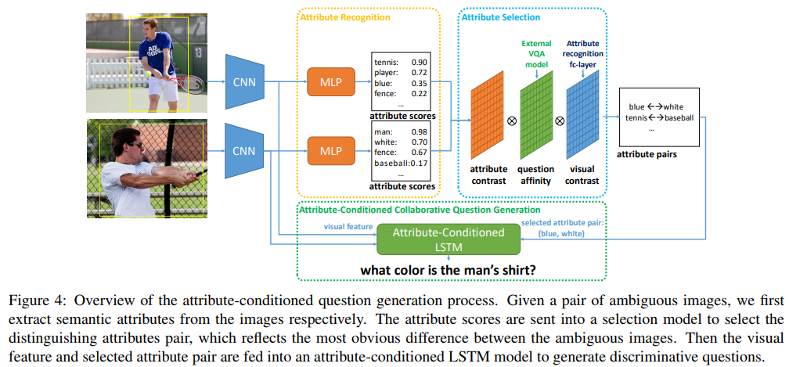

Yining Li, Chen Huang, Xiaoou Tang, Chen-Change Loy  
[arXiv](https://arxiv.org/abs/1708.02760) , [pdf](https://arxiv.org/pdf/1708.02760.pdf)  
ICCV2017  


# どんなもの？
2つの画像が与えられ，それらを区別したり明確にしたりするために良い質問を生成する Visual Discriminative Question Generation (VDQG)という新しいタスクを提案．  
Visual Genomeを拡張した10,000以上の画像ペア，100,000以上の識別と非識別の質問を含むVDQGデータセットを作成  


# 先行研究との差分
VDQGの目的は質問をしてオブジェクト間のあいまいさを解決すること．  
システムは比較を行うために2つのオブジェクトの最も際立った特徴を正確に把握する必要がある．  
異なる画像ペアを区別するためには，色，動作，位置，数などさまざまな種類の質問をする必要がある．  
したがって単一画像に基づいて文字通りの説明を生成することを目的とした画像キャプションとは異なる．


# VDQG Datasetについて
既存のVQGおよびVQAデータセットは単一の画像にアノテーションが付けられた質問のみ → VDQGの定量的評価および分析には不十分なので新しいデータセットを作成

オブジェクトクラスが同じというだけでなく，視覚的にも似ている画像を集める．  
  

Visual Genomeの87のオブジェクトカテゴリから画像を収集し，同じカテゴリーラベル内で，Inception-ResNetで抽出した特徴が類似しているものを画像ペアとして選択．  

2段階のステップで質問を集める．  
最初のステップで2つの画像の違いを見分けることができる質問の生成を依頼し，2~3の差別的な質問を収集．  
次に他の視覚的に類似した画像ペアから質問を取得し，Visual Genome VQAアノテーションでトレーニングされたCNN-LSTMモデルを使用して自動的に質問を生成することによって，各画像ペアの質問セットを増やす．  
これによって各ペアは8つ以上の質問を持つが，集められた質問は差別的な質問とは保証されないので，クラウドワーカーに判断してもらう．

## VDQGデータセットの統計量  
  

  

## オブジェクトカテゴリの分布  
  


## VDQGとVisual GenomeのN-gramシーケンス分布  


## VDQG例  


# 提案モデル
  

2段階のステップからなる．
最初のステップでは識別属性ペアを見つける．これにより，各領域は属性によって記述され，2つの領域を最も区別するペアを形成する． 
例：図4では野球用バットはほとんど見えないので，‘blue-white’属性は‘tennis-baseball’よりも識別力があると見なす． 

識別属性が与えられると，2番目のステップは識別質問を生成するために属性を使用してLSTMを調整する．

## Finding Discriminative Attribute Pairs
識別属性ペアを見つけるために，各領域からの視覚属性を認識して属性プールペアを形成．次に２つの領域を最もよく区別する属性を選択する．

属性は通常1単語で表現されるが，“location” よりも “next to building” の方が表現力があり差別化するのに良いので，1単語の属性表現を短いフレーズに拡張する．  
Visual Genomeから領域を記述している n-gram表現($n \geq 3$) を抽出し，最終的に612の属性リスト $\{att_k\}$ を形成．  
マルチラベルの分類問題として属性認識モデルを訓練し，属性スコアベクトル $v$ を生成．

$v_A, v_B$ が得られると，最もよく区別する属性ペア $(att_i, att_j)$ を選ぶ．  
選択された属性ペアは以下の3つの特性を持つ必要がある．  
1. 2つの地域で非常に対照的なはず．e.g.("red", "green")
2. ある質問に対するもっともらしい答えとして機能できるはず．e.g. A : ("red", "green") -> Q:"“What color is it?”
3. 視覚的観察によって容易に区別されるはず．

これらの制約を以下のスコア関数に統合する．

  

質問の類似性を評価するために回答が属性のみで学習したVQAを用いる．  


## CNN-LSTM with Attribute Conditions
従来のCNN-LSTM

```math
\begin{aligned}
L &= \sum_n -\log p(Q_n|f_n) \\
  &= \sum_n \sum_t -\log p(q_t^n|q_{t-1}^n,...q_1^n,f_n)
\end{aligned}
```


Attribute-Conditioned LSTMでは，LSTMの入力に意味属性($att_i$)を加える

```math
L = \sum_n -\log p(Q_n|f_n, \sigma(att_i^n))
```

2つの属性ペアを区別する質問を生成したいので，  
  

このように質問を生成することで，区別する質問があるデータセットを使わずに，1画像1質問のデータセットで学習できる．  

# 評価実験
Visual Genomeで学習し，VDQGでテスト．  
評価は ∆BLEU, BLEU, METEOR を使用．

## 比較手法
- Attribute-Conditioned Question Generation (ACQG) : サンプルごとに上位5つの属性ペアを選択し，各ペアに対して質問を生成．属性スコアと質問の確率の積が最も高いものを最終的な出力とする．
- CNN-LSTM : [最先端のキャプションモデル](https://arxiv.org/abs/1411.4389)を使用．
- Retrieval-based Approach (Retrieval) : テスト画像ペアが与えられると，まずk(=100)個の最近傍のトレーニング画像領域を検索し，検索された領域の質問を使用して候補プールを構築する．候補プール内の各質問について，BLEUを使用して他の質問との類似度を計算し，最も高いスコアを持つ候補質問が出力される．
- $Human_{top}$ : 各サンプルで最初に書かれたポジティブな質問
- $Human_{random}$ : 各サンプルですべてのポジティブなアノテーションの中からランダムで選択

## 実験結果
VDQGの全部のサブセットを使用．  
  

各オブジェクトカテゴリー内でポジティブのアノテーションの割合がより低い５０％のサンプルを選択することによってハードサブセットを構築  
  
$ACQG_{full}$ と非属性ガイドモデル間の性能差が増加しているので，VDQGのタスクでは識別属性が重要．

人のアノテーションにおいて，最初に書かれた質問が2つの画像の間の最も際立った違いを尋ねる可能性が高いと仮定．  
表2,3それぞれ$Human_{random}$よりも$Human_{top}$の方が優れている．VDQGデータセットとVDQG評価のための計量設定の有効性を示唆している．


## user study
27人の被験者に評価を依頼．  
各画像につき "human", "$ACQG_{full}$", "CNN-LSTM", "Retrieval" の質問を提示し，ランク付けを行う．  
  
  

## 参照表現との比較
14人の被験者に依頼し，差別的質問と参照表現を比較．  
バウンディングボックスでマークされた2つの曖昧なオブジェクトが映っている1画像と，オブジェクトの1つを参照する参照表現または差別的な質問+属性を提示．
与えられた情報によって参照されたオブジェクトを尋ねた．
平均の精度を計算．    
  
参照表現では65.14％，識別質問+属性では69.51％の結果が得られた．


## 定性的評価

